# Krakken security theorem program

Research navigation: [index](KRAKKEN_RESEARCH_INDEX.md).

This file separates proved global statements from the quantitative bounds
still needed to assess the full eight-round construction. All statements
refer to the current `krakken.c` and `krakken.h` source. A message in this
program is exactly 159 bytes, followed by the fixed `0x86` padding byte in
the first absorb block. Let `F_r(m)` be the full 2048-bit state after `r`
complete Krakken rounds starting from that block, with XRBD enabled.

<!-- BEGIN THEOREM NAVIGATION -->
## Theorem map and audit conventions

[Full inventory and audit scopes](KRAKKEN_THEOREM_INVENTORY.md) ·
[Certificate/script manifest](KRAKKEN_THEOREM_ARTIFACTS.md) ·
[Machine-readable permanent registry](../results/krakken_theorem_registry.json).

IDs are permanent and append-only. New results receive new IDs; moving a section
does not change its ID. The statements below, including all restrictions and
validation boundaries, remain authoritative. This map is not a certificate audit.

**Domains:** H = valid 159-byte first hash block with fixed padding and zero
initial capacity; P = unrestricted permutation; L = local Chi; U = uniform
Pressure input; R = reduced-width analogue. **Proof:** A = analytic proof;
F = finite exhaustive proof (also finite counterexample/rank certificates);
S = solver-backed exhaustive exclusion; E = empirical probe. A checkpoint such
as Chi1 is not a complete round. Audit coverage is detailed in the inventory.

Throughout this ledger, separate Python/C replays, opposite-pivot elimination,
and alternate derivations are **independent implementation audits**. Existing
uses of “independent” for these checks have that meaning, not external independent
verification. External reviewer comments do not establish external reproduction;
no external certificate reproduction is recorded here. Proof and implementation
validation remain distinct even when both use exhaustive computation.

### Compact theorem-status matrix

Each result column is the cryptanalytic implication within the quantified class;
none implies a global security-bit estimate. External status “—” means no recorded
external reproduction. Audit “scope” links to the exact coverage, including
partial replays. Supporting identities are indexed alongside theorem classes.

| ID | Family | Domain | Rounds/checkpoint | Quantified class | Result | Proof | Implementation audit | External | Implication |
|---|---|---|---|---|---|---|---|---|---|
| [LIN-GLOBAL-001](#lin-global-001) | Linear | H | 1–8 | All message/state affine masks | No perfect affine relation; only 1−2^-1271 numerical bound | F | [scope](KRAKKEN_THEOREM_INVENTORY.md#lin-global-001) | — | Perfect relations excluded; no useful security bits |
| [LIN-CHI-001](#lin-chi-001) | Linear | H | Chi1 | Exactly t=1,2,3 cells; all masks | Sharp maximum 2^-3t | A+F | [scope](KRAKKEN_THEOREM_INVENTORY.md#lin-chi-001) | — | Stated class/checkpoint only |
| [LIN-CHI-002](#lin-chi-002) | Linear | H | Chi1 | Exactly four cells; all message/output masks | Sharp maximum 2^-12 | A+F | [scope](KRAKKEN_THEOREM_INVENTORY.md#lin-chi-002) | — | Complete four-cell checkpoint class; not a full-round bound |
| [BOOM-LOCAL-001](#boom-local-001) | Boomerang | L | Chi | 255² diagonal/first-output entries | BCT=2^16; family need not exhaust maximizers | A | [scope](KRAKKEN_THEOREM_INVENTORY.md#boom-local-001) | — | Attack-side local structure |
| [BOOM-LOCAL-002](#boom-local-002) | Boomerang | L / unrestricted Chi | Chi | Every local nontrivial input/output difference pair; exact full-Chi product | Perfect iff diagonal/first-output; otherwise sharp BCT≤1536 (probability≤3/128) | A+F | [scope](KRAKKEN_THEOREM_INVENTORY.md#boom-local-002) | — | Complete local classification; no round-two or hash-interface bound |
| [BOOM-EMBED-001](#boom-embed-001) | Boomerang | P/H | Chi1 | One-cell family | Unrestricted embedding; first-block nonzero one-cell input excluded | A+F | [scope](KRAKKEN_THEOREM_INVENTORY.md#boom-embed-001) | — | Stated class/checkpoint only |
| [DIFF-RATE-001](#diff-rate-001) | Differential | H / shared-prefix later final absorb | Chi1 | All nonzero first-block differences; later same-length partial suffix differences after common prefix | Exact first-block min A1=5; later-block A≥5 corollary | A+F | [scope](KRAKKEN_THEOREM_INVENTORY.md#diff-rate-001) | — | Rate-only difference condition; differing prefixes open |
| [DIFF-RATE-002](#diff-rate-002) | Differential | H | Chi1 | Six fixed differences, uniform message base | Exact A1 distribution; sharp prescribed-output max 2^-38 | A+F | [scope](KRAKKEN_THEOREM_INVENTORY.md#diff-rate-002) | — | Stated class/checkpoint only |
| [DIFF-RATE-003](#diff-rate-003) | Differential | H | 1→2 | Three fixed differences conditioned on A1=5 | A2≥3; not all A1=5 pairs | A+F | [scope](KRAKKEN_THEOREM_INVENTORY.md#diff-rate-003) | — | Stated class/checkpoint only |
| [DIFF-RATE-004](#diff-rate-004) | Differential | First full 160-byte absorb / common-prefix later full absorb | Chi of that call | All nonzero rate-only full-block differences | Exact first-full-block min A=5; later shared-prefix full-block floor A≥5 | A+F | [scope](KRAKKEN_THEOREM_INVENTORY.md#diff-rate-004) | — | Does not cover differing earlier blocks or later padded call |
| [DIFF-RATE-005](#diff-rate-005) | Differential | H / common-prefix final 159-byte suffix | Chi1/XRBD1 | Every fixed nonzero message difference and every prescribed full-state difference | Probability at most 2^-24 under uniform message base; sharpness open | A+F | [scope](KRAKKEN_THEOREM_INVENTORY.md#diff-rate-005) | — | Checkpoint concentration, not a complete-round bound |
| [DIFF-RATE-006](#diff-rate-006) | Differential | H / fixed affine rate translate | 1 complete round | All but fewer than 2^1039 of the 2^1272 message differences; all eight-bit output differences on one specified nondigest projection | Each point probability ≤2^-8+255·2^-136; projected difference TV <2^-125 from uniform | A+F | [scope](KRAKKEN_THEOREM_INVENTORY.md#diff-rate-006) | — | Almost-all-difference projection theorem; attacker-chosen exceptions and digest remain open |
| [DIFF-RATE-007](#diff-rate-007) | Differential | H | 1 complete round | Three fixed differences, uniform message base conditioned on A1=5; every prescribed full-state output difference | Conditional point probability ≤1/4+2^-204, ≤1/8+2^-197, ≤1/16+2^-182 respectively | A+F | [scope](KRAKKEN_THEOREM_INVENTORY.md#diff-rate-007) | — | Conditional theorem; DIFF-RATE-008 supplies unconditional successor; digest and multi-round bounds open |
| [DIFF-RATE-008](#diff-rate-008) | Differential | H | 1 complete round | Three fixed differences; every uniform message base, no activity conditioning; every prescribed full-state output difference | Point probability <507/512000 =1.014/1024; ten-bit projected law within 2^-145 of exact finite reference | A+F | [scope](KRAKKEN_THEOREM_INVENTORY.md#diff-rate-008) | — | Full-state point bound via nondigest projection; projected R1 nonuniformity also certified; other differences/digest/later rounds open |
| [CHI-RATE-001](#chi-rate-001) | Chi projection / differential / linear | H / full rate / fixed affine offset | Chi1/XRBD1 | All 128 first-call bytes plus any ≤5 second-call bytes; every fixed nonzero difference; stated mask class | Joint uniformity; exact truncated-difference product; prescribed full difference ≤2^-30; sharp first-only mask maximum 2^-3t | A+F | [scope](KRAKKEN_THEOREM_INVENTORY.md#chi-rate-001) | — | First-Chi checkpoint only; no Pressure or later-round probability claim |
| [DIFF-ACT-001](#diff-act-001) | Differential activity / conditional linear | Affine rate plane | Chi1 / 1 | Every fixed full-state difference and affine offset; uniform 159-/160-byte base | Exact activity law and affine minimizer; exact conditioning spectrum; specified eight-bit complete-round bound | A+F | [scope](KRAKKEN_THEOREM_INVENTORY.md#diff-act-001) | — | Base-state nondigest projection; no output-difference or multi-round bound |
| [DIFF-CHI-001](#diff-chi-001) | Differential | Local Chi / H | Chi1 | Prescribed local transitions with active first S-box; hash transitions where every active first call is active | Affine base fibers; consistent hash event has exact probability 2^-rank | A+F | [scope](KRAKKEN_THEOREM_INVENTORY.md#diff-chi-001) | — | Counting shortcut; no Pressure conclusion |
| [DIFF-CHI-002](#diff-chi-002) | Differential | Local Chi / unrestricted full Chi | Chi | Every nonzero 16-bit local input difference, every output difference | Sharp maximum in {2^-6,2^-7,2^-12}; exact class counts 510/32130/32895; unique maximizer | A+F | [scope](KRAKKEN_THEOREM_INVENTORY.md#diff-chi-002) | — | Local/full-Chi uniform-base statement; hash-base correlations remain |
| [DL-LOCAL-001](#dl-local-001) | Differential-linear | Local Chi / unrestricted full Chi | Chi | Every nonzero local input difference and nonzero output mask | Exactly 65,025 perfect pairs; every other pair ≤71/512 in absolute correlation | A+F | [scope](KRAKKEN_THEOREM_INVENTORY.md#dl-local-001) | — | Complete perfect class; nonperfect bound not claimed sharp |
| [BOOM-ROUND-001](#boom-round-001) | Boomerang | P | 1→Chi2 | Four fixed choices, one site, zero background, all local bases | No required quartet survives Chi2 | F | [scope](KRAKKEN_THEOREM_INVENTORY.md#boom-round-001) | — | Stated class/checkpoint only |
| [BOOM-ROUND-002](#boom-round-002) | Boomerang | P | Chi2 | 4,784 surviving patterns from BOOM-ROUND-001 | Each pattern has a local obstruction for every Chi2 base | A+F | [scope](KRAKKEN_THEOREM_INVENTORY.md#boom-round-002) | — | Stated class/checkpoint only |
| [DIFF-PERM-001](#diff-perm-001) | Differential | P | XRBD1/Pressure1 | All 65,280 one-byte post-Chi differences | All 16 Pressure chains active for every base | A+F | [scope](KRAKKEN_THEOREM_INVENTORY.md#diff-perm-001) | — | Stated class/checkpoint only |
| [DIFF-PERM-002](#diff-perm-002) | Differential | P | 1→2 | All unrestricted [1,1] trails | Impossible; A1+A2≥3 | S | [scope](KRAKKEN_THEOREM_INVENTORY.md#diff-perm-002) | — | Stated class/checkpoint only |
| [DIFF-12-001](#diff-12-001) | Differential | P | 1→2 | LSB-obstructed BB sites | 1,034,445 sites excluded | A+F | [scope](KRAKKEN_THEOREM_INVENTORY.md#diff-12-001) | — | Stated class/checkpoint only |
| [DIFF-12-002](#diff-12-002) | Differential | P | 1→2 | Start 0, distinct BB sites | 6,223 sites excluded; remaining sites unresolved here | F | [scope](KRAKKEN_THEOREM_INVENTORY.md#diff-12-002) | — | Stated class/checkpoint only |
| [DIFF-12-003](#diff-12-003) | Differential | P | 1→2 | All 256 starts, BB low-two-bit gate | 1,628,104 excluded; 452,664 deferred/surviving | F | [scope](KRAKKEN_THEOREM_INVENTORY.md#diff-12-003) | — | Stated class/checkpoint only |
| [DIFF-12-004](#diff-12-004) | Differential | P | 1→2 | Complete distinct BB class | All 2,080,768 sites excluded | A+F+S | [scope](KRAKKEN_THEOREM_INVENTORY.md#diff-12-004) | — | Stated class/checkpoint only |
| [DIFF-12-005](#diff-12-005) | Differential | P | 1→2 | Complete same-pair mixed class | All 32,768 sites excluded | A+S | [scope](KRAKKEN_THEOREM_INVENTORY.md#diff-12-005) | — | Stated class/checkpoint only |
| [DIFF-12-006](#diff-12-006) | Differential | P | 1→2 | Complete distinct AA class | All 2,080,768 sites excluded | A+F+S | [scope](KRAKKEN_THEOREM_INVENTORY.md#diff-12-006) | — | AB closed separately; BA remains open |
| [DIFF-12-007](#diff-12-007) | Differential | P | 1→2 | Complete distinct AB class, first branch at i and second at j with i<j | All 2,080,768 sites excluded | A+F+S | [scope](KRAKKEN_THEOREM_INVENTORY.md#diff-12-007) | — | BA remains open; not global [1,2] |
| [ROT-001](#rot-001) | Rotational | P | 1–8 | All nontrivial lane rotations; constants on/off | No universal affine covariance | F | [scope](KRAKKEN_THEOREM_INVENTORY.md#rot-001) | — | Stated class/checkpoint only |
| [ROT-002](#rot-002) | Rotational | P | 1 | Byte rotations 8,…,56 | Exact residual identity; uniform full-state scope | A | [scope](KRAKKEN_THEOREM_INVENTORY.md#rot-002) | — | Stated class/checkpoint only |
| [LIN-THETA-001](#lin-theta-001) | Linear-layer structure | P | Theta alone | Every 2048-bit state; complete fixed space and cycles | `dim Fix(Theta)=1544`, `rank(Theta−I)=504`; all others in 2-cycles | A+F | [scope](KRAKKEN_THEOREM_INVENTORY.md#lin-theta-001) | — | Supporting Theta-only classification; no full-round distinguisher |
| [DL-001](#dl-001) | Differential-linear | P | 1 | 128 cells ×255 diagonal differences; 32D affine output space | Exact perfect-mask kernels of dimensions 26–29 | A+F | [scope](KRAKKEN_THEOREM_INVENTORY.md#dl-001) | — | Stated class/checkpoint only |
| [DL-002](#dl-002) | Differential-linear | P | 2 | 128 fixed delta=1 differences; all output masks | No perfect output autocorrelation | F | [scope](KRAKKEN_THEOREM_INVENTORY.md#dl-002) | — | Stated class/checkpoint only |
| [DIFF-TRUNC-001](#diff-trunc-001) | Truncated differential | P | 1 | All 128 diagonal one-cell sites; every base and nonzero byte difference | Certified per-site zero-output-bit sets; selected site has 15 zero bytes | A+F | [scope](KRAKKEN_THEOREM_INVENTORY.md#diff-trunc-001) | — | Attack-side one-round structure; no R2 claim |
| [PRESS-WALSH-001](#press-walsh-001) | Linear | U | Pressure | q=0; arbitrary 64-bit u,v,p | Exact counter; sharp nonperfect max 1/2 | A | [scope](KRAKKEN_THEOREM_INVENTORY.md#press-walsh-001) | — | Stated class/checkpoint only |
| [PRESS-WALSH-002](#press-walsh-002) | Linear | U | Pressure | u∈{0,bit0} or q∈{0,bit0}; other masks arbitrary | Exact counter; sharp nonperfect max 1/2 | A | [scope](KRAKKEN_THEOREM_INVENTORY.md#press-walsh-002) | — | Stated class/checkpoint only |
| [PRESS-WALSH-003](#press-walsh-003) | Linear | U | Pressure | Both outputs low k≤17; all input masks | Exact joint counter; sharp nonperfect max 1/2 for k≥2, zero at k=1; top-bit zero rule | A+F | [scope](KRAKKEN_THEOREM_INVENTORY.md#press-walsh-003) | — | Stated class/checkpoint only |
| [PRESS-DIFF-001](#press-diff-001) | Differential | Local Pressure | Low two bits | Every ten-bit input/output XOR profile | Exact 184-profile relation from two LSB and three factored cubic equations; all quadratic consequences leave 256 profiles | A+F | [scope](KRAKKEN_THEOREM_INVENTORY.md#press-diff-001) | — | Re-expression of local gate; no new global [1,2] exclusion |
| [PRESS-DIFF-002](#press-diff-002) | Differential | Local Pressure | Low three bits | Every 15-bit input/output XOR profile | Exactly 4,376 feasible; complete cubic closure has 128 false profiles forming one affine 7-flat; one explicit quintic makes that closure exact | A+F | [scope](KRAKKEN_THEOREM_INVENTORY.md#press-diff-002) | — | Local gate, not a two-round trail bound |
| [PRESS-DIFF-003](#press-diff-003) | Differential | Local full-word Pressure | Checkpoint | Every XOR profile | 126 necessary cubics +2 LSB equations per chain; affine-graph refinement | A+F | [scope](KRAKKEN_THEOREM_INVENTORY.md#press-diff-003) | — | Sound exclusions only; passing not feasibility; no new A2 floor |
| [PRESS-TRANS-001](#press-trans-001) | Differential / affine structures | P; uniform Pressure base for probability | Pressure1→R2; activity any adjacent pair | Complete 16D deterministic translation class; two saved cosets for rank claims | Sharp A1/A2/total ≥48/30/135; Chi2 point max 2^-184; all 65,535 lose deterministic R2 difference; saved hull ranks 2048/2064 | A+F | [scope](KRAKKEN_THEOREM_INVENTORY.md#press-trans-001) | — | Conditional internal-class cost; no hash reachability or global hull bound |
| [DIFF-WINDOW-001](#diff-window-001) | Differential window | P; conditional H | Any adjacent pair; 3/8-round corollaries | All nonzero U directions and every base | Consecutive U impossible; conditional eight-round ≥143 P / ≥144 H if U occurs before final round | A+F | [scope](KRAKKEN_THEOREM_INVENTORY.md#diff-window-001) | — | Case-split rule; unconditioned global floors unchanged |
| [DIFF-SCREEN-001](#diff-screen-001) | Differential methods | P relaxed endpoint model | Pressure1→Chi2 | All low-q profiles, q=1..4, certified supports | Second-call-only supports 5/8/13/16 project surjectively | A+F | [scope](KRAKKEN_THEOREM_INVENTORY.md#diff-screen-001) | — | Information-loss barrier for low-bit-only screens; synthetic endpoints not real trails |
| [PRESS-HULL-001](#press-hull-001) | Linear | U/R | Pressure | Arbitrary 64-bit masks; separate 4-bit counterexample | Exact signed identity; triangle bound fails in reduced model | A+F | [scope](KRAKKEN_THEOREM_INVENTORY.md#press-hull-001) | — | Identity / failed proof route |
| [PRESS-ZERO-001](#press-zero-001) | Linear | U | Pressure | Pairwise word projections and specified masks | Exact pair-uniformity and zero coefficients | A | [scope](KRAKKEN_THEOREM_INVENTORY.md#press-zero-001) | — | Stated class/checkpoint only |
| [LIN-RATE-001](#lin-rate-001) | Linear | H | 1 | 16 specified output masks; every message mask | Per-mask bounds at least 2^-174, strongest 2^-354 | A+F | [scope](KRAKKEN_THEOREM_INVENTORY.md#lin-rate-001) | — | Stated class/checkpoint only |
| [LIN-RATE-002](#lin-rate-002) | Linear | H | 1 | 31 nonzero masks in specified 5D space; every message mask | ≤2^-162; stated conditional/TV corollaries | A+F | [scope](KRAKKEN_THEOREM_INVENTORY.md#lin-rate-002) | — | Stated class/checkpoint only |
| [LIN-RATE-003](#lin-rate-003) | Linear | H | 1 | 63 nonzero masks in specified 6D space; every message mask | ≤2^-76; stated conditional/TV corollaries | A+F | [scope](KRAKKEN_THEOREM_INVENTORY.md#lin-rate-003) | — | Stated class/checkpoint only |
| [LIN-RATE-004](#lin-rate-004) | Linear | H / any fixed affine translate of message embedding | 1 complete round | All message masks; all 255 nonzero masks of a specified 8D output space crossing Pressure carries | ≤2^-246; affine-codimension-d TV bound | A+F | [scope](KRAKKEN_THEOREM_INVENTORY.md#lin-rate-004) | — | Selected nondigest output bits; not an all-mask or multi-round bound |
| [ALG-DEG-001](#alg-deg-001) | Algebraic | H | 1–8 | All coordinates; separate 256-bit projection | 32 R1 bits degree 13; other R1 and all R2–8 ≥20; projection ≥24 | A+F | [scope](KRAKKEN_THEOREM_INVENTORY.md#alg-deg-001) | — | Stated class/checkpoint only |
| [ALG-DEG-002](#alg-deg-002) | Algebraic | H / affine rate plane | 1 | 192 specified state bits from low six Pressure bits | Exact local degrees A=1,2,3,4,5,6 and C=1,2,3,5,7,9; first-round degree upper bounds 13×local degree | A+F | [scope](KRAKKEN_THEOREM_INVENTORY.md#alg-deg-002) | — | Upper bounds only; no round-two or security-bit implication |
| [LIN-HULL-001](#lin-hull-001) | Linear | H/P | 1–8 | All message/state masks | Exact signed coset sum of 2^776 full-state coefficients | A | [scope](KRAKKEN_THEOREM_INVENTORY.md#lin-hull-001) | — | Global proof obligation identified |
| [ZERO-001](#zero-001) | Zero-sum | P | Chi1/1/2 | Fixed square, all backgrounds; sites as specified | R1 projected balance; no universal R2 coordinate at 128 sites, no mask at site 0 | A+F | [scope](KRAKKEN_THEOREM_INVENTORY.md#zero-001) | — | Stated class/checkpoint only |
| [INT-CUBE-001](#int-cube-001) | Integral | H | Chi1/1/2 | Every d≥14 cube at checkpoints; fixed 14-direction family at complete rounds | Sharp threshold 14; fixed family exactly 32 universal R1 coordinates, none R2 | A+F | [scope](KRAKKEN_THEOREM_INVENTORY.md#int-cube-001) | — | Stated class/checkpoint only |
| [INT-KERNEL-001](#int-kernel-001) | Integral / affine-fiber degree | H; fixed-offset extension for inclusion only | Chi1/XRBD1/1/2 | All dimension-8–248 direction spaces in the first-Chi-input kernel; exact mask classification for one saved 8D cube only | Sharp checkpoint threshold 8; 32 guaranteed R1 coordinates; saved cube universal mask dimensions exactly 32 then 0 | A+F | [scope](KRAKKEN_THEOREM_INVENTORY.md#int-kernel-001) | — | Attack-side 256-message R1 integral; all-mask R2 exclusion only fixed cube, not all kernel subspaces |
| [INT-NONLINEAR-001](#int-nonlinear-001) | Nonlinear-output integral | H; specified state projections | Complete R1–R8 separately | Fixed saved 8D cube; all 2^256 Boolean predicates of each of 16 eight-bit projections | Exactly 64 universal R1 predicates (56 nonlinear); only 2 constants at each R2–R8 | A+F | [scope](KRAKKEN_THEOREM_INVENTORY.md#int-nonlinear-001) | — | Defined predicate class; other cubes/joint projections/statistical integrals open; not digest-only |
| [PARTITION-001](#partition-001) | Perfect nonlinear partition/common labels | H | Complete R1–R8 separately | 175 source × 48 destination byte observations; arbitrary label functions | Exactly 16 matching R1 cases have q^16 labels; all other 67,184 cases constant-only | A+F | [scope](KRAKKEN_THEOREM_INVENTORY.md#partition-001) | — | Perfect separable labels only; biases/joint observations remain open |
| [ALG-REL-001](#alg-rel-001) | Mixed input/output algebraic relations | H; four-bit/four-bit observations | Complete R1–R8 separately | All Boolean equations in each of 67,200 eight-coordinate windows | 16 matching R1 supports have ideal <e0,e1>, dimension 192; all other supports full and ideal zero | A+F | [scope](KRAKKEN_THEOREM_INVENTORY.md#alg-rel-001) | — | Exact small-window support; no independence or large-system solving bound |
| [SBOX-ALG-001](#sbox-alg-001) | Primitive S-box algebra | 8-bit byte map; uniform byte for probabilities | S-box only | All inputs/differences/masks as separately stated | Exact affine inversion; analytic DDT 4 / BCT 6; finite Walsh 32, NL 112, degree 7 | A+F | [scope](KRAKKEN_THEOREM_INVENTORY.md#sbox-alg-001) | — | Component provenance and local properties; no new round/hash bound |
| [SCHEDULE-AFF-001](#schedule-aff-001) | Related-round / cyclic schedules | Same H message; modified schedules | Complete lengths 1–8 separately | All 28 distinct cyclic phase pairs; all independent output masks | Exact R1 offsets; no perfect affine relation at R2–R8, all 196 paired ranks 4096; nonlinear conjugacy survives | A+F | [scope](KRAKKEN_THEOREM_INVENTORY.md#schedule-aff-001) | — | Defined perfect relation class, not all slide attacks or nonperfect bounds |
| [INT-BYTE-001](#int-byte-001) | Integral | H | 2 | All 159 byte cubes, arbitrary bases, coordinate masks | No universal coordinate balance | F | [scope](KRAKKEN_THEOREM_INVENTORY.md#int-byte-001) | — | Stated class/checkpoint only |
| [INT-BYTE-002](#int-byte-002) | Integral | H | 1/2 | Byte-0 cube, all bases/output masks | R1 sum rank 2041; R2 rank 2048, no universal nonzero mask | F | [scope](KRAKKEN_THEOREM_INVENTORY.md#int-byte-002) | — | Stated class/checkpoint only |
| [DIV-BYTE-001](#div-byte-001) | Division property | H | 1/2 | Byte-0 defined direction family and linear masks | Exact universal balance spaces: dimensions 7 and 0 | A+F | [scope](KRAKKEN_THEOREM_INVENTORY.md#div-byte-001) | — | Stated class/checkpoint only |
| [SUBSPACE-001](#subspace-001) | Subspace | H | Chi1/1/2 | 159 byte-coordinate subspaces, zero-base coset | Affine hull rank 255 at stated checkpoints | F | [scope](KRAKKEN_THEOREM_INVENTORY.md#subspace-001) | — | Stated class/checkpoint only |
| [SUBSPACE-002](#subspace-002) | Subspace | H | Chi1/Pressure1/2 | Bytes 40,56 diagonal planes; all 256 defined cosets | Chi rank 238–254; Pressure and complete R1/R2 rank 255 | F | [scope](KRAKKEN_THEOREM_INVENTORY.md#subspace-002) | — | Stated class/checkpoint only |
| [REBOUND-001](#rebound-001) | Rebound | L/P | Chi1/XRBD1 | Diagonal inbound family; all one-byte second-output differences | Exact 256×DDT count; outbound support ranges as stated | A+F | [scope](KRAKKEN_THEOREM_INVENTORY.md#rebound-001) | — | Stated class/checkpoint only |
| [REBOUND-002](#rebound-002) | Rebound | H | Chi1 | All single-cell input or output difference supports | Nonzero first-block reachability excluded | A+F | [scope](KRAKKEN_THEOREM_INVENTORY.md#rebound-002) | — | Stated class/checkpoint only |
| [DEPEND-001](#depend-001) | Dependency | H | 1/2 | All 1,272 input bits ×2,048 output bits | Possible influence for every pair; not probability | F | [scope](KRAKKEN_THEOREM_INVENTORY.md#depend-001) | — | Possible influence only |
| [DIFF-MULTI-001](#diff-multi-001) | Differential corollary | P/H | 1–8 | All distinct unrestricted inputs; H; three selected differences under A1=5 | Eight-round totals ≥12 / ≥15 / ≥17 respectively; inherited premises | A | [scope](KRAKKEN_THEOREM_INVENTORY.md#diff-multi-001) | — | Total activity only; no security-bit conversion |
| [BOOM-MULTI-001](#boom-multi-001) | Boomerang / zero-sum | P | 1 | 56 ordered disjoint chain-unit classes; all nonzero directions in specified 128D kernels and all common backgrounds | Constructed four distinct inputs and complete R1 outputs both XOR to zero | A+F | [scope](KRAKKEN_THEOREM_INVENTORY.md#boom-multi-001) | — | Attack-side one-round construction; R2 and hash reachability open |

### Dependency map

Arrows indicate proof inputs or stated refinements, not multiplication of security
bounds. This is a map of the major chains, not a claim that every theorem depends
on every earlier result. Local spectra, source identities and rank certificates
are proof inputs in their own right. Artifact paths are in the manifest.

```mermaid
flowchart TD
  sboxAlgebra["SBOX-ALG-001: exact affine inversion + byte properties"] --> spectra
  sboxAlgebra --> ddt
  sboxAlgebra --> completeboom
  spectra["Exact local Chi Walsh spectra"] --> sparse["LIN-CHI-001: sparse Chi1 classes"]
  rank["Certified message-to-Chi projection ranks"] --> sparse
  rank4["All 10,668,000 four-cell input projections rank 64"] --> sparse4["LIN-CHI-002: sharp four-cell mask maximum"]
  spectra --> sparse4
  rank --> rate["DIFF-RATE-001: exact A1 minimum 5"]
  ddt["Exact local Chi DDT constraints"] --> rate
  rank4 --> concentration["DIFF-RATE-005: prescribed Chi1/XRBD1 difference <= 2^-24"]
  rank5["All five-byte conditional projections have rank 40"] --> chirate["CHI-RATE-001: 133-byte independence"]
  chirate --> concentration2["Prescribed Chi1/XRBD1 difference <= 2^-30"]
  chirate --> densefirst["Sharp first-output mask maximum 2^-3t, t<=128"]
  floor["DIFF-RATE-001/004: A1>=5"] --> concentration2
  rate --> concentration
  ddt --> concentration
  ddt --> fibers["DIFF-CHI-001: affine active-first-call fibers"]
  ddt --> dptri["DIFF-CHI-002: exact local maximum-DP trichotomy"]
  act["Complete byte S-box ACT, nontrivial max 32"] --> dlperfect["DL-LOCAL-001: exact perfect DL class"]
  dptri --> dlperfect
  rate --> prob["DIFF-RATE-002: six fixed-line distributions"]
  rate --> selected["DIFF-RATE-003: three selected A1=5 gates"]
  rate --> fullrate["DIFF-RATE-004: full 160-byte absorb minimum 5"]
  fullrank["Independent 1280-bit rate-image support ranks"] --> fullrate
  aff["Pressure affine LSB identities + exact XRBD transpose"] --> bridge["LIN-RATE-001: 16 complete-round masks"]
  spectra --> bridge
  image["Rate-aware affine-image inequality + certified ranks"] --> bridge
  bridge --> five["LIN-RATE-002: specified 5D mask space"]
  image --> five
  bridge --> six["LIN-RATE-003: specified 6D mask space"]
  image --> six
  effective["Effective-coordinate affine-image lemma"] --> nonlinear["LIN-RATE-004: 8D nonlinear-Pressure bridge"]
  spectra4["Complete 4-bit Pressure slice spectra"] --> nonlinear
  image --> effective
  image --> activity["DIFF-ACT-001: exact activity syndrome"]
  nonlinear --> activityBound["DIFF-ACT-001: conditioned R1 projection"]
  nonlinear --> diffAlmost["DIFF-RATE-006: almost-all R1 projected differentials"]
  effective --> diffConditioned["DIFF-RATE-007: conditioned complete R1 differential bounds"]
  selected --> diffConditioned
  effective --> diffUnconditional["DIFF-RATE-008: unconditional complete R1 fixed-difference bounds"]
  selected -->|fixed differences only| diffUnconditional
  chirate --> kernelIntegral["INT-KERNEL-001: kernel-directed 8-cube integrals"]
  aff --> kernelIntegral
  kernelCert["S-box degree 7 + full cube-sum spanning certificates"] --> kernelIntegral
  activity --> activityBound
  thetaParity["Exact eight-column parity recurrence"] --> thetaFixed["LIN-THETA-001: fixed dimension 1544 / rank 504"]
  localboom["BOOM-LOCAL-001: local perfect family"] --> embed["BOOM-EMBED-001: embedding / rate gate"]
  localboom --> completeboom["BOOM-LOCAL-002: complete local BCT classification"]
  localboom --> roundboom["BOOM-ROUND-001: four defined continuation classes"]
  roundboom --> obstruction["BOOM-ROUND-002: base-independent Chi2 obstructions"]
  no11["DIFF-PERM-002: adjacent no-[1,1]"] --> multi["DIFF-MULTI-001: eight-round totals 12 / 15 / 17"]
  rate --> multi
  selected --> multi
  localboom --> coordinated["BOOM-MULTI-001: complete R1 quartets"]
  separation["Certified XRBD projection kernels + disjoint Pressure chains"] --> coordinated
  lsb["DIFF-12-001: LSB exclusions"] --> low2["DIFF-12-003: all-site low-two-bit gate"]
  low2 --> bb["DIFF-12-004: complete BB exclusion + refinements"]
  low2 --> cubic["PRESS-DIFF-001: exact three-cubic representation; no quadratic gain"]
  cubic --> cubic3["PRESS-DIFF-002: low-three-bit polynomial hierarchy"]
  cubic --> fullword["PRESS-DIFF-003: full-word necessary gates"]
  screening["DIFF-SCREEN-001: certified endpoint projection surjectivity"] --> fullword
  chiDdt["DIFF-CHI-002: exact local DDT maxima"] --> translations["PRESS-TRANS-001: complete translations and sharp code costs"]
  translations --> windows["DIFF-WINDOW-001: no adjacent U, conditional activity composition"]
  translations --> cosets["PRESS-TRANS-001 D/E: finite R2 counterexamples and full affine hulls"]
  aaScan["Complete split-site AA scan + low-bit refinements"] --> aa["DIFF-12-006: complete distinct-AA exclusion"]
  abScan["Complete split-site AB scan + low-bit refinements"] --> ab["DIFF-12-007: complete distinct-AB exclusion"]
  anf["Exact serial-Chi ANF + derivative certificates"] --> degree["ALG-DEG-001: coordinate degree map"]
  anf --> degreeUpper["ALG-DEG-002: 192 round-one degree ceilings"]
  anf --> cubes["INT-CUBE-001: checkpoint threshold / fixed cube"]
  byte["INT-BYTE-002: byte-0 cube-sum ranks"] --> division["DIV-BYTE-001: exact balance spaces"]
  tables["Exact local derivative tables + Pressure pullback"] --> division
  carry["Joint carry recurrence + analytic suffix bound"] --> low17["PRESS-WALSH-003: exact low-17 class"]
  coset["LIN-HULL-001: signed rate coset identity"] --> open["OPEN: useful global quantitative hull bound"]
  low17 -. "partial component control only" .-> open
  six -. "restricted mask class only" .-> open
  kernelIntegral["INT-KERNEL-001: kernel cube and first-round balances"] --> nonlinearIntegral["INT-NONLINEAR-001: all eight-bit predicates, R1–R8"]
  pressureSubtract["Exact low-31-bit Pressure subtraction identity"] --> nonlinearIntegral
  pressureSubtract --> partitions["PARTITION-001: perfect nonlinear byte labels, R1–R8"]
  graphWitness["Actual-message bipartite connectivity witnesses"] --> partitions
  pressureSubtract --> mixedRelations["ALG-REL-001: exact mixed eight-coordinate ideals, R1–R8"]
  supportWitness["Actual-message complete support + Boolean-ring evaluation"] --> mixedRelations
  pairedSchedule["Source R_i=H+q_i + paired-output full-rank certificates"] --> scheduleAffine["SCHEDULE-AFF-001: exact R1 / no perfect R2–R8"]
  cyclicComposition["Ordered periodic-round composition"] --> scheduleConjugacy["SCHEDULE-AFF-001: surviving nonlinear eight-round conjugacy"]
  nonlinear --> conjugacyGate["SCHEDULE-AFF-001 corollary: fixed-prefix four-bit reachability gate"]
  scheduleConjugacy --> conjugacyGate
```



### OPEN / RESEARCH TARGET — not proved claims

- **Global linear hull:** the all-mask `lambda_r` target below remains open;
  `2^-128` at eight rounds is a target. The signed `2^776`-term coset sum
  [LIN-HULL-001](#lin-hull-001) and intermediate-mask interference remain
  proof obligations, not security estimates.
- **General Pressure:** arbitrary coupled 64-bit output masks remain outside
  the closed two-shear and low-17 classes.
- **Two-round activity:** unrestricted `[1,2]` is not globally closed. The
  distinct AA, AB and BB classes and the same-spatial-pair mixed class are closed;
  distinct mixed BA remains open.
- **Hash activity and differential hulls:** the three fixed-difference gates
  do not prove a universal `A1=5 ⇒ A2≥3`; all-difference/all-output probabilities
  and multi-round hull bounds remain separate targets.
- **Other attack families:** the exclusions below apply only to their defined
  families. Selected cubes, backgrounds, masks and reduced analogues do not
  exclude all integrals, boomerangs, rebound attacks or subspaces.

The original detailed targets and failed inequalities appear in “Proof work
remaining” and “Why the existing local lemmas do not yet yield a useful global
bound” below. E-labelled examples in theorem sections remain examples.
<!-- END THEOREM NAVIGATION -->

## Global linear-correlation target

For 1272-bit message mask `alpha` and 2048-bit state mask `beta`, define

`Corr_r(alpha,beta) = 2^-1272 sum_m (-1)^(alpha·m XOR beta·F_r(m))`.

The desired theorem is a **numerically useful** upper bound

`max_{alpha != 0, beta != 0} |Corr_r(alpha,beta)| <= 2^-lambda_r`

for each `r=1..8`, especially `r=8`, with no selected-mask or
selected-message restriction. The Walsh sum already includes the complete
linear hull—all intermediate masks, with their signs. A bound around
`2^-128` at eight rounds would address one strong form of linear
distinguishing resistance for this fixed hash input class. It would not
by itself prove collision or preimage security, and the number `128`
is a research target, not an established result.

<a id="lin-global-001"></a>
## Theorem proved: no perfect relation for rounds 1–8

<!-- THEOREM METADATA LIN-GLOBAL-001 -->
**Permanent ID:** `LIN-GLOBAL-001` · **Proof classification:** finite exhaustive proof. Scope and audit limits are stated below.
<!-- END THEOREM METADATA LIN-GLOBAL-001 -->

**Theorem.** For each `r=1,...,8`, there is no nontrivial affine relation

`alpha·m XOR beta·F_r(m) XOR c = 0`

holding for every valid 159-byte message `m`, for any masks `alpha,beta`
not both zero and any bit `c`. Equivalently, the absolute correlation is
**strictly less than one** for every nontrivial mask pair. This includes
all masks of the first 256 output bits (the digest-length portion) as a
special case.

**Certificate.** A graph row is the 3321-bit vector
`(1, m[1272], F_r(m)[2048])`. Any universal affine relation must be
orthogonal to every such row. `krakken_full_linear_rank.py` found 3,325
valid messages for which the graph rows have rank **3321/3321** for
every `r=1..8`. The first full ranks occurred between messages 3,321
and 3,325. The certificate is `full_linear_rank_8rounds_messages.bin`
(concatenated 159-byte messages), with a digest in
`full_linear_rank_8rounds.json`. The script uses the original C layers
and verifies the manual eight-round one-block result against the hash
API. `krakken_full_linear_rank_audit.py` replayed the entire certificate
through the same source and confirmed rank 3321 in a different, low-pivot
elimination order (`full_linear_rank_8rounds_audit.json`).

This is a **deterministic proof from a finite certificate**, not a
statistical claim: if a relation held for all `2^1272` messages, it
would hold on these 3,325, contradicting full rank.

The resulting numeric bound is only
`|Corr_r| <= 1 - 2^-1271` by the even-integer spacing of a Walsh sum.
That is formally global but far too weak to estimate attack complexity.
The theorem closes the correlation-`1` case; it does **not** establish
a useful `lambda_r`.

<a id="lin-chi-001"></a>
## Theorem proved: exact sparse-mask Chi1 correlations

<!-- THEOREM METADATA LIN-CHI-001 -->
**Permanent ID:** `LIN-CHI-001` · **Proof classification:** analytic proof + finite exhaustive proof. Scope and audit limits are stated below.
<!-- END THEOREM METADATA LIN-CHI-001 -->

For each serial-Chi byte-pair component, the exact 16-bit Walsh table has
maximum absolute correlation `1/8` for a nonzero output mask (see the
pure-Python `sbox_walsh_certificate.json`). The new
`krakken_rate_chi_component_rank.py` certificate checked **every** set of
one, two, and three such components in the first padded hash block:

| Components `t` | Sets checked | Message-to-selected-input rank | Sharp maximum over masks |
|---:|---:|---:|---:|
| 1 | 128 | 16/16 | `2^-3` |
| 2 | 8,128 | 32/32 | `2^-6` |
| 3 | 341,376 | 48/48 | `2^-9` |

**Theorem.** Let `H(m)` be the state immediately after first-round Chi,
before XRBD and Pressure. For *every* message mask `alpha` and *every*
post-Chi output mask `beta` active on exactly `t=1,2,3` serial-Chi
byte-pair components,

`|Corr(alpha·m, beta·H(m))| <= 2^(-3t)`.

For each `t`, this bound is attained by some masks, so the maximum for
that complete sparse-mask class is exact. To prove it, the certified
rank `16t` makes the selected Chi inputs independent and uniform. A
message mask outside the row span of those selected inputs has zero
correlation; a mask in the span gives a product of `t` exact local Chi
coefficients, each of magnitude at most `1/8`. Choosing locally optimal
masks in each component attains the product. The fixed padding changes
only the sign. The report is `rate_chi_component_rank_3_pure_replayed.json`.
`krakken_rate_chi_component_rank_audit.py` replayed all 349,632 subset
ranks with the opposite pivot order; its report is
`rate_chi_component_rank_3_pure_audit.json`.
This closes the stated sparse-mask class at **Chi1**; this theorem by
itself makes no claim about complete rounds or masks touching four or
more components. The four-component class is separately closed below.

<a id="lin-chi-002"></a>
## Theorem proved: exact four-component sparse-mask Chi1 correlations

<!-- THEOREM METADATA LIN-CHI-002 -->
**Permanent ID:** `LIN-CHI-002` · **Proof classification:** analytic proof plus finite exhaustive rank certificate. No external certificate reproduction is recorded.
<!-- END THEOREM METADATA LIN-CHI-002 -->

For a uniform valid 159-byte padded first-block message, **every** four
distinct serial-Chi components have jointly uniform 64-bit pre-Chi inputs.
The message-to-selected-input projection has rank 64 for all
`C(128,4)=10,668,000` selections. An explicit SHAKE-derived 128-bit
projection of each full 1,272-bit coordinate row makes these rank checks
compact: rank 64 after projection proves rank 64 before projection. Two
complete C scanners use separate enumeration and opposite-pivot elimination;
an [independent Python prefix audit](../results/krakken_rank4_extension_audit.json)
reconstructs all 1,272 message-basis columns and all 2,048 coordinate and
projected rows. This is **base-input projection rank**, not the distinct
outside-support quotient rank that has six 63-dimensional exceptions.

Let `H(m)` be the state immediately after Chi1. For every message mask
`alpha` and every post-Chi output mask `beta` active on exactly four
components, `|Corr(alpha·m,beta·H(m))|<=2^-12`; the maximum over this
entire class equals `2^-12`. A mask outside the selected-input row span
cancels on its kernel. Inside the span, the four independent local Walsh
coefficients factor and each has magnitude at most `1/8`. The mask
`(0x38,0x38)` to `(0x01,0x00)` attains `-1/8` locally, so its lift over
any four cells attains the product. This concerns Chi1, before Pressure;
no full-round or eight-round bound follows.

<a id="boom-local-001"></a>
## Theorem proved: maximal local serial-Chi boomerang family

<!-- THEOREM METADATA BOOM-LOCAL-001 -->
**Permanent ID:** `BOOM-LOCAL-001` · **Proof classification:** analytic proof. Scope and audit limits are stated below.
<!-- END THEOREM METADATA BOOM-LOCAL-001 -->

Let the effective two-byte serial-Chi permutation be
`F(a,b)=(u,v)=(S(a XOR b),S(b XOR u))`, with a bijective byte S-box
`S`. For every nonzero byte `beta` and nonzero byte `gamma`,

`B_F[(beta,beta),(gamma,0)]=2^16=65,536`.

The family contains `255²=65,025` nontrivial entries. Since a BCT
entry counts at most `2^16` bases, the component's nontrivial
boomerang uniformity is exactly the maximal value `65,536`. This
theorem alone does not establish completeness; `BOOM-LOCAL-002` below
closes that question.

**Proof.** Diagonal input translation by `(beta,beta)` leaves
`a XOR b`, hence `u`, fixed. With `I=S^-1`, the inverse is
`b=I(v) XOR u`, `a=I(u) XOR b`. The diagonal translation changes
`I(v)` by `beta`. Now XOR `(gamma,0)` into both output points; the
changed `u` is equal in both, so the inverse points still differ by
`(beta,beta)` for every base. This establishes the BCT equality
independently of ABYSSAL's other statistics. The fresh
[original-C continuation](../scripts/krakken_boomerang_fresh.py) parses and
verifies the current S-box bijection and checks 64,000 embedded local
quartets at all 128 byte-cell sites. The argument, rather than a
selection of examples, proves the whole family.

This is an **attack-side component theorem**, not a complete-round
boomerang distinguisher. The fresh continuation and its exact finite
scope are stated below; no historical quartet result is used.

<a id="boom-local-002"></a>
## Theorem proved: complete local serial-Chi boomerang classification

<!-- THEOREM METADATA BOOM-LOCAL-002 -->
**Permanent ID:** `BOOM-LOCAL-002` · **Proof classification:** analytic reduction plus finite exhaustive proof of the remaining byte-table case. The separate original-C truth-table and direct-BCT checks are implementation audits; no external certificate reproduction is recorded.
<!-- END THEOREM METADATA BOOM-LOCAL-002 -->

For the same effective two-byte serial-Chi permutation `F` as in
`BOOM-LOCAL-001`, the **only** nontrivial perfect boomerang pairs are
`alpha=(d,d)`, `beta=(r,0)` with `d,r` nonzero. There are exactly
`255²=65,025` such pairs. Every other nontrivial pair has
`B_F[alpha,beta]≤1,536`, or uniform unrestricted-base success probability
at most `3/128`; this bound is sharp, for example at
`alpha=(01,01), beta=(01,05)` in hexadecimal byte notation.

**Proof.** The [full derivation](THEOREM.md) changes coordinates to
`t=a XOR b` and `z=b XOR S(t)`, and expresses each 16-bit BCT entry as a
sum of byte S-box BCT entries. With `p=da XOR db`, `q=db`, and
`T_r(t)=S^-1(S(t) XOR r)`, the exact count is

`B_F[(da,db),(r,s)] = Σ_{t: T_r(t) XOR T_r(t XOR p)=p} B_S[q XOR S(t) XOR S(t XOR p),s]`.

The byte S-box has nonzero DDT maximum 4 and nontrivial BCT maximum 6.
For `p=0`, the formula is `256 B_S[q,s]`, yielding precisely the perfect
family when `s=0`, and at most 1,536 otherwise. For `p,r≠0,s=0`, it is
`256 B_S[p,r]≤1,536`. For `p,r,s≠0`, at most four of at most six admitted
terms can equal 256, so the count is at most `4·256+2·6=1,036`.
For `p≠0,r=0,s≠0`, the exact count is the XOR convolution
`Σ_d D_S[p,d] B_S[q XOR d,s]`. All `255·256·255=16,646,400` entries of
this last case were exhaustively computed with two exact integer
implementations, which agree entry for entry and give maximum 1,364.
The first two cases attain 1,536. This exhausts all nontrivial pairs.

The 128 effective cells of unrestricted `chi_scalar` use disjoint bytes,
so their uniform-base BCT probabilities multiply exactly. A full-Chi
pair is perfect exactly when each cell has zero input difference, zero
output difference, or belongs to the perfect family above. If `k` cells
fail those conditions, its BCT probability is at most `(3/128)^k`,
sharply. The exact count of full-Chi perfect pairs with both global
differences nonzero is `196096^128−2·2^2048+1`.

The [source-pinned verifier](../scripts/krakken_chi_bct_classification.py)
and [certificate](../results/krakken_chi_bct_classification.json) use the
current original C Chi mapping and independently implement the finite
convolution in C and integer Walsh arithmetic. The certificate was rerun
byte for byte. This is a local/unrestricted-Chi result under a uniform
base. It does not bound a full-round or hash-reachable boomerang, and it
does not replace the different Chi2 rectangle condition used in the
multi-cell continuation work.

<a id="boom-embed-001"></a>
## Theorem proved: one-cell boomerang embedding and first-block exclusion

<!-- THEOREM METADATA BOOM-EMBED-001 -->
**Permanent ID:** `BOOM-EMBED-001` · **Proof classification:** analytic proof + finite exhaustive proof. Scope and audit limits are stated below.
<!-- END THEOREM METADATA BOOM-EMBED-001 -->

In the current C source, each serial-Chi cell at row `y`, pair `p`,
byte offset `j` has effective input `(a,b)` and output `(u,v)` as above;
the second word's byte lies at offset `(j-4) mod 8` because of the
32-bit rotation. For nonzero `d,gamma` and arbitrary `u,v`, put
`e = v XOR S(S^-1(v) XOR d)`. The four post-Chi1 states with local
output bytes `(u,v)`, `(u,v XOR e)`, `(u XOR gamma,v)`, and
`(u XOR gamma,v XOR e)` form a rectangle. Inverting Chi shows the two
horizontal input pairs both have effective difference `(d,d)`;
the two vertical post-Chi1 differences are both `(gamma,0)`.

**Unrestricted embedding.** Every such local quartet, with any common
post-Chi1 background in the other bytes, has a valid four-state
unrestricted permutation embedding at the start of round 1. Chi is
bijective cellwise. The current-C linear prefix
`Theta → MDS → Rho → Pi` has GF(2) rank **2048/2048**, so each of
the four pre-Chi1 states has a unique round-start preimage. The
[embedding certificate](../results/krakken_boomerang_embed.json) contains one
four-state round-start witness and replays its complete first round
through the original-C entry point. An independent Python prefix
implementation matches all 2,048 original-C basis columns. The rank
argument applies to every
local family member; the file stores only one concrete witness.

**First-block hash exclusion.** This one-cell horizontal difference
cannot be obtained from any nonzero difference of two valid 159-byte
messages in their first absorb block. For each of the **128** cell
sites, the C-derived 1272-column rate-to-pre-Chi1 map, projected
outside that cell's two input bytes, has rank **1272/1272**. Hence
zero outside the cell forces the input-message difference to zero.
The [rate-gate certificate](../results/krakken_boomerang_rate_gate.json) recomputes
all ranks with highest-pivot and lowest-pivot GF(2) elimination;
its Python prefix independently matches all 1,272 original-C columns.
This excludes the one-cell inbound at the first absorb only; it does
not cover multi-cell structures or later absorb blocks.

<a id="diff-rate-001"></a>
## Theorem proved: exact first-block Chi1 minimum is 5

<!-- THEOREM METADATA DIFF-RATE-001 -->
**Permanent ID:** `DIFF-RATE-001` · **Proof classification:** analytic proof + finite exhaustive proof. Scope and audit limits are stated below.
<!-- END THEOREM METADATA DIFF-RATE-001 -->

Consider all nonzero XOR differences between valid 159-byte first-block
messages, with the fixed `0x86` byte and initial capacity unchanged.
Let `A1` count active byte-S-box **inputs** in serial Chi1. Then

`min A1 = 5`.

The support part is exact. The 1272-bit message-to-pre-Chi1 image was
computed from the current original-C `Theta → MDS → Rho → Pi` prefix.
Quotienting the 2048-bit state by that image maps each 16-bit serial-Chi
input cell to 16 syndrome vectors. A rate-reachable nonzero difference
confined to a set of cells exists exactly when those vectors are
linearly dependent. Exhaustive GF(2) rank checks give:

| Support size | Cell sets | Minimum quotient rank | Full rank |
|---:|---:|---:|---:|
| 1 | 128 | 16 | 16 |
| 2 | 8,128 | 32 | 32 |
| 3 | 341,376 | 48 | 48 |
| 4 | 10,668,000 | 63 | 64 |

Exactly **six** four-cell supports have rank 63; every other four-cell
support has rank 64. Each exception has a one-dimensional reachable
difference intersection. The [original-C rank enumeration](../results/krakken_boomerang_rate_support.json)
and [independent Python prefix/opposite-pivot audit](../results/krakken_boomerang_rate_support_audit.json)
agree on all **10,668,000** four-cell supports and the same
six exceptions. The [message-difference certificate](../results/krakken_boomerang_four_cell_witness.json)
solves the rate map for each exception and replays all six valid
159-byte differences against the original C.

Every active serial-Chi input cell costs at least one active S-box call.
For each of the six four-cell differences, the four effective input
byte differences `(da,db)` are rotations of
`(110,4), (0,90), (5,32), (16,3)`. The first S-box input differences
are `da XOR db = 106,90,37,19`. To silence the second S-box, the
byte S-box derivative would need output difference `db`. The exact
DDT counts for these four requests are **`0,2,0,2`**. Therefore the
first and third cells necessarily cost two calls each, and the other
two cost at least one: every four-cell reachable difference has
`A1 >= 6`. A difference involving at least five cells has `A1 >= 5`.
This proves the universal **lower bound 5**.

The matching **upper bound 5** is attained by an actual valid
159-byte message pair. The [attaining certificate](../results/krakken_five_cell_candidates.json)
stores both messages and their five active Chi1 cells, each with
exactly one active call. The [independent original-C/Python audit](../results/krakken_five_cell_witness_audit.json)
replays the padding, prefix, Chi1, first complete round, Chi2, and
full 32-byte hash digests. The witness has **A1=5, A2=255**; its
five post-Chi1 active bytes become **216 active bytes after XRBD1**.
These A2 and XRBD figures describe that witness, not every five-call
input.

As an intermediate exact subfamily result, every reachable difference
confined to four Chi cells needs **at least six** calls. For each of
the six such difference lines, the
[constructed valid-message pair](../results/krakken_boomerang_four_cell_optimum.json)
uses the two nonzero DDT entries to silence the second S-box in the
other two cells; original-C replay gives active-call pattern
`(2,1,2,1)`. The [independent audit](../results/krakken_boomerang_four_cell_optimum_audit.json)
recomputes the C-derived prefix and Chi in Python and reproduces the
original-C complete-hash digests for all six message pairs.

For these **six witnesses only**, the original-C [outbound trace](../results/krakken_boomerang_four_cell_outbound.json)
and [independent Python replay](../results/krakken_boomerang_four_cell_outbound_audit.json)
find **242–247 active bytes after XRBD1** and **A2=253–255**. This
is concrete cross-round behavior, not a universal A2 bound. These
four-cell differences are hash-reachable but are not the one-cell
perfect local boomerang inbound.

For the **fixed message XOR difference of the five-call witness**, the
five relevant first-S-box input bytes form a rank-40 linear projection
of the 1272 free message bits, so they are jointly uniform under a
uniform valid base message. Each of the five required S-box derivatives
has exactly two favorable byte bases out of 256. Consequently the
probability of the event `A1=5` for this **fixed difference** is
exactly **`(2/256)^5 = 2^-35`**, or `2^1237` favorable base messages
among `2^1272`. The [source-pinned calculation](../results/krakken_five_cell_probability.json)
and [independent Python audit](../results/krakken_five_cell_probability_audit.json)
verify the derivative counts and rank 40/40. This is an activity-event
probability, not the probability of a specified full-round
differential trail.

**Common-prefix later-absorb corollary (same `DIFF-RATE-001` ID).** Let two
equal-length hash messages share any number of complete 160-byte prefix
blocks and differ nontrivially only in their final partial block of
length `1..159` bytes. At the Chi layer of the permutation call for that
final padded block, the two states have **at least five active serial-Chi
byte-S-box calls**, regardless of the populated common capacity state.
The one-, two-, and three-cell support exclusions also carry over.
This is a property of the first round of the **later permutation call**,
not a claim that the overall multi-block hash has only one round.

**Proof.** After each shared complete block the two sponge states are
identical. At the final absorb, identical-length padding cancels in the
XOR difference, leaving a nonzero difference confined to at most the
first 159 rate bytes and zero capacity difference. The next
Theta→MDS→Rho→Pi map is linear, so its pre-Chi difference is exactly
the same rate-image vector as for a first padded block with that suffix
difference. The `A1>=5` support/DDT proof above quantifies over **all**
base values at Chi and therefore applies despite the new common base
state. This argument does not cover messages with different earlier
blocks or a differing complete 160-byte block; in those cases the
capacity difference need not be zero. A [source-pinned original-C audit](../results/krakken_common_prefix_gate_audit.json)
checked 288 paired executions over 0–3 shared full blocks and final
lengths 1, 17, and 159, verified identical pre-Chi differences with
and without the shared prefix, and replayed their full hash outputs.
Those finite checks validate the implementation; the absorb identity
and the existing `DIFF-RATE-001` theorem give the universal claim.

<a id="diff-rate-002"></a>
## Theorem proved: exact sparse-output probabilities for all six four-cell rate lines

<!-- THEOREM METADATA DIFF-RATE-002 -->
**Permanent ID:** `DIFF-RATE-002` · **Proof classification:** analytic proof + finite exhaustive proof. Scope and audit limits are stated below.
<!-- END THEOREM METADATA DIFF-RATE-002 -->

Fix any one of the six valid 159-byte first-block message XOR
differences in the complete four-cell support exception certificate
above, and choose the base message uniformly from all `2^1272`
valid messages. The first-Chi activity has the **exact distribution**

`A1 = 6 + Binomial(2,127/128)`.

Equivalently, `Pr[A1=6]=2^-14`, `Pr[A1=7]=254/2^14`, and
`Pr[A1=8]=16129/2^14`. For **every specified 256-byte post-Chi1
difference** under the fixed input difference,

`Pr[that post-Chi1 difference] <= 2^-38`,

and the bound is **sharp for each of the six differences**. Conditioned
on `A1=6`, the sharp maximum for one specified post-Chi1 difference
is `2^-24`.

**Proof.** The original-C message-to-pre-Chi1 basis gives rank `64/64`
on the eight selected input bytes of the four active serial-Chi
components, independently for all six message differences. These
four two-byte bases are therefore mutually uniform and independent
under the uniform valid-message base distribution, despite the fixed
padding and initial capacity. Exhaustive enumeration of all `2^16`
two-byte bases per distinct local input difference gives exactly
`[0,512,0,512]` one-call bases across the four cells. The other two
cells always cost two calls. Thus the two possible second-call
cancellations are independent, each with probability `512/65536=1/128`,
giving the stated activity distribution.

The same exact local enumeration gives maximal counts
`[16,512,16,512]` for **one prescribed output-byte pair** in the
four cells. Uniform independence makes the largest complete
post-Chi1 probability exactly

`(16*512*16*512)/2^64 = 2^-38`.

The local maximizing output pairs are simultaneously attainable
because the selected-input projection has full rank. Dividing this
sharp probability by `Pr[A1=6]=2^-14` gives the conditional sharp
maximum `2^-24`. This is an exact **one-Chi-layer differential-output
distribution theorem for six fixed hash-reachable differences**, not
a differential-hull probability across a complete round.

The [producer and six attaining valid-message witnesses](../results/krakken_four_cell_probability.json)
and [independent C-S-box/opposite-pivot audit](../results/krakken_four_cell_probability_audit.json)
verify all six rank calculations, the local counts, and original-C
Chi1 and Chi2 replays. The six maximizing witnesses have `A2`
values `256,256,256,251,256,255`; those are witness values, not a
universal round-two lower bound. This theorem does not cover other
first-block input differences or later absorb blocks.

<a id="diff-rate-007"></a>
## Theorem proved: conditioned fixed-difference probabilities through one complete round

<!-- THEOREM METADATA DIFF-RATE-007 -->
**Permanent ID:** `DIFF-RATE-007` · **Proof classification:** analytic affine-conditioning/Fourier proof plus finite exhaustive local differential-event, Walsh and effective-coordinate rank certificates. The separate matrix, opposite-pivot, character-sum and original-C replay is an independent implementation audit within this investigation; no external reproduction is recorded.
<!-- END THEOREM METADATA DIFF-RATE-007 -->

Fix the three valid-message differences of `DIFF-RATE-003`, indexed
`(support,difference)=(2,6),(2,9),(21,2)`. With a uniform 159-byte base,
fixed `0x86` pad and zero initial capacity, let `H_delta` be `A1=5`.
For every prescribed full-state difference `d` after the **first complete
XRBD-enabled round**, the conditional probabilities are respectively at most

`1/4 + 2^-204`, `1/8 + 2^-197`, and `1/16 + 2^-182`.

Because each event has exact probability `2^-35`, the joint probabilities
`Pr[H_delta and F1(m) XOR F1(m XOR delta)=d]` are respectively at most
`2^-37+2^-239`, `2^-38+2^-232`, and `2^-39+2^-217`.
These are not unconditional differential probabilities for the fixed
differences. The complement of `H_delta` remains uncontrolled by this
conditional theorem; `DIFF-RATE-008` below supplies an unconditional successor.

On each event the post-Chi1 and post-XRBD1 differences are fixed. Select
Pressure chain 2's low four output bits for the first two cases and chain 1's
low five output bits for the third. Their exact local uniform-input derivative
maxima are `1024/4096`, `512/4096`, and `2048/32768`. Uniformity of the actual
Pressure input is **not assumed**. Instead, the effective-coordinate
affine-image lemma bounds each required slice character by `B_t` for every
message mask. Conditioning on the affine codimension-35 event gives a bound
`min(1,2^35 B_t)`. Expanding each local derivative-event indicator exactly
then bounds its probability error by the signed Fourier sum's absolute
enclosure. The saved rational errors are strictly below `2^-204`, `2^-197`,
and `2^-182`. Constants cancel, and rotations/shuffle transport the bits;
every specified full-state difference implies one selected projected value.

The selected bits are nondigest coordinates. No digest, multi-round,
all-input-difference or security-bit consequence is asserted. Local maxima
are exact; sharpness of the conditioned hash bounds is open. The unsuccessful
whole-slice uniformity attempts are retained as failed inequalities, not
promoted into claims.

The [full proof and reproduction note](KRAKKEN_CONDITIONED_PRESSURE_DIFFERENTIAL.md),
[event certificate](../results/krakken_conditioned_pressure_events.json) and
[audit](../results/krakken_conditioned_pressure_audit.json) preserve every
local output count, used Fourier mask, exact rational error and replay messages.
The independent implementation audit reconstructs 1,272 prefix and 2,048
XRBD columns, checks 1,458 used-mask occurrences across six reported case/chain
combinations, reconstructs all three event ranks, and replays 48 actual message
pairs through the original complete-round C.

<a id="diff-rate-008"></a>
## Theorem proved: unconditional fixed-difference probabilities through one complete round

<!-- THEOREM METADATA DIFF-RATE-008 -->
**Permanent ID:** `DIFF-RATE-008` · **Proof classification:** analytic affine-conditioning, differential-coordinate and mixture proof plus finite exhaustive rank, Walsh, local Chi and Pressure count certificates. The separate matrix/opposite-pivot/direct-character-sum/recursive-transform/scalar-C count and original-C replay is an independent implementation audit within this investigation; no external reproduction is recorded.
<!-- END THEOREM METADATA DIFF-RATE-008 -->

Fix any of the three 159-byte message differences indexed `(2,6),(2,9),(21,2)`
in `DIFF-RATE-003`. For a uniform valid first-block base, **without any
activity conditioning**, every prescribed full-state output difference `d`
after the first complete XRBD-enabled round satisfies

`Pr[F1(m) XOR F1(m XOR delta)=d] < 507/512000 = 1.014/1024`.

The selected ten-bit projection is lane 28 bits 11–15 followed by lane 10
bits 11–15. Its differential law is within total variation **strictly less
than `2^-145`** of a completely saved exact finite reference law `Q_delta`.
The reference point maxima are, respectively,

`4561743864564605/2^62`, `9131790296210861/2^63`,
and `1152944171538406687/2^70`.

Thus the stronger per-case point bound is `max Q_delta + epsilon`, with
`epsilon<2^-145`; the common ceiling is checked by exact rational arithmetic.
A full-state output difference implies one projected value. These are
complete-round differential bounds including all internal alternatives for
the three fixed inputs, not products of local trail probabilities.

Each input difference affects exactly five Chi cells. Their combined input
projection has rank 80, making their five inputs independent uniform local
16-bit values. Fixing them is an affine codimension-80 message condition
and fixes the post-Chi/XRBD difference. This partitions **all** message
bases, rather than only the rare `A1=5` bases of `DIFF-RATE-007`.

The low-five-bit Pressure derivative is independent of its three top base
input bits: translating any one changes both original outputs by a fixed
linear vector, which cancels between the two states. Its base dependence
therefore factors through the twelve low-four-bit input coordinates, while
its difference still uses fifteen bits. The all-message-mask bounds `B_t`
for those twelve coordinates satisfy `sum B_t^2<=2^-448`; conditioning on
the eighty affected inputs yields `TV<=2^79 sqrt(sum B_t^2)<2^-145`.
Independence between those inputs and the Pressure base is **not assumed**.
The otherwise-vacuous fifteen-bit whole-slice inequality is retained as a
failed proof route.

For each affected cell, exhaust its 65,536 bases and project its actual Chi
difference through XRBD. Exact XOR convolution of the five local histograms
accounts for every affected-input combination. Exhaust all 134,217,728
effective Pressure pairs and average with that difference law to obtain
`Q_delta`; data processing and averaging preserve the total-variation error.
Constants cancel and shuffle transports the bits through the complete round.

The proof also establishes **nonuniformity** of these particular round-one
projected difference laws: their maxima exceed `1/1024` by more than the error.
This is a reduced-round nondigest structure, not an eight-round hash weakness.
No digest bound, other-input-difference bound, later-round bound or security
bits are inferred. Conditional sharpness and unrestricted global differential
maxima remain open.

See the [proof/reproduction note](KRAKKEN_UNCONDITIONAL_ROUND1_DIFFERENTIAL.md),
[exact certificate](../results/krakken_unconditional_round1_differential_k5.json),
and [final audit](../results/krakken_unconditional_round1_differential_k5_audit_final.json).
The audit independently reproduces all 4,095 slice-mask bounds, all three
80-rank projections, 983,040 local Chi evaluations, and all three reference
laws using a separate exact scalar C counter; it checks 98,304 top-bit
translations and replays 96 saved actual message pairs through original C.

<a id="diff-rate-003"></a>
## Theorem proved: three fixed valid-message differences satisfy `A1=5 => A2>=3`

<!-- THEOREM METADATA DIFF-RATE-003 -->
**Permanent ID:** `DIFF-RATE-003` · **Proof classification:** analytic proof + finite exhaustive proof. Scope and audit limits are stated below.
<!-- END THEOREM METADATA DIFF-RATE-003 -->

Fix any of the three 159-byte message XOR differences indexed
`(support,difference)=(2,6),(2,9),(21,2)` in the source-pinned
[five-cell candidate set](../results/krakken_five_cell_candidates.json). These are
the three minimum-five lines in that **selected 155-support set**, not
an enumeration of all valid message differences. For every valid base
message for which any one of these differences attains `A1=5`, the
second round satisfies **`A2>=3`**: its pre-Chi2 difference touches at
least three distinct 16-bit serial-Chi cells. Consequently
`A1+A2>=8` within each of these three conditioned events.

The five nonzero pre-Chi1 cells each have a nonzero first-S-box input
difference. Thus `A1=5` forces the second S-box call inactive in all
five. In a serial cell, that fixes the first-S-box output difference
to the known second input-byte difference, so the **entire post-Chi1
difference is fixed** for every base message in each event. All three
events are attained by valid-message pairs replayed through original C.

Propagate each fixed post-Chi1 difference through exact XRBD. For a
hypothetical pre-Chi2 difference supported in at most two serial-Chi
cells, allow **arbitrary 16-bit differences in both cells**. Pull each
cell's full 16-bit basis backward through the exact inverse of
`shuffle → Theta → MDS → Rho → Pi` to Pressure's output. Pressure
obeys 32 exact bit-zero XOR identities, two for each 128-bit chain.
All 128 one-cell supports are excluded for each difference. Of the
`C(128,2)=8,128` two-cell supports per difference, the bit-zero
identities exclude all pairs for the first two lines and all but two
for `(21,2)`. Those two pairs are cells `(10,54)` and `(20,107)`.
Their bit-zero equations leave respectively 32 and 256 affine
endpoint assignments. For each assignment, an **exact joint low-two-bit
Pressure transition test** enumerates the 64 possible independent
two-bit base slices in each relevant chain, including both additions
and their carry dependence. None survives. Thus even the enlarged
family allowing arbitrary 16-bit differences in two Chi2 cells is
excluded, and `A2>=3` follows.

The [three-line producer](../scripts/krakken_a15_three_line_gate.py) and
[certificate](../results/krakken_a15_three_line_gate.json) record the complete
support scan and three attaining pairs. The
[independent audit](../scripts/krakken_a15_three_line_gate_audit.py) and
[audit certificate](../results/krakken_a15_three_line_gate_audit.json) rebuild
the 2048-bit inverse with the opposite GF(2) pivot order, replay the
witnesses and Pressure checks through original C, and independently
enumerate the low-two-bit transitions. The witness `A2` values are
`256,254,256`; these do not assert a universal value. The earlier
[one-line rank certificate](../results/krakken_sponge_a15_rank_all.json) remains
valid for `(2,6)`. The present theorem covers only these three fixed
hash-reachable differences and says nothing about the global minimum
of `A1+A2`.

<a id="diff-rate-004"></a>
## Theorem proved: exact five-call minimum at the first full 160-byte absorb

<!-- THEOREM METADATA DIFF-RATE-004 -->
**Permanent ID:** `DIFF-RATE-004` · **Proof classification:** analytic support/DDT argument plus finite exhaustive proof of all one- through four-cell supports. Separate original-C and Python-prefix implementations agree; the five-call attaining messages are replayed through original C. No external certificate reproduction is recorded.
<!-- END THEOREM METADATA DIFF-RATE-004 -->

For two distinct valid 160-byte messages starting from Krakken's zero
state, let `A` count active serial-Chi byte-S-box calls in the **first
round of the first permutation call**, immediately after absorbing the
un-padded complete 160-byte block. Then

`min A = 5`, over every nonzero 160-byte message XOR difference and
every pair of base messages. The hash API subsequently performs a
separate padded final permutation call for these 160-byte messages;
this theorem concerns the first call only.

**Proof.** The first complete block supplies 1,280 free rate-difference
bits and zero capacity difference. The actual linear
Theta→MDS→Rho→Pi prefix maps these bits injectively to pre-Chi state
differences. Quotient by that image and enumerate supports in the 128
disjoint two-byte serial-Chi cells. The quotient rank equals the full
coordinate dimension for all 128 single cells, 8,128 pairs, and
341,376 triples: no nonzero full-block rate difference can touch fewer
than four cells. Among all 10,668,000 four-cell supports, exactly
**eight** have rank 63 rather than 64. They form one eight-offset
family; the 159-byte domain admits six of these eight, while the
extra byte makes the remaining two reachable. Every exceptional
support has a one-dimensional reachable difference intersection.

For each of the eight difference lines, the four local input-byte
differences are `(110,4), (0,90), (5,32), (16,3)` in decimal. To
silence the second S-box in each serial cell, the byte S-box derivative
for input difference `da XOR db` must output `db`. The exact DDT counts
for those four requests are `(0,2,0,2)`. Thus the first and third
cells each require two active calls and the other two at least one:
every reachable four-cell difference has `A≥6`. Any difference
touching at least five cells has `A≥5`.

For attainment, append the **same byte `0x86`** to both 159-byte
messages in the existing `DIFF-RATE-001` five-call witness. The first
full absorb of each resulting valid 160-byte message is byte-for-byte
identical to that witness's padded 159-byte absorb, so its first-round
activity is exactly five. The [original-C replay](../results/krakken_full_block_witness_audit.json)
confirms the five calls and both complete 160-byte hash executions,
including the extra final padding call.

The [original-C support certificate](../results/krakken_full_block_rate_support_c_four.json)
and [independent Python-prefix certificate](../results/krakken_full_block_rate_support_python_four.json)
agree on every support count, rank minimum, and exceptional four-cell
support. These two complete enumerations share the support-enumeration
and high-pivot rank code; their **prefix implementations** are separate.
A [Python low-pivot recount](../results/krakken_full_block_rate_support_python_low_three.json)
separately confirms all one- through three-cell ranks. The [line certificate](../results/krakken_full_block_four_lines.json)
solves all eight pre-Chi differences back to actual 160-byte rate
differences; its [Python-prefix/DDT audit](../results/krakken_full_block_four_lines_audit.json)
independently replays their linear images and local derivative counts.

**Later full-block corollary.** If two hash messages have identical
complete preceding blocks and first differ in the next complete
160-byte block, the first round of that block's permutation call has
`A≥5`, whatever common state the earlier blocks produced. The states
before this absorb are identical; XORing different rate blocks adds a
nonzero rate-only difference with zero capacity difference. The
support/DDT proof above depends on that difference and holds for every
common base. This corollary does **not** cover differing earlier
blocks, where capacity differences may already exist, nor does it
bound the subsequent final padding call or later rounds.

<a id="diff-rate-005"></a>
## Theorem proved: global prescribed-difference concentration at first Chi

<!-- THEOREM METADATA DIFF-RATE-005 -->
**Permanent ID:** `DIFF-RATE-005` · **Proof classification:** analytic proof using finite exhaustive support, projection-rank, and local-DDT certificates. No external certificate reproduction is recorded.
<!-- END THEOREM METADATA DIFF-RATE-005 -->

For every fixed nonzero difference `delta` between valid 159-byte
first-block messages, every prescribed 2,048-bit difference `eta`, and
uniform valid 159-byte base message `m`, let `H(m)` be the state immediately
after Chi1. Then

`Pr[H(m) XOR H(m XOR delta) = eta] <= 2^-24`.

The same bound holds immediately after XRBD1: its linear invertibility
maps a prescribed output difference to one prescribed Chi1 difference.
Sharpness of the universal bound is **not** established. This is the first
such concentration bound covering **every** nonzero first-block message
difference, rather than six selected four-cell lines.

For a serial-Chi component `F(a,b)=(S(a XOR b),S(b XOR S(a XOR b)))`,
input difference `(da,db)`, and requested output difference `(du,dv)`,
write `dx=da XOR db` and `dy=db XOR du`. The exact number of matching
local bases is `D_S[dx,du] D_S[dy,dv]`. The triangular coordinate
change `(a,b)->(a XOR b,b XOR S(a XOR b))` is bijective, and the two
derivative equations separate in these coordinates. The current S-box
has maximum nonzero DDT entry four. Hence an active local component's
specified output transition has probability at most `1/64` under a
uniform 16-bit base.

`DIFF-RATE-001` excludes any nonzero rate difference supported on at
most three pre-Chi components. Choose four of the active components.
Their 64 base bits are jointly uniform by `LIN-CHI-002`, so the four
specified local output events factor and contribute at most
`(1/64)^4=2^-24`. Ignoring all remaining components only weakens the
upper bound. For a particular `delta,eta`, the exact product of the
four local DDT probabilities is available; if the selected cells
contain `q` active S-box calls, the coarse bound improves to `2^(-6q)`.
The six exceptional four-cell input lines retain their stronger sharp
`2^-38` maximum from `DIFF-RATE-002`.

The same proof applies to the first Chi checkpoint of a final padded
159-byte suffix after any number of **identical** preceding full blocks:
the common pre-absorb state translates the affine base image. On a
message affine subspace of codimension `d`, conditioning alone yields
the weaker `min(1,2^(d-24))` bound. This does not cover differing
prefixes. It cannot be carried through nonlinear Pressure by
bijectivity alone, and cannot be multiplied across rounds. In
particular, `2^-24` is neither a complete-round differential bound
nor 24 bits of hash security.

This remains a valid four-cell argument. The stronger conditional-branch
certificate in [CHI-RATE-001](#chi-rate-001) gives `2^-30` for the same
159-byte checkpoint domain (and also treats a uniform full 160-byte rate).
The old ID and its original proof are retained for audit history.

<a id="chi-rate-001"></a>
## Theorem proved: 133-byte first-Chi independence at the rate interface

<!-- THEOREM METADATA CHI-RATE-001 -->
**Permanent ID:** `CHI-RATE-001` · **Proof classification:** analytic proof plus finite exhaustive rank certificate. A separate prefix/quotient/scan and original-C message replay are independent implementation audits within this investigation; no external certificate reproduction is recorded.
<!-- END THEOREM METADATA CHI-RATE-001 -->

Let `n` be 1272 or 1280, `J_n` embed those message bits in the first
`n/8` scalar-state bytes, and `z_*` be any **fixed** 2048-bit state
offset. The message `m` is uniform over all `n` bits. Apply the actual
linear round prefix `L = Theta -> MDS -> Rho -> Pi` to `z_* XOR J_n m`.
In each of the 128 serial-Chi cells write its paired pre-Chi bytes as
`(a_i,b_i)`, then put `x_i=a_i XOR b_i`, `u_i=S(x_i)`,
`y_i=b_i XOR u_i`, and `v_i=S(y_i)`. For **every** set `T` of at most
five cells,

`((x_i) for all 128 i, (y_j) for j in T)`

and `((u_i) for all 128 i, (v_j) for j in T)` are exactly uniform on
`1024+8|T|` bits. Each prescribed tuple has exactly
`2^(n-1024-8|T|)` message preimages, so the 133-byte case has
`2^208` preimages for `n=1272`. A prescribed partial Chi output can
be constructed by inverting `S` on those bytes and solving a
surjective binary affine system. This is a **checkpoint** statement,
not a full-hash preimage claim.

**Finite rank obligation.** The message-to-`x` matrix has rank 1024,
and the combined message-to-`(x,b)` matrix has rank 1272 in the
159-byte domain. Modulo the row span of `x`, every one of the
`C(128,5)=264,566,400` five-cell selections of `b` contributes rank
40. A 64-bit projection certified full rank directly for
264,566,379 selections; the 21 projected defects were all rank 40
on the original rows. A separately reconstructed prefix, opposite
pivots, different projection and reverse enumeration found
264,566,389 projected full-rank selections and resolved its other
11 defects on the original rows. Thus the true combined rank is
`1024+8|T|` for all `|T|<=5`. Adding the eight columns of the full
160-byte rate cannot reduce that row rank. Fixed offsets affect
right-hand sides only. The triangular bijection `(x,b_T) -> (x,y_T)`
and byte bijectivity of `S` then prove the uniformity and preimage
counts. These exhaustive rank scans are finite proof obligations;
the 32 saved original-C constructed-message replays validate the
implementation rather than replacing the rank argument.

**Exact truncated-differential identity.** Fix any message difference
`delta`, let `(da_i,db_i)` be its paired pre-Chi difference, prescribe
all first-output differences `du_i`, and prescribe second-output
differences `dv_j` for `j in T`, `|T|<=5`. Put `dx_i=da_i XOR db_i` and
`dy_j=db_j XOR du_j`. With `D_S(r,s)=#{t:S(t) XOR S(t XOR r)=s}`,
the probability over the **uniform rate-message base** is exactly

`product_i D_S(dx_i,du_i)/256 * product_(j in T) D_S(dy_j,dv_j)/256`.

It is a truncated event unless the unselected second-output
conditions are vacuous. The complete source S-box has largest
nonzero-difference DDT entry four. For any nonzero rate difference,
the inherited `A1>=5` theorem holds at every base. Selecting up to
five active second calls therefore gives, for **every prescribed
full post-Chi1 difference** `eta`,

`Pr[Chi1(m) XOR Chi1(m XOR delta)=eta] <= 2^-30`.

The same bound holds at the immediately following XRBD1 difference
because XRBD is linear and invertible. This strengthens the
`DIFF-RATE-005` numerical checkpoint bound. Its sharpness is open.
Conditioning on an arbitrary nonempty affine message subspace of
codimension `d` gives only the generic bound
`min(1,2^(d-30))`; joint uniformity is not asserted there.

**Exact linear class.** Give all first Chi output bytes arbitrary masks
`A_i` and at most five second output bytes nonzero masks `B_i`.
For each fixed output mask, its maximum absolute correlation over
**all** message masks is exactly `product_i kappa(A_i,B_i)`, where
`kappa` is the normalized maximum Walsh coefficient of the local
serial-Chi cell. In particular `kappa(A,0)=1/8` for `A!=0`,
`kappa(0,B)=1/64` for `B!=0`, and `kappa(A,B)<=1/8` when both are
nonzero. Hence a mask on any `t` first outputs and no second outputs
has **sharp** maximum `2^(-3t)` for every `1<=t<=128`; at `t=128`
this is `2^-384`. The saved message/output masks attain signed
correlation `-2^-384` for the usual `0x86` pad. Mask maxima transport
through invertible linear XRBD by its transpose. None of these
claims crosses nonlinear Pressure or a complete round.

**Scope and audit:** [the full derivation](../RESULTS2.md),
[producer rank rows](../discovery2/branch_rank.json),
[conditional rows](../discovery2/conditional_rank.json),
[producer scan](../discovery2/conditional_scan_5.json),
[producer resolution](../discovery2/conditional_resolution.json),
[independent implementation scan](../discovery2/conditional_scan_audit_5.json),
[its resolution](../discovery2/conditional_resolution_audit.json),
[local spectra and dense-mask witness](../discovery2/linear_certificate.json),
and [constructed-message/finite-model checks](../discovery2/structure_validation.json)
carry the source-pinned evidence. The
[read-only promotion audit](../scripts/krakken_chi_rate_promotion_audit.py)
and its [saved report](../results/krakken_chi_rate_promotion_audit.json)
check source pins, saved artifact hashes, both scan totals and exception
resolutions, the 1024/1272 base ranks, and 200 fixed-seed full-row
five-cell ranks. This pass did **not** rerun the two
264-million-subset scans. The
complete round, digest, arbitrary second-output masks, variable
offset correlated with the new message, and multi-round hulls remain
outside the theorem.

<a id="diff-act-001"></a>
## Theorem proved: exact first-Chi activity fibers and conditioned round-one projection

<!-- THEOREM METADATA DIFF-ACT-001 -->
**Permanent ID:** `DIFF-ACT-001` · **Proof classification:** analytic proof plus finite source-pinned rank and DDT obligations, inheriting the `LIN-RATE-004` complete-round certificate. Separate prefix reconstruction, reduced exhaustive checks, and original-C message replays are independent implementation audits within this investigation; no external certificate reproduction is recorded.
<!-- END THEOREM METADATA DIFF-ACT-001 -->

Let `n` be 1272 or 1280, `J_n` embed a uniform `n`-bit message base
in the first `n/8` state bytes, `z_*` be any fixed full-state offset,
and `Delta` be any fixed 2048-bit difference, **including capacity
differences**. Compare the first-Chi inputs reached from
`z_* XOR J_n m` and `z_* XOR J_n m XOR Delta`. The partner need not
belong to the same rate plane. In each serial-Chi cell, let
`dx_i=da_i XOR db_i`, where `(da_i,db_i)` is the pre-Chi difference.
Write `k` for the number of nonzero `dx_i`, `d` for the number of
cells with `dx_i=0,db_i!=0`, and `n2,n4` for the numbers of cells
with `dx_i!=0` and S-box DDT entry `D_S(dx_i,db_i)` equal to 2 or 4.
Put `h=n2+n4`, `c=7n2+6n4`, `A_min=2k+d-h`, and `A_max=2k+d`.

**Exact activity law and minimizing set.** A surjective affine
`c`-bit syndrome map `q_Delta` has `n2` seven-bit blocks and `n4`
six-bit blocks such that, at **every** base,

`A_Delta(m)=A_min + number of nonzero syndrome blocks`.

Each syndrome has exactly `2^(n-c)` base-message preimages. Every
activity from `A_min` through `A_max` occurs. The minimum set is one
affine space of dimension `n-c`, with probability `2^-c`; its
direction is exactly the translation stabilizer of the entire
activity function. With `Z=A_max-A_Delta`, the independent exact law
is `Z=Binomial(n2,1/128)+Binomial(n4,1/64)`. In particular,
`#[m:Z=z]=2^(n-c)[t^z](127+t)^n2(63+t)^n4`.
This gives rejection-free uniform sampling at every attainable
activity level by finite integer-weight selection and affine solving.

**Exact conditioning spectrum.** For any nonempty set `J` of
cancellation counts, let `D_J` sum the coefficients of
`(127+t)^n2(63+t)^n4` indexed by `J`. For
`0<=ell2<=n2, 0<=ell4<=n4`, let `B_(ell2,ell4)` be the sum over
`z in J` of coefficient `t^z` in
`(t-1)^(ell2+ell4)(127+t)^(n2-ell2)(63+t)^(n4-ell4)`.
The **exact** Fourier `l1` norm of the normalized conditioning
indicator on message space is

`K_J = (1/D_J) sum_(ell2,ell4) C(n2,ell2)127^ell2 C(n4,ell4)63^ell4 |B_(ell2,ell4)|`.

The signed coefficients for a union of activity levels are summed
**before** taking absolute values. In particular, no cancellations
give `K_0=2^h`, while the minimum-activity event gives `K_h=2^c`.

**Specified complete-round consequence.** Let `Y(m)` be lane 7
bits 18–21 followed by lane 21 bits 30–33 after one complete current
scalar round on the **base** state `z_* XOR J_n m`. Inheriting the
all-message-mask `2^-246` bound of [LIN-RATE-004](#lin-rate-004),
for every input mask `alpha`, nonzero eight-bit output mask `beta`,
and nonempty activity event `E_J`,

`|Corr(alpha·m,beta·Y(m) | E_J)| <= min(1,2^-246 K_J)`,

and `TV(Law(Y | E_J),Uniform(F2^8)) <= min(1,sqrt(255)/2 * 2^-246 K_J)`.
For `n=1280`, fixing its last eight rate bits gives 1272-bit affine
slices, so the inherited bound extends by averaging. In particular,
**for every fixed `Delta`**, maximum-activity conditioning gives
correlation at most `2^-118` and TV `<2^-115`. Any nonempty event
with activity at most five gives correlation at most `2^-211` and
TV `<2^-208`. These use the actual conditioned rate-message base
distribution through nonlinear Pressure; they do not assume
uniform Pressure inputs.

The analytic proof uses the source's serial-Chi equations, the exact
DDT values 0/2/4, and the full-rank 1024-bit message-to-first-Chi
`x` projection from [CHI-RATE-001](#chi-rate-001). Each nonempty
two- or four-point derivative fiber is an affine line or plane;
stacking its six- or seven-bit zero tests gives the surjective
syndrome. Character sums over zero and nonzero syndrome blocks give
`K_J`. Expanding the conditioning indicator into message characters
then applies `LIN-RATE-004` to each term, without replacing the
conditioned distribution by a uniform full-state model.

The [full proof and replay report](../RESULTS3.md) cites the
[producer](../discovery3/activity_fibers.py),
[separate implementation audit](../discovery3/activity_audit.py),
[exact Fourier verifier](../discovery3/activity_spectrum.py),
[different-prefix hash replay](../discovery3/differing_prefixes.py),
and [saved integrity report](../discovery3/integrity.json).
The source hashes and saved report/script/dependency hashes match
the current pinned C/header. The integrity report checks artifacts;
it does not rerun the large finite checks. The independent audit
reconstructs the prefix and replays 134 paired Chi evaluations,
while the Fourier verifier checks 203,104 coefficients in finite
models. The inherited `LIN-RATE-004` spectra were not recomputed
in this investigation.

This theorem gives an exact **first-Chi activity** description and
a bound for one specified eight-bit **base-state nondigest**
projection after one round. It is not a bound for the XOR of two
round outputs, digest bits, all state masks, later rounds, differential
hulls, or collision/preimage security. The minimum-five rate-only
result does not transfer to arbitrary capacity differences.

<a id="diff-chi-001"></a>
## Theorem proved: affine fibers for active-first-call Chi transitions

<!-- THEOREM METADATA DIFF-CHI-001 -->
**Permanent ID:** `DIFF-CHI-001` · **Proof classification:** analytic proof; exhaustive byte derivative checks and selected original-C local transitions are implementation audits. No external certificate reproduction is recorded.
<!-- END THEOREM METADATA DIFF-CHI-001 -->

Fix a local serial-Chi input/output difference with `dx=da XOR db != 0`.
Its set of matching `(a,b)` bases is empty or an affine subspace of
16 bits, of size exactly `D_S[dx,du] D_S[db XOR du,dv]`.
For a bijective 4-uniform byte S-box, each nonempty derivative root
set at nonzero input difference has two or four elements. The roots
form an affine line or plane because they occur in pairs separated by
the input difference. On a four-root plane, the four S-box outputs XOR
to zero, making the restricted S-box affine. Under the bijective
coordinates `x=a XOR b`, `y=b XOR S(x)`, the first and second root
sets form an affine product. The inverse `(a,b)=(x XOR y XOR S(x),
y XOR S(x))` is affine on that product, proving the claim.

Consequently, if a prescribed first-Chi differential has `dx!=0`
in every nonzero input component, the complete valid-message base
condition is an affine GF(2) system after substituting the linear
message-to-pre-Chi map. It has probability **zero if inconsistent**
and otherwise exactly `2^-r`, where `r` is the system rank. This
computes one prescribed transition, without assuming component-base
independence. When `dx=0` and only the second S-box call is active,
the affine-fiber guarantee does not apply. No Pressure constraint is
included.

The [source-pinned extension](../review_extensions_20261003/THEOREMS.md)
checks all 32,385 nonempty nonzero byte derivative fibers, 128 direct
65,536-base local transitions, and original-C representatives. A
[separate prefix/S-box audit](../results/krakken_rank4_extension_audit.json)
rechecks the byte derivative histogram and the four-cell input rows.

<a id="diff-chi-002"></a>
## Theorem proved: exact serial-Chi maximum differential-probability trichotomy

<!-- THEOREM METADATA DIFF-CHI-002 -->
**Permanent ID:** `DIFF-CHI-002` · **Proof classification:** analytic proof using a finite exhaustive byte-DDT certificate. A separate C table implementation and 63 original-C `chi_scalar` transition replays audit the implementation; no external certificate reproduction is recorded.
<!-- END THEOREM METADATA DIFF-CHI-002 -->

For the unrestricted two-byte serial-Chi map
`F(a,b)=(S(a XOR b),S(b XOR S(a XOR b)))`, fix any nonzero input
difference `(da,db)` and let `dx=da XOR db`. The maximum probability
over **all** two-byte output differences, for a uniform 16-bit local
base, is exactly

| Condition | Number of input differences | Sharp maximum |
|---|---:|---:|
| `dx=0`, or `dx!=0` and `D_S(dx,db)=4` | 510 | `2^-6` |
| `dx!=0` and `D_S(dx,db)=2` | 32,130 | `2^-7` |
| `dx!=0` and `D_S(dx,db)=0` | 32,895 | `2^-12` |

For **each** of the 65,535 nonzero local input differences, the
maximizing output difference is unique. For `dx=0` it is
`(du,dv)=(0,z*(db))`; for `D_S(dx,db)>0` it is `(db,0)`; and for
`D_S(dx,db)=0` it is `(z*(dx),z*(db XOR z*(dx)))`, where `z*(r)` is
the unique output difference with `D_S(r,z*(r))=4` for `r!=0`.

**Proof.** The exact local count from `DIFF-CHI-001` is
`D_S(dx,du) D_S(db XOR du,dv)`. The current byte S-box DDT has, for
every nonzero input difference, exactly 129 zeros, 126 twos, and
one four; the zero-input row has only `D_S(0,0)=256`. If `du=db`
is allowed by the first DDT factor, the second derivative can be
silenced, uniquely at `dv=0`, giving count 1,024 or 512. Every
other `du` has both derivatives active and gives count at most 16,
so it cannot tie. If `du=db` is forbidden, choosing the unique
first-factor count four and the unique second-factor count four
gives count 16; every other first-factor choice gives at most eight.
For `dx=0`, only `du=0` is allowed and the second factor has its
unique count four. Dividing the counts by `2^16` proves the table
and uniqueness. The class counts follow from 255 nonzero DDT rows:
`255+255`, `255*126`, and `255*129`.

Because the 128 cells are disjoint, under a **uniform unrestricted
2048-bit pre-Chi state** the sharp maximum for a fixed full-Chi input
difference is the product of these per-active-cell maxima. This
direct-product corollary is not a hash-message probability statement:
the first-block rate image correlates the local bases. The earlier
`DIFF-RATE-002` four-cell `2^-38` case is consistent with two
`2^-12` and two `2^-7` local factors; its hash-level proof remains
separate.

The [source-pinned producer](../scripts/krakken_serial_chi_differential_trichotomy.py)
and [report](../results/krakken_serial_chi_differential_trichotomy.json)
enumerate every nonzero input difference and all candidate first
output differences, verify uniqueness, and replay 63 attaining
transitions through original C. A [separate C finite audit](../scripts/krakken_serial_chi_differential_trichotomy_audit.c)
and its [report](../results/krakken_serial_chi_differential_trichotomy_audit.json)
independently reproduce the complete DDT row spectrum, all class
counts, and uniqueness.

<a id="dl-local-001"></a>
## Theorem proved: complete perfect local differential-linear class

<!-- THEOREM METADATA DL-LOCAL-001 -->
**Permanent ID:** `DL-LOCAL-001` · **Proof classification:** analytic proof plus finite exhaustive byte-ACT certificate. Direct 16-bit checks and a separate C ACT computation are implementation audits; no external certificate reproduction is recorded.
<!-- END THEOREM METADATA DL-LOCAL-001 -->

For one unrestricted serial-Chi cell, fix nonzero input difference
`(da,db)` and nonzero output mask `(A,B)`. Correlation means the
uniform-base expectation of the character of the **output
difference**, `(-1)^(A·du XOR B·dv)`. Its absolute value is one
**if and only if**

`(da,db)=(d,d), (A,B)=(A,0), with d!=0 and A!=0`.

There are exactly `255^2=65,025` such nontrivial perfect pairs. Every
other nontrivial pair has absolute correlation **at most `71/512`**;
this nonperfect bound is **not claimed sharp**. Under a uniform
unrestricted full-Chi input, the 128 local correlations multiply.
Thus a full-Chi pair is perfect exactly when each cell has zero input
difference, zero output mask, or the stated diagonal/first-output
pattern. If `k` cells have both a nonzero input difference and a
nonzero output mask outside that pattern, the absolute full-Chi
correlation is at most `(71/512)^k`. This does not apply by direct multiplication to
the restricted first-block hash-message distribution.

**Proof.** Let `ACT_S(t,B)=sum_y (-1)^(B·(S(y) XOR S(y XOR t)))` and
`dx=da XOR db`. Changing to independent uniform local coordinates
`x=a XOR b` and `y=b XOR S(x)` gives the exact unnormalized sum

`DLCT_F((da,db),(A,B)) = sum_z D_S(dx,z) (-1)^(A·z) ACT_S(db XOR z,B)`.

Divide by `2^16` for correlation. The exhaustive source S-box ACT
table has `|ACT_S(t,B)|<=32` whenever `t` and `B` are both nonzero;
`ACT_S(0,B)=ACT_S(t,0)=256`. If `B!=0` and `dx!=0`, the term
`z=db` has DDT weight at most four and ACT magnitude 256; all
other terms have ACT magnitude at most 32. Hence the total magnitude
is at most `[4*256+(256-4)*32]/65536=71/512<1`. If `B!=0` and
`dx=0`, nonzero input forces `db!=0`, and the magnitude is at most
`32/256=1/8`. If `B=0`, a nonzero output mask has `A!=0`, and the
correlation reduces to `ACT_S(dx,A)/256`: it is one exactly when
`dx=0`, and otherwise has magnitude at most `1/8`. This proves both
the perfect classification and the stated conservative bound.

The [source-pinned ACT producer](../scripts/krakken_serial_chi_dlct.py)
and [report](../results/krakken_serial_chi_dlct.json) compute all
65,025 nontrivial byte-ACT entries and verify the 256-term identity
against 128 direct exhaustive 16-bit local sums. The
[separate C ACT audit](../scripts/krakken_serial_chi_dlct_audit.c) and
[report](../results/krakken_serial_chi_dlct_audit.json) reproduce
the complete byte-ACT histogram and maximum. The original-C local
map is also checked by the 63 transition replays in `DIFF-CHI-002`.

<a id="boom-round-001"></a>
## Theorem proved: four defined boomerang classes do not cross Chi2

<!-- THEOREM METADATA BOOM-ROUND-001 -->
**Permanent ID:** `BOOM-ROUND-001` · **Proof classification:** finite exhaustive proof. Scope and audit limits are stated below.
<!-- END THEOREM METADATA BOOM-ROUND-001 -->

Fix the local site `y=0, p=0, j=0`, differences `d=gamma=128`, and
set every other **post-Chi1** byte to zero. Exhaust every pair of
local output-base bytes `(u,v)` in `0..255` (all **65,536** choices).
For each, form the four-state local boomerang rectangle above, then
apply the original C's `XRBD → Pressure → constants → shuffle →
Theta2 → MDS2 → Rho2 → Pi2 → Chi2` to all four states. The necessary
Chi2 boomerang condition is equal horizontal differences at Chi2 input
and equal vertical differences at Chi2 output. Equivalently, the
four-state XOR defect must vanish before **and** after Chi2.

Exactly **1,300/65,536** choices have zero defect after Pressure and
therefore also at Chi2 input; **zero of those 1,300** has zero defect
after Chi2. Thus **no member of this complete defined class satisfies
the Chi2 boomerang condition**. Pressure does *not* universally kill
the quartet: it preserves 1,300 of them. One unrestricted round-start
witness with `u=v=0` survives to Chi2 input and has 1,017 defect bits
after Chi2. The complete [original-C enumeration](../results/krakken_boomerang_cell_exhaust.json)
and [independent Python audit](../results/krakken_boomerang_cell_audit.json)
agree on the full Pressure histogram, all 1,300 survivors, and the
Chi2 exclusion. The [broader finite grid](../results/krakken_boomerang_fresh_report.json)
and [independent audit](../results/krakken_boomerang_fresh_audit.json) additionally
cover all 128 sites, five independently varied nonzero input and
switch differences (25 pairs), four local bases, and five complete-state
backgrounds: **64,000** quartets, **65** surviving Pressure, none
satisfying the Chi2 condition. That grid is a finite
screen, not a theorem about untested differences or backgrounds.

Three more complete classes use the same site and zero post-Chi1
background, with the following fixed difference pairs:

| `(d,gamma)` | Local bases exhausted | Pressure rectangles | Chi2 BCT survivors |
|---|---:|---:|---:|
| `(128,128)` | 65,536 | 1,300 | 0 |
| `(255,128)` | 65,536 | 1,356 | 0 |
| `(255,1)` | 65,536 | 1,196 | 0 |
| `(128,1)` | 65,536 | 932 | 0 |

The **complete union of these four defined classes** has **262,144**
local base choices, **4,784** Pressure-surviving rectangles, and
**zero** Chi2 BCT survivors. The [additional original-C enumeration](../results/krakken_boomerang_cell_suite.json),
[independent full-base audit](../results/krakken_boomerang_cell_suite_audit.json),
and [combined certificate check](../results/krakken_boomerang_four_class_verified.json)
give their exact scopes. These four pairs are selected attack families,
not all nonzero `(d,gamma)` pairs.

All of these continuation results are **unrestricted permutation**
statements. The exclusion theorem fixes one site, four `(d,gamma)` pairs,
and zero post-Chi1 background. Other local boomerang embeddings,
multi-cell quartets, and hash-reachable multi-cell constructions remain
open. In particular, there is no global claim that boomerangs die at
round 2.

<a id="boom-round-002"></a>
### Stronger certificate: each Pressure survivor has a base-independent Chi2 obstruction

<!-- THEOREM METADATA BOOM-ROUND-002 -->
**Permanent ID:** `BOOM-ROUND-002` · **Proof classification:** analytic proof + finite exhaustive proof. Scope and audit limits are stated below.
<!-- END THEOREM METADATA BOOM-ROUND-002 -->

For the two-byte serial-Chi map `F`, define the exact local rectangle
count

`N_F(a,b) = #{x in {0,1}^16 : F(x) XOR F(x XOR a) XOR F(x XOR b) XOR F(x XOR a XOR b) = 0}`.

The **4,784** Pressure survivors in the four classes enter Chi2 as full-state
rectangles, so their horizontal and vertical input differences decompose
into 128 local mask pairs `(a_j,b_j)`. For **every** one of these 4,784
quartets, at least one Chi2 cell has `N_F(a_j,b_j)=0`. Thus the Chi2
failure is not merely an unlucky value of that cell's 16-bit base:
**no possible base at the obstructing cell can preserve the quartet
while its two input differences remain fixed**. In the first class,
every quartet has nonzero horizontal and vertical differences in all
128 Chi2 cells; the other classes need only one obstructing cell.

The [current-source producer](../scripts/krakken_boomerang_chi2_obstruction.py)
constructs the complete 65,536-entry local `F` table by calling the
original-C `chi_scalar`, checks it against the source-derived two-byte
formula, and counts the local equation exactly. It tested 323 distinct
local mask pairs while finding one zero-count cell for every Pressure
survivor in the first class; 319 of those distinct pairs have zero
count. The [additional obstruction certificate](../results/krakken_boomerang_cell_suite_obstruction.json)
finds one zero-count cell for each of the other 3,484 Pressure
survivors. Across the four classes, the producers counted **1,025**
distinct local mask pairs; **1,019** have zero count. The
[independent audit](../results/krakken_boomerang_chi2_obstruction_audit.json)
recomputes all 323 counts from an independently generated Python/NumPy
table and independently replays the full-layer input differences for
all 1,300 first-class quartets. The
[suite audit](../results/krakken_boomerang_cell_suite_audit.json) independently
recomputes the other 702 local counts and replays all 3,484 additional
quartets. The [first-class certificate](../results/krakken_boomerang_chi2_obstruction.json)
and suite certificate record each obstructing cell and its masks.

This conditional theorem fixes the **difference patterns produced by
the specified 4,784 Pressure-surviving quartets**. A different
post-Chi1 background can change Pressure's output differences, and
multi-cell or hash-reachable inbounds remain outside this claim.

<a id="boom-multi-001"></a>
## Theorem proved: coordinated multi-cell quartets cross complete round one

<!-- THEOREM METADATA BOOM-MULTI-001 -->
**Permanent ID:** `BOOM-MULTI-001` · **Proof classification:** analytic proof + finite exhaustive proof of the stated projection ranks. Independent implementation audit: all 16 ranks, saved complete-round C quartet, and follow-up classification of all 1,344 reached Chi2 patterns/counts; no full independent replay of every complete-round-two sample.
<!-- END THEOREM METADATA BOOM-MULTI-001 -->

This is an **attack-side unrestricted-permutation theorem**. Let `E,O`
be the 1024-dimensional first/second serial-Chi output-coordinate
spaces and `X` the current XRBD map. For each Pressure-chain unit
`G` in `{0,2}, {1,3}, {4,6}, {5,7}, {8,10}, {9,11}, {12,14}, {13,15}`,
both spaces of `U in E` and `V in O` whose XRBD images are confined
to `G` have exact dimension **128** (outside-support rank 896).

For any distinct units `G,H`, any nonzero permitted directions `U,V`
respectively, and any common post-Chi background `B`, the quartet
`(B,B XOR V,B XOR U,B XOR U XOR V)` has inverse-prefix/inverse-Chi
round-start states whose XOR is zero and complete-round-one outputs
whose XOR is zero. These four states are distinct.

**Proof.** Inverse serial Chi is `b=I(v) XOR u`, `a=I(u) XOR b`, a
sum of functions of the two separate output bytes. Its mixed rectangle
XOR vanishes, and the `V` sides give matching diagonal input
differences, embedding the local perfect family wherever both
directions are nonzero. The inverse linear prefix preserves zero XOR.
XRBD maps the directions to disjoint Pressure chains. Within each
chain the four bases occur in equal pairs, so their output XOR is
zero for every background and every carry behavior. Constant XOR and
the linear shuffle preserve it. The 16 projection ranks were computed
from original-C columns and independently reproduced with opposite
pivot elimination. No local probability product is assumed.

This closes the **complete defined one-round construction class**;
it does not establish a fixed complete-round BCT entry across all
bases, a two-round continuation, or valid-message reachability.
Input/output direction values can change with the background.
A fixed saved quartet supplies a four-query one-round full-state
zero-sum test: random-permutation acceptance is `1/(2^2048-3)`, whereas
the constructed quartet accepts deterministically for round one.
This is not a distinguisher for eight-round Krakken.

The [detailed construction](KRAKKEN_MULTICELL_BOOMERANG.md),
[producer](../scripts/krakken_multicell_boomerang.py), and
[report](../results/krakken_multicell_boomerang_sample.json) also record a
**finite systematic sample**, separately from the theorem: all 56
ordered unit pairs, 24 choices each, 1,344 original-C quartets;
1,047 have at least two nontrivial overlapping local cells. None of
these samples preserves the rectangle after Chi2 or complete round
two. The observed minimum defects are 903 and 950 bits, respectively;
neither is a proved class-wide lower bound.

The [separate audit](../scripts/krakken_multicell_boomerang_audit.py) and
[report](../results/krakken_multicell_boomerang_audit.json) replay the saved
four round-start states through both complete C round counts and
recompute all 16 ranks. For that saved pattern only, exhaustive local
counting gives zero compatible Chi2 rectangles at cell `(0,0,0)`
with differences `(1190,1536)`. This obstruction covers every local
base for that fixed pair; it does not exclude changed earlier
backgrounds or other members of the coordinated family. The audit
does not replay every sampled continuation. General multi-cell
boomerangs through round two and shared-chain carry matching remain open.

**Finite verification follow-up, same 1,344 constructions.** The
[classification report](../results/krakken_multicell_20260930/README.md) now records
all 172,032 reached Chi2 cell occurrences (172,003 distinct unordered
pair keys). Every construction has at least one exact zero-count cell,
and none has positive counts in every cell; each has 111–128 zero-count
cells. All selected obstruction pairs were directly enumerated over
65,536 local bases. A new original-C replay checks every quartet through
Chi2, and a separate Python implementation checks every reached count
and certificate. This extends the finite verification beyond the one
saved pattern above. It excludes a repaired Chi2 rectangle for each
fixed reached difference pattern, not other earlier backgrounds or
directions in the whole coordinated family. No general two-round
exclusion or hash reachability claim is added.

**First-block rate-gate follow-up, same 1,344 saved directions.** The
[source-pinned classification](../results/krakken_multicell_20261002/README.md)
uses the exact inverse-Chi byte relations and the 1,272-bit valid-message
prefix image. It excludes **896** saved U/V direction pairs from valid
159-byte first-block embedding for *every* common background; the
other **448** pass only these linear necessary tests and are not known
reachable. Original-C prefix columns and an independent Python-prefix,
opposite-pivot audit agree on every record. This is a complete finite
classification of those saved directions, not a universal claim about
the full 128-dimensional direction spaces or later absorb blocks.

<a id="diff-perm-001"></a>
## Theorem proved: one active Chi1 call reaches every Pressure chain

<!-- THEOREM METADATA DIFF-PERM-001 -->
**Permanent ID:** `DIFF-PERM-001` · **Proof classification:** analytic proof + finite exhaustive proof. Scope and audit limits are stated below.
<!-- END THEOREM METADATA DIFF-PERM-001 -->

For the current XRBD-enabled **unrestricted permutation**, suppose
exactly one of the 256 serial-Chi byte S-box calls in round 1 has a
nonzero input difference. Its post-Chi1 difference is one nonzero
byte. After XRBD, the difference has nonzero bytes in **all 32
64-bit lanes**, at least **32 active bytes**, and nonzero input in
**all 16 disjoint 128-bit Pressure chains**. For every pair of base
states realizing that difference, all 16 Pressure-chain output
differences are also nonzero. This is a chain-activity statement,
not a lower bound on Chi2 S-box calls or a trail probability.

The [complete certificate](../results/krakken_xrbd_onebyte_pressure_chains.json)
enumerates every one of `256 × 255 = 65,280` one-byte
position/value differences. An independent Python implementation of
the five XRBD butterfly stages agrees with current original C in
all 65,280 cases; the active-byte range is **32–196** and the
active-lane and active-chain counts are exactly **32** and **16**
throughout. The certificate pins the C/header hashes and an ordered
digest of the full XRBD output table.

Pressure's 128-bit chain is bijective: from outputs `A,C`, recover
`c=C−(A XOR (A<<31)) (mod 2^64)` and then
`a=A−(c XOR (c>>17)) (mod 2^64)`. The other chain has the same
form after undoing its output rotations. Hence a nonzero pair input
difference cannot map to a zero pair output difference. The
[certificate script](../scripts/krakken_xrbd_onebyte_pressure_chains.py)
checks this inverse against 1,600 original-C chain executions.
The first padded hash block has its own stronger rate-interface
restrictions; this theorem is stated for unrestricted permutation
differences.

<a id="diff-perm-002"></a>
## Theorem proved: no unrestricted two-round `[1,1]` differential trail

<!-- THEOREM METADATA DIFF-PERM-002 -->
**Permanent ID:** `DIFF-PERM-002` · **Proof classification:** solver-backed exhaustive exclusion. Scope and audit limits are stated below.
<!-- END THEOREM METADATA DIFF-PERM-002 -->

For the source-pinned XRBD-enabled permutation, let `A1,A2` count
active byte S-box calls in serial Chi of rounds 1 and 2. For **every**
nonzero unrestricted 2048-bit input difference and every choice of base
state, `(A1,A2) != (1,1)`. Consequently every nonzero two-round
differential trail has `A1+A2 >= 3`. This includes first-block
hash-reachable differences as a subset, but the lower bound is on the
two-round **total**, not on round 2 alone.

**Exhaustive model argument.** One active Chi1 call has exactly one
nonzero post-Chi1 byte. The [SCIP model](../krakken/krakken_prove_11_v2.py)
allows every nonzero value at every one of the 256 byte locations.
XRBD is exact. For each 128-bit Pressure branch, the modular-addition
XOR difference at bit `i` obeys
`dz_i=dx_i XOR dy_i XOR dc_i`, where `dc_i` is the difference of
the two carry bits and `dc_0=0`. Its allowed next-carry difference
is a **superset** of the real full-adder behavior: it is zero if all
three input differences are zero, one if all three are one, and
unrestricted otherwise. The extra condition that each branch output
difference be nonzero is sound because XRBD gives every branch a
nonzero input for all 65,280 location/value choices and each Pressure
branch is bijective. The subsequent InkCloud→Theta→MDS→Rho→Pi
difference map is compiled exactly. Inverse-mapping both one-active
Chi2 support families—first or second S-box, every component and byte
location—gives a superset of all real `[1,1]` trails. Round constants
cancel in XOR differences.

The [complete run log](../krakken/prove_11_full.log) records
`512/512` SCIP `INFEASIBLE` jobs: 256 start byte positions times both
Chi2 branches, with no timeout or unknown result. The
[independent audit](../scripts/krakken_11_audit.py) verifies the source and log
hashes, exact job coverage, all 65,280 XRBD branch cuts, the relaxed
carry truth table, 768 constructed one-active Chi shapes, and C-vs-model
linear layers. The [audit report](../results/krakken_11_audit_validated.json)
pins the artifacts, but its `replayed_scip_jobs` field is empty:
**no independent solver reruns are recorded in this cited report**.
The audit script offers optional representative replays through `--replay`;
that capability is not evidence that they were performed. The original
512-job producer log and the implementation/model checks are distinct
from an independent solver replay or a formally checked UNSAT proof object.
The result is a solver-backed exhaustive
impossibility theorem for the stated class; an independent reviewer can
rerun all 512 jobs from the source script.

This does **not** prove `[1,2]` or `[2,1]` impossible, nor a useful
large eight-round active-S-box minimum. The conservative multi-round
corollary below follows separately from this adjacent-round exclusion.
A faster sieve using just Pressure's
32 exact LSB relations was tested across all 65,536
start-position/one-active-target cases. Simple full-column rank
excludes none, but adding the required nonzero-byte condition excludes
**18,349 endpoint cases**: 12,820 second-branch cases and 5,529
first-branch cases. This is an independent necessary-condition proof
for those cases, and a cheap prefilter; it does not replace the full
`[1,1]` solver result or prove any `[1,2]` claim. The
[rank report](../results/krakken_pressure_lsb_endpoint_rank.json) records the
complete counts. The [optimized oracle](../scripts/oracle_optimized.py)
includes exact LSB equations in its master, so the prefilter
quantifies a portion of its likely early pruning rather than a new
oracle capability. A stronger batched bound must incorporate carry
feasibility or additional layer structure for the much larger `[1,2]`
endpoint family.

<a id="diff-multi-001"></a>
## Corollary proved: conservative activity floors through eight rounds

<!-- THEOREM METADATA DIFF-MULTI-001 -->
**Permanent ID:** `DIFF-MULTI-001` · **Proof classification:** analytic proof, inheriting the solver-backed premise `DIFF-PERM-002`. C replay and finite arithmetic enumeration are independent implementation audits, not a fresh differential-feasibility proof.
<!-- END THEOREM METADATA DIFF-MULTI-001 -->

Let `A_i` count active serial-Chi byte-S-box inputs in round `i` for
two distinct full-state inputs to the current XRBD-enabled permutation.
For `1 <= R <= 8`, the following conservative lower bounds hold:

| Domain | Bound on `sum_(i=1)^R A_i` | At eight rounds |
|---|---|---:|
| Unrestricted distinct inputs | `floor(3R/2)` | **12** |
| Distinct valid 159-byte first-block messages, domain H | `5 + floor(3(R-1)/2)` | **15** |
| The three fixed differences of `DIFF-RATE-003`, conditioned on `A1=5`, `R>=2` | `8 + floor(3(R-2)/2)` | **17** |

**Round-index lemma.** The original C round applies the same ordered
layers at every index: Theta, MDS, Rho, Pi, Chi, XRBD, Pressure,
round-constant XOR, then InkCloud. Only the constant vector depends
on the index. The transition from a post-Chi difference to the next
pre-Chi difference is therefore XRBD → Pressure → constant XOR →
InkCloud → Theta → MDS → Rho → Pi. The XOR constant cancels between
the two trajectories; the remaining differential wiring is index
independent. Constants can change the actual next-round bases, but
`DIFF-PERM-002` quantifies over arbitrary bases and uses necessary
conditions containing every real Pressure carry transition. Hence a
real adjacent `[1,1]` at any round index would satisfy an instance
already excluded by that theorem. It follows that
`A_i + A_(i+1) >= 3` for every adjacent pair within the eight rounds.

**Nonzero activity lemma.** The prefix and every completed round are
bijections: Theta is involutive, MDS invertible, rotations/shuffles
bijective, XRBD an invertible XOR-shear network, Pressure reversible
by undoing rotations and subtracting in reverse order, and serial
Chi bijective using the inverse byte S-box. Thus distinct states stay
distinct. If all first Chi-call inputs agreed in a round, their first
outputs would agree; if all second-call inputs also agreed, the
paired input bytes would agree too. Zero active calls would therefore
force equal pre-Chi states. Consequently `A_i >= 1` in every round.

**Arithmetic proof.** Pair consecutive rounds and sum the inequality
`A_i+A_(i+1)>=3`; for an odd leftover round use `A_i>=1`. This gives
`3 floor(R/2)+(R mod 2)=floor(3R/2)`. For H use the already proved
`A1>=5` from `DIFF-RATE-001`, then pair the `R-1` remaining rounds.
For the three selected differences under `A1=5`, additionally use
`A2>=3` from `DIFF-RATE-003`, then pair the `R-2` remaining rounds.
The last row does not apply to all hash-reachable five-call pairs.

The [source-pinned checker](../scripts/krakken_multiround_activity.py) confirms
the round loop's ordering, checks 256 original-C constant/suffix
difference identities and 256 original-C indexed-round prefixes, and
computes the necessary-inequality minima by dynamic programming.
Its [report](../results/krakken_multiround_activity_validated.json) records source
hashes and all round counts. A [separate enumerator](../scripts/krakken_multiround_activity_audit.py)
exhausts abstract admissible activity patterns for rounds 1–8 and
matches every bound in its [audit report](../results/krakken_multiround_activity_audit_validated.json).
These finite checks validate the derivation's implementation; the
lemmas and pairing argument are the proof. No SCIP job was rerun.

This corollary inherits the source/model/log premises and the audit
limits of its parent theorems, including the absence of recorded
independent solver replay for `DIFF-PERM-002`. The floors are not
claimed attainable by real Krakken trails. They are total-activity
bounds, not per-round minima, differential probabilities, hull bounds,
or security bits. The unrestricted row applies within any permutation
call starting from distinct states; the H-specific row does not
automatically extend to other message lengths or later absorbs.

<a id="diff-12-001"></a>
### Defined `[1,2]` subclass excluded without a carry solver

<!-- THEOREM METADATA DIFF-12-001 -->
**Permanent ID:** `DIFF-12-001` · **Proof classification:** analytic proof + finite exhaustive proof. Scope and audit limits are stated below.
<!-- END THEOREM METADATA DIFF-12-001 -->

The same rank method covers a two-active Chi2 subclass. Suppose Chi2
has exactly two active **second** S-box calls in two distinct 16-bit
serial cells, and every other Chi2 call is inactive. Each selected
cell has a single nonzero pre-Chi byte variable `v`, replicated in
the pair's two lane bytes by the exact first-S-box-inactive condition.
There are `C(128,2)=8,128` choices of cell pair for each of 256
one-byte post-Chi1 start positions, or **2,080,768 site cases**.
For **1,034,445** of these cases, Pressure's exact 32 LSB differential
equations force at least one selected `v` byte to zero. This
contradicts its required activity, so **no real `[1,2]` trail of
those specified site/branch patterns exists for any base or nonzero
start-byte value**. Every exclusion is a GF(2) rank calculation,
without a timed carry solver. The [rank program](../scripts/krakken_pressure_lsb_endpoint.py)
and [report](../results/krakken_pressure_lsb_endpoint_rank.json) enumerate the
class; the program also checks the LSB equations against C-derived
Pressure transitions. An [independent Z3 audit](../scripts/krakken_pressure_lsb_rank_audit.py)
replays 25 excluded site cases at five dispersed start positions with
explicit nonzero-byte constraints.

The LSB-only screen leaves 1,046,323 site cases; these are **not**
claimed feasible, and the joint-two-bit theorem below excludes many
of them.
Other `[1,2]` patterns—first-branch calls, or both calls within one
serial cell—are outside this subclass. A full `[1,2]` impossibility
theorem remains open.

<a id="diff-12-002"></a>
### Exact two-bit carry exclusion for one complete start-position slice

<!-- THEOREM METADATA DIFF-12-002 -->
**Permanent ID:** `DIFF-12-002` · **Proof classification:** finite exhaustive proof. Scope and audit limits are stated below.
<!-- END THEOREM METADATA DIFF-12-002 -->

Fix the sole nonzero **post-Chi1** difference byte at lane 0, byte 0.
Allow every nonzero value in that byte. At Chi2, require exactly two
active **second** S-box calls in distinct serial cells and every other
call inactive. Enumerate all `C(128,2)=8,128` choices of those cells.
This is an unrestricted-permutation, `[1,2]` endpoint-support class.

For each of the 16 Pressure chains, its low two output bits obey the
exact joint relations

`A = a + (c XOR h) (mod 4),  C = c + A (mod 4)`,

where `h` is bits 17–18 of the original `c` word. Under a pairwise XOR
difference, only **184 of 1,024** possible five-tuples
`(delta-a, delta-c, delta-h, delta-A, delta-C)` occur. The low-bit
`A<<31` shear does not enter these equations. This is an exact
existential condition on the chain's two-bit base slices; allowing
different unconstrained bases for the 16 chains is a sound relaxation.

After exact XRBD and inverse `shuffle → Theta → MDS → Rho → Pi` maps,
the one Chi1 byte and the two Chi2 cell bytes give 24 symbolic bits.
Solving Pressure's 32 exact bit-zero equations and enumerating each
kernel through dimension 18 gives the following **complete accounting
of this fixed start-position slice**:

| Endpoint cell pairs | Count | Meaning |
|---|---:|---|
| LSB excluded | 3,872 | A required byte is forced zero |
| Additionally excluded by exact joint two-bit carries | 2,351 | Every nonzero LSB-kernel assignment violates a chain relation |
| Low-two-bit survivors | 1,139 | Necessary conditions pass; no real trail established |
| Kernel dimension above 18 | 766 | Enumeration deliberately deferred |

Thus **6,223 named site pairs cannot realize a real `[1,2]` trail**
at this fixed Chi1 byte location, for any nonzero byte differences or
base state. The [source-pinned enumerator](../scripts/krakken_12_joint2_screen.py)
and [complete report](../results/krakken_12_joint2_start0.json) use exact low-two-bit
carry feasibility. The [independent audit](../scripts/krakken_12_joint2_start0_audit.py)
derives the linear columns and inverse prefix from original C, uses
opposite-pivot GF(2) elimination, checks all 1,024 target basis
columns through the C tail, and reproduces all four counts in its
[audit report](../results/krakken_12_joint2_start0_audit.json). Both programs
check the low-two-bit rule against 200 original-C Pressure
transitions. This fixed-start certificate alone does **not** exclude
the 1,139 survivors, the 766 capped cases, the other 255 Chi1 byte
locations, or other Chi2 two-call patterns. The all-position theorem
below extends the screen to every start location.

<a id="diff-12-003"></a>
### Theorem proved: exact two-bit Pressure gate excludes 1,628,104 `[1,2]` site cases

<!-- THEOREM METADATA DIFF-12-003 -->
**Permanent ID:** `DIFF-12-003` · **Proof classification:** finite exhaustive proof. Scope and audit limits are stated below.
<!-- END THEOREM METADATA DIFF-12-003 -->

In the unrestricted permutation, place the sole nonzero post-Chi1
difference byte at **any** of the 256 state-byte locations. At Chi2,
require exactly two active **second** S-box calls in two distinct
serial-Chi cells, with every other call inactive. There are exactly
`256 × C(128,2) = 2,080,768` start-location/endpoint-cell-pair
site cases in this defined class. A site case ranges over **all
nonzero values** of the three symbolic difference bytes and every
base state; excluding one means none can realize a real trail.

For each site case, solve Pressure's 32 exact bit-zero differential
equations. If a required byte is forced to zero, the case is
impossible. Otherwise, for bit-zero kernel dimension at most 18,
enumerate all assignments with all three bytes nonzero and test the
exact *joint* low-two-bit relation of both Pressure additions in all
16 chains. The relation permits 184 of 1,024 local difference tuples.
Its use as a necessary condition is sound even when the full chain
bases are correlated. An empty result excludes the real trail; a
surviving assignment establishes no trail.

| Outcome over all 256 start locations | Site cases | Status |
|---|---:|---|
| Excluded by bit-zero equations | 1,034,445 | Proved impossible |
| Additionally excluded by joint low-two-bit equations | 593,659 | Proved impossible |
| Low-two-bit survivor | 298,360 | Unresolved |
| Kernel dimension above 18 | 154,304 | Unresolved by this screen |

Therefore **1,628,104 of 2,080,768 site cases (78.2453%) are
impossible for every base and every nonzero start-byte value**.
The other **452,664** cases are not claimed feasible. The theorem
does not cover Chi2 first-branch calls, two active calls within one
cell, or other `[1,2]` endpoint shapes; full `[1,2]` impossibility
remains open.

The 452,664 cases left by this *two-bit screen* are resolved for this
BB class by the stronger theorem immediately below.

The [sequential producer](../scripts/krakken_12_joint2_all_positions.py) and
[source-pinned 256-position summary](../results/krakken_12_joint2_all_positions/summary_k18.json)
record all cases. The [independent auditor](../scripts/krakken_12_joint2_all_positions_audit.py)
derives XRBD and the inverse tail from original C, replays all 1,024
endpoint basis columns through the C tail, uses opposite-pivot GF(2)
elimination and an independently enumerated two-addition relation,
then recounts every site case. Its [256-position certificate](../results/krakken_12_joint2_all_positions/audit_summary_k18.json)
matches each producer count exactly. A separate integrity check read
all 256 producer and 256 audit files, verified their current source
hashes, all 8,128 cases per position, and the aggregate totals.

<a id="diff-12-004"></a>
### Theorem proved: no unrestricted `[1,2]` trail with two distinct Chi2 second-branch calls

<!-- THEOREM METADATA DIFF-12-004 -->
**Permanent ID:** `DIFF-12-004` · **Proof classification:** analytic proof + finite exhaustive proof + solver-backed exhaustive exclusion. Scope and audit limits are stated below.
<!-- END THEOREM METADATA DIFF-12-004 -->

For the current XRBD-enabled C permutation, let the sole active
first-round Chi call produce a nonzero byte at any of the 256
post-Chi1 locations. There is **no** two-round differential trail
whose Chi2 activity consists of exactly two second-branch calls in
distinct serial-Chi cells and no other active calls. This covers all
`256 × C(128,2) = 2,080,768` named start-location/site-pair cases,
every nonzero start byte, both nonzero Chi2 input bytes, and every
unrestricted base state.

The proof uses a chain of sound necessary-condition exclusions. The
independently recounted bit-zero/joint-two-bit screen excludes
`1,628,104` cases. The completed [three-bit producer
summary](../results/krakken_12_joint3_all_positions_summary.json) excludes
another `451,718`, leaving `946` relaxed SAT cases and no unknowns.
For each of those 946, the [resumable refinement
script](../scripts/krakken_12_refine_sat.py) jointly models both Pressure
additions at successively more low bits. It proves 914 cases UNSAT at
four bits and the remaining 32 at five bits. Thus
`1,628,104 + 451,718 + 914 + 32 = 2,080,768`.

These low-bit equations are necessary for the original 64-bit
Pressure map: for `k<=5`, the low bits depend on the disjoint slices
`a[0:k]`, `c[0:k]`, and `c[17:17+k]`; the `A<<31` shear has no effect
there. Each per-site Z3 problem lets the three required difference
bytes and all 16 Pressure-chain base slices vary freely, so UNSAT of
this relaxation excludes every real base. The two selected Chi2
second-call input bytes are required nonzero; Chi2 S-box DDT
compatibility is omitted, which can only admit more candidates.

The refinement's [946-case report](../results/krakken_12_sat_refinement.json)
is source-hashed and gives the first excluding width for every
survivor. An [independent original-C audit](../scripts/krakken_12_refine_sat_audit.py)
rebuilds the columns using a separate Pressure-profile and Z3
encoding, checks 100 full-width original-C Pressure pairs, and
reproves all 946 UNSAT outcomes in its [audit report](../results/krakken_12_sat_refinement_audit.json).
The 451,718 three-bit exclusions have a source-pinned resumable
producer and complete per-site records; they have not yet received a
second full independent recount. This is a computational theorem
under the stated C source and solver model, with that verification
boundary recorded for external review.

This theorem closes **only the distinct-second-branch (`BB`) Chi2
class**. The distinct `AA` and same-spatial-pair classes are closed
separately below. Distinct mixed AB is closed separately; BA remains open, so full `[1,2]`
impossibility is not claimed.

<a id="diff-12-005"></a>
### Theorem proved: no unrestricted `[1,2]` trail with both Chi2 calls in one spatial pair

<!-- THEOREM METADATA DIFF-12-005 -->
**Permanent ID:** `DIFF-12-005` · **Proof classification:** analytic proof + solver-backed exhaustive exclusion. Scope and audit limits are stated below.
<!-- END THEOREM METADATA DIFF-12-005 -->

Place the sole nonzero post-Chi1 difference byte at any of 256
locations. At Chi2, require exactly one first-branch call and the
paired second-branch call in the **same spatial two-byte pair**, with
all other calls inactive. There are `256 × 128 = 32,768` named
start-location/pair cases. None is realizable for any nonzero start
byte or unrestricted base state.

For a spatial pair, write `alpha` for the first-call input difference
and `dy` for the paired input byte difference. The pre-Chi2 difference
is the XOR of `alpha` in the first byte and `dy` in both paired bytes.
The [split-site source-pinned scan](../scripts/krakken_12_remaining_split.py)
allows all nonzero start bytes and `alpha`, and **even allows `dy=0`**;
omitting the nonlinear Chi derivative and second-call nonzero
requirement makes it a safe relaxation. Its 256 per-position reports
in [the results directory](../results/krakken_12_remaining_split_results) cover
all 128 sites per position: 743 fail exact Pressure bit-zero equations
and 32,001 more fail exact joint three-bit equations. The 24 remaining
relaxed SAT cases all fail exact joint four-bit equations in the
[refinement report](../results/krakken_12_same_refinement.json). Therefore
`743 + 32,001 + 24 = 32,768` sites are excluded.

The scan builds XRBD and inverse-tail columns from the current C
source, cross-checks bit-zero signatures between independently built
column representations, and checks random full-width original-C
Pressure transitions against the low-bit equations. All 256 output
files were checked for source hashes, unique site indices, and
complete accounting. A second full independent recount of the
32,001 three-bit solver exclusions has not yet been done; this is the
stated validation boundary for external review.

Together with the BB, AA and AB theorems, four defined Chi2 shapes
are closed. Distinct mixed BA remains open, so a global `[1,2]`
exclusion is not claimed.

<a id="diff-12-006"></a>
### Theorem proved: no unrestricted `[1,2]` trail with two distinct Chi2 first-branch calls

<!-- THEOREM METADATA DIFF-12-006 -->
**Permanent ID:** `DIFF-12-006` · **Proof classification:** analytic proof + finite exhaustive coverage + solver-backed exhaustive exclusion. Scope and audit limits are stated below.
<!-- END THEOREM METADATA DIFF-12-006 -->

For the current XRBD-enabled C permutation, let the only active Chi1
call produce a nonzero byte at any of the 256 post-Chi1 locations.
There is **no** two-round differential trail whose Chi2 activity is
exactly two first-branch calls in distinct spatial serial-Chi pairs,
with every other Chi2 call inactive. This is the complete distinct
`AA` endpoint class: `256 × C(128,2) = 2,080,768` named sites, all
nonzero difference-byte values, and all unrestricted base states.

The source-pinned [split-site scan](../scripts/krakken_12_remaining_split.py)
uses exact Pressure bit-zero constraints and jointly exact low-three-bit
constraints as necessary conditions. Its 256 [per-position
reports](../results/krakken_12_remaining_split_results) exclude
395,109 sites at bit zero and 1,670,915 more at three bits. The
remaining 14,744 relaxed-SAT sites were checked by the
[refinement script](../scripts/krakken_12_refine_position.py): 12,823
are UNSAT at four bits and 1,921 at five bits. Thus
`395,109 + 1,670,915 + 12,823 + 1,921 = 2,080,768`;
no relaxed candidate remains.

These are sound exclusions for real 64-bit Pressure transitions:
at the widths used, the two additions' low bits depend on disjoint
input slices, and the left-shift-by-31 term has not entered. The
model permits all relevant base slices and nonzero difference bytes
to vary and omits nonlinear Chi derivative restrictions. It is
therefore a relaxation: any real trail in this endpoint class would
satisfy its low-bit equations. UNSAT excludes that trail.

The [coverage and integrity audit](../scripts/krakken_12_aa_closure_audit.py)
checks all 256 source-pinned reports, all 8,128 site indices per
position, every relaxed case's refinement outcome, and the current
C/header hashes. Its [certificate](../results/krakken_12_aa_closure_audit.json)
records the per-file hashes and the totals above. This audit checks
saved-result coverage and consistency; it is **not** a second
independent Z3 recount of the 1,670,915 three-bit UNSAT results or
14,744 refinements. That is the explicit implementation-audit limit.

This theorem concerns the unrestricted permutation and this complete
`AA` endpoint class only. It does not cover distinct mixed `AB` or
`BA` endpoints, nor does it give a hash-interface or probability bound.
The distinct AB class is closed separately under DIFF-12-007; BA has not been closed.

<a id="diff-12-007"></a>
### Theorem proved: no unrestricted `[1,2]` trail with distinct Chi2 AB calls

<!-- THEOREM METADATA DIFF-12-007 -->
**Permanent ID:** `DIFF-12-007` · **Proof classification:** analytic necessary-condition reduction + finite complete site coverage + solver-backed exhaustive exclusion. The saved-result coverage audit is an implementation audit, not an independent solver recount or external reproduction.
<!-- END THEOREM METADATA DIFF-12-007 -->

For the current pinned XRBD-enabled permutation, suppose the sole active
Chi1 call produces one nonzero byte at any of the 256 post-Chi1 locations.
No real trail has exactly two active Chi2 calls in the **AB** arrangement:
a first-branch call in spatial pair i and a second-branch call in pair j,
where `0<=i<j<128`, with all other Chi2 calls inactive. This exhausts
`256*C(128,2)=2,080,768` named sites, all allowed nonzero difference
bytes and unrestricted base states. The reverse branch assignment at the
same ordered pair is **BA**, a separate class not excluded here.

The [split-site worker](../scripts/krakken_12_remaining_split.py) uses
current-source XRBD and inverse-tail columns, exact Pressure bit-zero
constraints and joint low-three-bit equations as necessary conditions.
The full scan excludes **707,670** sites at bit zero and **1,368,444**
more at three bits. All **4,654** relaxed-SAT sites were refined by the
[source-pinned worker](../scripts/krakken_12_refine_position.py):
**4,316** become UNSAT at four bits and **338** at five bits. Thus

`707,670 + 1,368,444 + 4,316 + 338 = 2,080,768`.

There are no remaining relaxed candidates or unknowns. The model allows
all relevant base slices and endpoint difference bytes, and omits the
nonlinear Chi derivative compatibility constraints. Real full-width
transitions must satisfy the retained low-bit equations: at widths up to
five the shifted c slices are disjoint and the A-left-shift-by-31 term
cannot affect those bits. UNSAT in this relaxation excludes a real trail;
no relaxed SAT has been interpreted as a real trail. These are inherited
source/model facts of the same split worker used for AA, not a claim of
full-state solver optimization.

The [AB coverage audit](../scripts/krakken_12_ab_closure_audit.py) checks
all 256 reports, every index and its exact spatial pair, source/script
pins, every relaxed case's matching refinement and terminal UNSAT status.
Its [certificate](../results/krakken_12_ab_closure_audit.json) records
all scan/refinement hashes and aggregate counts. It **does not rerun**
the 1,368,444 three-bit exclusions or all 4,654 refinements using an
independent solver implementation. This is the explicit audit boundary.

Together with distinct AA, distinct BB and same-pair mixed exclusions,
this closes four endpoint classes. Distinct **BA remains open**, so
neither global unrestricted `[1,2]` impossibility nor `A1=1 => A2>=3`
is claimed yet. No hash-interface, trail-probability or security-bit
bound follows from this individual class closure.

<a id="rot-001"></a>
## Theorem proved: no exact lane-rotation covariance through eight rounds

<!-- THEOREM METADATA ROT-001 -->
**Permanent ID:** `ROT-001` · **Proof classification:** finite exhaustive proof. Scope and audit limits are stated below.
<!-- END THEOREM METADATA ROT-001 -->

Let `R_k` rotate **every** 64-bit state lane left by `k` bits, where
`k=1,...,63`. Let `P_r` be the unrestricted 2048-bit permutation
after `r=1,...,8` source rounds. No fixed 2048-bit correction `c`
can satisfy

`P_r(R_k x) = R_k P_r(x) XOR c`

for **all** states `x`, for any of the `63×8=504` `(k,r)` choices.
The same result holds for `Q_r`, the composition of the same round
layers with `beta_iota` omitted, so round constants alone do not
explain the exclusions.

**Finite witness proof.** At `x=0`, any such `c` is forced to equal
`P_r(0) XOR R_k P_r(0)` (or the analogous `Q_r` value). The single
additional input with bit 11 set in lane 0 violates the resulting
equality in **every one** of the 1,008 mode/round/rotation cases.
The [source-pinned verifier](../scripts/krakken_rotational_affine_audit.py)
evaluates the original C layers and records each mismatch Hamming
weight and both witness states in its
[certificate](../results/krakken_rotational_affine_audit.json).
This closes the precise *perfect rotational affine symmetry* class
for the unrestricted permutation. It does not bound statistical
rotational correlations, related-input distinguishers, or cycles.

<a id="rot-002"></a>
### Exact one-round byte-rotation residual decomposition

<!-- THEOREM METADATA ROT-002 -->
**Permanent ID:** `ROT-002` · **Proof classification:** analytic proof. Scope and audit limits are stated below.
<!-- END THEOREM METADATA ROT-002 -->

For `k∈{8,16,24,32,40,48,56}`, write the first round as
`P_1 = Ink ∘ Xor(RC_0) ∘ Pressure ∘ B`, where `B` is the exact
Theta→MDS→Rho→Pi→Chi→XRBD prefix. Every layer of `B`, and Ink,
commutes with `R_k`; `B` is bijective. Therefore, for every state
`x`, with `z=B(x)`, the following identity holds **exactly**:

`P_1(R_k x) XOR R_k P_1(x)
 = Ink(Pressure(R_k z) XOR R_k Pressure(z)
       XOR RC_0 XOR R_k RC_0)`.

Under a uniform unrestricted state input, `z` is uniform. Thus the
entire one-round rotational-residual distribution is precisely the
Pressure-only residual distribution, with bits relabeled by Ink and
some signs flipped by the fixed constant. This attributes any
one-round byte-rotation bit bias to Pressure's ARX behavior; the
preceding layers do not erase it on a uniform full-state domain.
The source-level commutation proof follows directly from the bytewise
MDS/S-box wiring, lane permutations, and commuting bit rotations.
The [C verifier](../scripts/krakken_rotational_decomposition.py) and
[report](../results/krakken_rotational_decomposition_validated.json) check the
identity for all seven rotations on 100 random states each. The
identity does not apply unchanged to the restricted hash-message
input distribution, and it makes no claim that a two-round residual
has a useful bias.

<a id="lin-theta-001"></a>
## Theorem proved: exact Theta fixed space and two-cycle structure

<!-- THEOREM METADATA LIN-THETA-001 -->
**Permanent ID:** `LIN-THETA-001` · **Proof classification:** analytic proof plus finite exhaustive source-matrix/basis certificate. The separate Python reconstruction and original-C replays are independent implementation audits within this investigation; no external certificate reproduction is recorded.
<!-- END THEOREM METADATA LIN-THETA-001 -->

For the current scalar-source **Theta layer alone**, on all unrestricted
2048-bit states, let `P_c` be the XOR of the four 64-bit lanes in
column `c`, for `c=0,...,7`. The source applies the same correction
`D_c=ROTR_1(P_(c-1)) XOR P_(c+1)` to all four lanes of column `c`
(column indices modulo eight). Then

`Theta^2=I`, `rank(Theta−I)=504`, and `dim Fix(Theta)=1544`.

Consequently Theta has exactly `2^1544` fixed states; every other
state lies on a **2-cycle**, and the number of nontrivial 2-cycles
is `(2^2048−2^1544)/2`. These are layer-only facts. They do not
assert a full-round invariant, distinguisher, hash weakness, or
security-bit estimate.

**Analytic proof.** XORing `D_c` into four lanes leaves `P_c`
unchanged, so the next Theta application computes the same `D_c`
and cancels it. A state is fixed iff every `D_c=0`, equivalently
`P_(c+1)=ROTR_1(P_(c-1))`. The even and odd parity columns each
form a four-word recurrence determined by one 64-bit seed invariant
under `ROTR_4`. Such a word repeats a four-bit pattern sixteen
times, so each parity-class seed has dimension four. The fixed
parity tuples therefore have dimension eight. The map from state
to its eight column parities is surjective with kernel dimension
`8×3×64=1536`; its preimage of the fixed parity tuples has
dimension `1536+8=1544`. Rank-nullity gives `rank(Theta−I)=504`.

An **explicit basis** is the 1536 parity-zero vectors
`e_(c,0,b) XOR e_(c,y,b)` for columns `c=0..7`, lanes `y=1..3`
within a column and bits `b=0..63`, plus eight vectors obtained by
choosing one of four repeated-nibble bits in the even or odd parity
seed, generating that parity class by successive `ROTR_1`, and
placing each resulting parity word in its column's first lane.
The [complete 1544-vector binary basis](../results/krakken_theta_fixed_space.basis.bin)
uses 256 little-endian bytes per state, in that order. This
construction is independent: the first 1536 vectors have zero
parity and the last eight project to a basis of the admissible
parity tuples.

**Finite source certificate and implementation audit.** The
[original-C producer](../scripts/krakken_theta_fixed_space.py) calls
the current `theta_scalar` on every one of the 2048 state basis
vectors and saves the exact [2048×2048 binary matrix](../results/krakken_theta_fixed_space.matrix.bin)
as output columns. Its [report](../results/krakken_theta_fixed_space.json)
records matrix rank 2048, `rank(Theta−I)=504`, exact involutivity
on all 2048 basis vectors, and original-C fixation of all 1544
explicit basis vectors. It also saves 16 non-fixed states and their
original-C `x→Theta(x)→x` replays. The
[separate Python audit](../scripts/krakken_theta_fixed_space_audit.py)
reconstructs all 2048 columns directly from the scalar equations,
rebuilds the explicit basis independently, obtains the same ranks
with opposite-pivot elimination, and checks all saved two-cycle
witnesses; its [report](../results/krakken_theta_fixed_space_audit.json)
records PASS. The source hashes and matrix/basis hashes are in
both reports.

The earlier corpus uses Theta involutivity as a supporting fact, but
does not classify its complete fixed space, rank, basis and cycles.
This permanent ID records that additional **Theta-only** class;
the round-level cryptanalytic implications remain open.

<a id="dl-001"></a>
## Theorem proved: complete one-round differential-linear mask class

<!-- THEOREM METADATA DL-001 -->
**Permanent ID:** `DL-001` · **Proof classification:** analytic proof + finite exhaustive proof. Scope and audit limits are stated below.
<!-- END THEOREM METADATA DL-001 -->

Define the differential-linear autocorrelation of an output mask
`beta` at input difference `Delta` by
`AC_r(Delta,beta)=2^-2048 sum_x (-1)^(beta·(P_r(x) XOR P_r(x XOR Delta)))`,
where `x` ranges over **all unrestricted 2048-bit states**. Select
one of the 128 two-byte serial-Chi cells and any nonzero byte
`delta`. Invert the linear Theta→MDS→Rho→Pi prefix on the pre-Chi
difference `(delta,delta)` at that cell to define `Delta`. Its first
Chi call is inactive, its second is active, and all other Chi calls
are inactive: `A1=1`.

Let `W` be the 32-dimensional output-mask space generated by the two
exact Pressure LSB output masks in each of its 16 independent word
pairs, transported through the round's final InkCloud shuffle.
Within **every** `(cell,delta)` case, the masks in `W` with
`AC_1(Delta,beta)=+1` form a linear subspace of exact dimension:

| Serial-Chi cells | Perfect-mask subspace dimension |
|---:|---:|
| 8 | 29 |
| 56 | 28 |
| 48 | 27 |
| 16 | 26 |

These are **exact classifications within `W`**, not lower-bound
search results. In 125 of the 128 cells, this perfect subspace
contains a single-bit one-round output mask; the other three cells
have a two-bit attaining mask.

**Proof.** The diagonal pre-Chi difference leaves the first serial
S-box input unchanged. The only post-Chi difference is one byte of
the form `D_delta S(t)=S(t) XOR S(t XOR delta)` in the second output.
As the unrestricted base varies, `t` spans all 256 values. Exhaustive
source-S-box calculation proves that the **affine span** of
`{D_delta S(t):t∈GF(2)^8}` has rank 8 for every one of the 255
nonzero `delta`. For a mask in `W`, Pressure's carry-free LSB
identities pull its output parity back to an input parity; XRBD pulls
that mask back to the one variable post-Chi byte. Let `T_cell` map
the 32 basis-mask coefficients to the resulting eight-bit mask.
The derivative parity is constant exactly when `T_cell lambda=0`:
if the eight-bit mask is nonzero, the rank-8 affine-span fact makes
its parity nonconstant. Exhaustive GF(2) elimination gives
`rank(T_cell)=3,4,5,6` in `8,56,48,16` cells respectively, so
`dim ker(T_cell)=32-rank(T_cell)` as tabulated. Every kernel mask
has derivative parity zero, hence autocorrelation `+1`.

The [source-pinned counter](../scripts/krakken_differential_linear.py) records
all 128 cell ranks and attaining low-weight masks in its
[certificate](../results/krakken_differential_linear_validated.json). It checks
all 255 S-box derivative spans, 3,200 Pressure affine-relation
instances against C, and a representative complete one-round
relation on 1,000 original-C bases. The theorem is about the
unrestricted permutation. Its chosen input differences have `A1=1`,
which the earlier first-block rate-only exclusion rules out for valid
padded hash inputs. The theorem does not imply a two-round
differential-linear distinguisher. A separate
[20,000-base screen](../results/krakken_differential_linear_round2_20k.json)
found no familywise-significant round-two continuation among 128
minimum-weight masks at `delta=1`; that empirical result is recorded
in the research notebook, not used in this proof.

<a id="dl-002"></a>
### Theorem proved: no perfect two-round output mask for 128 fixed differences

<!-- THEOREM METADATA DL-002 -->
**Permanent ID:** `DL-002` · **Proof classification:** finite exhaustive proof. Scope and audit limits are stated below.
<!-- END THEOREM METADATA DL-002 -->

For each of the 128 input differences `Delta` above with **`delta=1`**,
the affine span of the complete 2048-bit two-round derivative set

`{P_2(x) XOR P_2(x XOR Delta) : x∈GF(2)^2048}`

is the entire `GF(2)^2048`. Therefore **for every nonzero 2048-bit
output mask `beta`**, the derivative parity
`beta·(P_2(x) XOR P_2(x XOR Delta))` is nonconstant as `x` varies;
equivalently, `|AC_2(Delta,beta)| < 1`. This covers **all** output
masks, not just the 32-dimensional Pressure-affine space used in the
one-round theorem. It does not give a useful numerical upper bound
below one or cover other input differences.

**Finite rank proof.** For each `Delta`, the
[source-pinned certificate](../results/krakken_differential_linear_fullstate_rank_all128.json)
specifies a reference two-round derivative and 2,048 additional
derivatives by the exact base-state generator seeds and accepted
indices, with a digest of the full derivative sequence.
Their differences have GF(2) rank 2,048. Every one of the 128 cases
reaches full rank after at most 2,059 base evaluations. No
statistical assumption is involved: these are concrete C input
pairs and a finite rank calculation. The
[independent audit](../scripts/krakken_differential_linear_fullstate_audit.py)
replayed **262,464 original-C pairs**, checked the stored derivative
digests, and reproduced every rank using least-significant pivots
instead of the producer's most-significant pivots. Its
[report](../results/krakken_differential_linear_fullstate_audit_validated.json)
records source hashes and completion. This is a complete-class
two-round **perfect-correlation exclusion** for the stated 128
unrestricted input differences. The earlier hash-interface theorem
still excludes those `A1=1` differences from the first padded absorb.

<a id="press-walsh-001"></a>
## Theorem proved: complete first-output Pressure mask class

<!-- THEOREM METADATA PRESS-WALSH-001 -->
**Permanent ID:** `PRESS-WALSH-001` · **Proof classification:** analytic proof. Scope and audit limits are stated below.
<!-- END THEOREM METADATA PRESS-WALSH-001 -->

For one 128-bit Pressure chain write

`A = a + f(c) mod 2^64`, `C = c + (A XOR (A << 31)) mod 2^64`,
where `f(c)=c XOR (c >> 17)`. For arbitrary input masks `(u,v)` and
an arbitrary first-output-word mask `p`, with the second-output-word
mask fixed to zero, the **exact** uniform-chain-input coefficient is

`Corr_P((u,v),(p,0)) = Corr_ADD((u,(f^-1)^T v),p)`.

The linear map `f` is invertible:
`f^-1(t)=t XOR (t>>17) XOR (t>>34) XOR (t>>51)`.
`krakken_pressure_first_branch_walsh.py` evaluates the right side
exactly for **any 64-bit masks** with a two-carry-state signed dynamic
program; there is no search or sampling in this count.

**Theorem.** Every nonperfect coefficient in this entire output-mask
class has absolute value at most `1/2`, and the bound is attained.
The only nontrivial perfect relation is
`A[0] XOR a[0] XOR c[0] XOR c[17] = 0`.

For the addition proof, process bits from low to high. If an input-mask
bit differs from the corresponding output-mask bit, that bit's signed
carry transition has normalized absolute row sum exactly `1/2` for
both carry states, so it contracts the `l1` norm by at least `1/2`.
If all input and output masks match, the sign depends only on carry
bits. Write `T=w0+w1` and `D=w0-w1` for the signed carry-state masses.
A bit with output mask zero maps `(T,D)` to `(T,D/2)`; a bit with
output mask one maps it to `(D,T/2)`. Starting at `(1,1)`, bit zero
leaves `T=1` and gives `|D|=1/2`, regardless of its output-mask bit.
The first selected carry above bit zero makes both coordinates at
most `1/2` in magnitude; later updates cannot increase that bound.
Selecting bit 1 on both addition inputs and the output attains `1/2`.
The script checked **all** `8+64+512+4096=4680` small-word mask triples
for word widths 1–4 against brute force, checked 100 full-width
Python/C first-branch evaluations on both rotated and unrotated chains,
checked all eight one-bit signed carry transition norms, and saved
`pressure_first_branch_walsh_full_layer.json`.

The 16 Pressure chains use disjoint inputs. Under a uniform full
2048-bit Pressure input, this coefficient factors across chains.
Consequently, for output masks confined to the 16 first-output words,
the coefficient is at most `2^-t` if `t` chains have a first-output mask
containing any bit above the LSB; the maximum over that complete class
is sharp by using bit 1 in each such chain. Odd chains' output rotations
only relabel mask bit positions. The script provides an exact
16-chain counter and verifies a two-active-chain `1/4` witness.
This theorem is about **uniform
unrestricted Pressure input**, not the distribution after Chi/XRBD
from a valid hash message. Masks involving Pressure's second output
word remains open for an arbitrary-mask theorem across both outputs.

<a id="press-walsh-002"></a>
### Theorem extension: second shear and second-output LSB

<!-- THEOREM METADATA PRESS-WALSH-002 -->
**Permanent ID:** `PRESS-WALSH-002` · **Proof classification:** analytic proof. Scope and audit limits are stated below.
<!-- END THEOREM METADATA PRESS-WALSH-002 -->

`krakken_pressure_second_shear_walsh.py` closes two further **complete**
chain-mask classes. With the input mask on `a` fixed to zero, change
variables from `(a,c)` to `(A,c)`. This is a bijection, so `A` and `c`
are independent uniform words. Since `g(A)=A XOR (A<<31)` is invertible,
the substitution `t=g(A)` gives

`Corr_P((0,v),(p,q)) = Corr_ADD((v,(g^-1)^T p),q)`

for **all** 64-bit masks `v,p,q`. Here
`g^-1(t)=t XOR (t<<31) XOR (t<<62)` modulo `2^64`, and
`(g^-1)^T p = p XOR (p>>31) XOR (p>>62)`. The same signed carry
counter therefore evaluates every coefficient in this second class
exactly. Its only nontrivial perfect relation is
`C[0] XOR c[0] XOR A[0]=0`; every nonperfect coefficient has
absolute value at most `1/2`, attained with `v=p=q=bit1`.

There is an additional carry-free bridge: `C[0]=c[0] XOR A[0]`.
For **arbitrary** input masks `(u,v)`, first-output mask `p`, and
second-output mask `q` equal to zero or bit zero,

`Corr_P((u,v),(p,q)) = Corr_P((u,v XOR q),(p XOR q,0))`.

The other exact LSB identity, `A[0]=a[0] XOR c[0] XOR c[17]`, also
lets us toggle `u[0]` without changing the signed coefficient.
Toggling both identities gives a canonical representative with
`u[0]=q[0]=0` for **every** chain mask. In particular, the exact
counter covers the larger union `u∈{0,bit0}` with arbitrary `v,p,q`,
or `q∈{0,bit0}` with arbitrary `u,v,p`. The only perfect
coefficients in this union are the four
combinations of the two known affine LSB identities; **all other
coefficients have magnitude at most `1/2`**.

For the full 16-chain Pressure layer under a uniform 2048-bit input,
`pressure_layer_two_shear_numerator` multiplies the exact chain counts
whenever **each** chain lies in this union. If `t` chains have
nonperfect coefficients, the full coefficient is at most `2^-t`;
the bound is sharp, including mixed first-shear/second-shear choices.
The updated report `pressure_two_shear_affine_extended_validated.json`
records **18,720**
all-mask reduced-word brute-force identity checks (widths 1–4, two
shift pairs), **4,096** exhaustive reduced affine-canonicalization mask
checks, 200 full-width C/inverse checks, and a mixed two-chain
`1/4` witness. These checks validate the implementation; the two
bijective substitutions and the carry lemma prove the 64-bit claims.

The remaining arbitrary chain-mask case, after LSB canonicalization,
has `u≠0` **and** `q≠0`. Both
additions then contribute nonlinear carry constraints. The two-shear
theorem alone does not assign a bound below one to every coefficient
in that case; the low-17 theorem below closes a further complete
subclass. The full-width arbitrary-mask task remains open.

<a id="press-walsh-003"></a>
### Theorem proved: exact joint-carry counter for all low-17 output masks

<!-- THEOREM METADATA PRESS-WALSH-003 -->
**Permanent ID:** `PRESS-WALSH-003` · **Proof classification:** analytic proof + finite exhaustive proof. Scope and audit limits are stated below.
<!-- END THEOREM METADATA PRESS-WALSH-003 -->

For `1≤k≤17`, restrict **both** unrotated output-word masks `p,q` to
their low `k` bits. In the full 64-bit chain, those outputs depend only
on three disjoint `k`-bit input words: `a[0:k]`, `c[0:k]`, and
`c[17:17+k]`. They are independent and uniform for a uniform
unrestricted chain input. The exact low-bit equations are

`A_low = a_low + (c_low XOR c_high) mod 2^k`,
`C_low = c_low + A_low mod 2^k`.

The `A<<31` term cannot affect these bits. At each bit position, an
exact signed dynamic program sums the eight possible fresh input-bit
triples while retaining the **two carry bits jointly**. Its four-state
numerator divided by `2^(3k)` is therefore the exact complete-chain
Walsh coefficient for **every** supported input mask. Any input-mask
bit outside those three `k`-bit words gives exact zero by independent
uniformity. This is a closed, arbitrary-mask theorem for the entire
defined low-output class, including masks coupled across both
additions; it is not an arbitrary 64-bit-output theorem.

The [counter](../scripts/krakken_pressure_joint_lowbit_walsh.py) and
[report](../results/pressure_joint_lowbit_walsh_validated.json) compare all
**33,824** reduced-width mask quintuples at `k=1,2,3` against complete
Walsh transforms, reproduce the earlier exact `C[5]` correlation
`-85/256`, and check the low-17 equations on 1,000 original-C
full-width inputs. For example, the genuinely coupled `k=17` masks
`(u,v_low,v_high;p,q)=(2^16,0,2^16;0,2^16)` have exact correlation
`-357913941/1073741824`, approximately `-1/3`. This example is a
component correlation under a uniform Pressure input, not a hash
message-to-state correlation.

**Sharp maximum for the entire low-17 class.** The argument actually
proves a standalone theorem for the three-independent-word map
`Phi_k(a,c,h)=(A,C)`, where `A=a+(c XOR h)` and `C=c+A` modulo
`2^k`, for **every integer `k≥1`** under uniform independent
`a,c,h`. Krakken's real Pressure chain realizes this map exactly
on its low `k≤17` bits, with `h=c[17:17+k]`.

Let `M_b` be the
integer `4×4` signed transition matrix for one bit-mask pattern
`b=(u_i,v_i,h_i,p_i,q_i)`, with rows and columns indexed by the two
carry bits. Each row sums the signs of exactly eight fresh input-bit
triples, so its absolute row sum is at most `8`. Let `j` be the
highest bit selected by either output mask. Summing the three fresh
input bits at `j` leaves either zero or one of exactly **three**
top-bit carry-character vectors:

`(8,8,-8,-8)`, `(8,-8,-8,8)`, `(8,-8,8,-8)`.

The two-bit base has a short algebraic proof. For fixed incoming
carries `r,s` and fresh bits `a,c,h`, the outgoing carries are
`r'=majority(a,c XOR h,r)` and `s'=majority(c,A,s)`, with
`A=a XOR c XOR h XOR r` at that bit. Their quadratic parts over
GF(2) are respectively `ac XOR ah` and `ac XOR ch`; the quadratic
part of `r' XOR s'` is `ah XOR ch`. Each is the product of two
independent linear forms: `a(c XOR h)`, `c(a XOR h)`, or
`h(a XOR c)`. The lower input/output masks contribute only affine
terms in `a,c,h`. Every nonzero outgoing-carry character plus any
affine term therefore has normalized Walsh magnitude at most `1/2`:
after an invertible linear variable change it is `xy` plus affine
terms, and the two-variable `xy` sign sum has magnitude two out of
four. Thus **every** two-bit suffix component has magnitude at most
`32=8²/2`.

The [finite-base proof script](../scripts/krakken_pressure_lowbit_half_theorem.py)
also checks all `3×32=96` ways to prepend one arbitrary lower mask-bit
pattern, for all four incoming carry states. It verifies the three
quadratic parts for each incoming-carry pair, and independently
enumerates all 64 two-bit input triples for each base case. Thirty-two
base patterns give the zero vector and 64 attain component magnitude
32. Every still-lower bit applies a transition with absolute row
sum at most 8. Induction therefore keeps all four suffix components
at most `8^(j+1)/2` in magnitude. Dividing by the `8^(j+1)` input
triples gives **`|Corr|≤1/2` whenever `j≥1`**, for every mask and
every abstract word length; it applies to Krakken for `k≤17`.
If `j=0`, the relevant one-bit truncation is affine and its three nonzero
coefficients are precisely the known perfect LSB relations; all
other coefficients vanish. The bound is sharp for every `k≥2`:
`(u,v_low,v_high;p,q)=(3,0,2;0,2)` gives `+1/2`, including at
`k=17` where the numerator is `2^50` over `2^51`. The
[proof report](../results/pressure_lowbit_half_theorem_algebraic_validated.json) records
the finite base and witness. This is an analytic induction after a
small exact base table, not an extrapolation from six-bit enumeration.

The earlier single-addition proof's per-bit `1/2` row contraction
does **not** transfer verbatim: one joint-carry row has normalized
absolute sum `3/4`. The successful argument first groups the top
**two** masked bit positions, where the signed cancellations give
the `1/2` bound, then uses only the universal row-sum bound `1` for
all lower positions.

**Independent exhaustive validation through six bits.** The
[all-mask certificate](../scripts/krakken_pressure_lowbit_max_certificate.py)
computes an integer Walsh transform for **every** pair of low-`k`
output masks and thereby checks all `2^(5k)` input/output mask
quintuples, for each `k=1,...,6`. Its
[source-pinned report](../results/pressure_lowbit_max_k6_certificate.json) records
**1,108,378,656** exact coefficients in total, including all
**1,073,741,824** at `k=6`. At `k=1`, all nonperfect coefficients are
zero. For **each** `k=2,...,6`, the exact maximum nonperfect absolute
correlation is `1/2`; the only perfect coefficients are the four
combinations of the two affine LSB relations. The witness
`(u,v_low,v_high;p,q)=(3,0,2;0,2)` attains `+1/2` at every `k≥2`.
This is an independent exact exhaustive check of the analytic theorem
for the first six widths. The [top-bit support rule](../scripts/krakken_pressure_lowbit_top_support.py)
also proves that a mask not meeting three forced highest-bit input
conditions is exactly zero for every `k≤17`; its
[report](../results/pressure_lowbit_top_support_validated.json) checks the rule
against full Walsh spectra through `k=5` and 1,000 forbidden
`k=17` counter cases. Explicitly, if `j` is the highest bit of
`p OR q`, then `u_j=p_j XOR q_j`, `v_j=p_j`, and
`h_j=p_j XOR q_j`, while all three input-slice masks must vanish
above `j`. Among the `32^k` relevant mask quintuples, this rule leaves
only `1+3(32^k-1)/31` candidates; all others are **exact zeros**.

Under a uniform 2048-bit Pressure-layer input, the 16 chains are
independent. Restrict both unrotated output masks in **each** chain
to low `k≤17` bits (undo the fixed output rotations on odd chains).
If `t` chains use nonperfect coefficients, the complete layer
correlation has absolute value at most `2^-t`, and this bound is
attainable for every `t=1,...,16` by putting the witness above in
exactly `t` chains and trivial masks in the others. This remains a
uniform-input component theorem, not a hash-conditioned hull bound.

<a id="press-diff-001"></a>
## Theorem proved: exact three-cubic low-two-bit Pressure difference gate

<!-- THEOREM METADATA PRESS-DIFF-001 -->
**Permanent ID:** `PRESS-DIFF-001` · **Proof classification:** analytic proof plus finite exhaustive polynomial-space and profile checks. This is a local relation, not a new complete-round activity bound.
<!-- END THEOREM METADATA PRESS-DIFF-001 -->

For one Pressure chain's low two bits, take independent two-bit
inputs `a,c,h`, where `h` represents the disjoint `(c>>17)` slice.
The outputs are `A=a+(c XOR h) mod 4` and `C=c+A mod 4`.
Write `(da,dc,dh,dA,dC)` for a prescribed XOR-difference profile,
and set `alpha=da_0`, `gamma=dc_0`, `eta=dh_0`,
`kappa=da_1 XOR dc_1 XOR dh_1 XOR dA_1`, and
`lambda=dc_1 XOR dA_1 XOR dC_1`. Among all `2^10=1024`
profiles, **exactly 184** are possible over some local base.
Feasibility is equivalent to the two LSB equations

`dA_0=alpha XOR gamma XOR eta`, `dC_0=alpha XOR eta`,

together with these three **factored cubic** equations over GF(2):

`(1+alpha)(1+gamma+eta)kappa=0`,
`(1+gamma)(1+alpha+eta)lambda=0`,
`(1+eta)(1+alpha+gamma)(kappa+lambda+alpha)=0`.

The carry-difference pair `(kappa,lambda)` is an affine map of the
three low base bits for each `(alpha,gamma,eta)`. Its eight cases
have rank zero, one or two; the displayed products encode exactly
the forbidden carry pairs in the rank-deficient cases. The
[1024-profile verifier](../discovery4/three_cubic_gate.py) matches
the relation from all 64 local bases and 64 input differences.

The complete space of vanishing Boolean polynomials of degree at
most two on the 184 feasible profiles has common zero set of size
**256**, exactly the set satisfying the two LSB equations. Hence
**no standalone quadratic consequence of this local two-bit
relation excludes an additional profile**. Degree-three equations
have common zero set exactly the 184 profiles. The
[finite polynomial-space certificate](../discovery4/carry_relation_polynomials.json)
uses all square-free monomials, an exact GF(2) row/nullspace basis,
and checks every one of the 1024 profiles. A separate direct
enumeration reproduced the 184-profile cubic relation in this pass.

This compact gate removes local base variables for the two-bit
**existential** relation. It is the same necessary Pressure gate
already available as a table in the `[1,2]` work; changing its
representation alone cannot prove any new site UNSAT. Site-specific
substitutions, higher-bit consistency, Chi compatibility, and
complete-round bounds remain separate. The [full report](../RESULTS4.md)
and [source-pinned reports](../discovery4/three_cubic_gate.json)
give the exact scope and audit records.

<a id="press-diff-002"></a>
## Theorem proved: exact low-three-bit Pressure relation and its polynomial closures

<!-- THEOREM METADATA PRESS-DIFF-002 -->
**Permanent ID:** `PRESS-DIFF-002` · **Proof classification:** analytic finite-domain reduction plus two complete finite exhaustive enumerations with opposite GF(2) pivots. The inherited original-C low-bit slice checks validate source correspondence; the result is local to one Pressure chain.
<!-- END THEOREM METADATA PRESS-DIFF-002 -->

For one chain, the low three bits of the source Pressure map are
exactly `A=a+(c XOR h) mod 8`, `C=c+A mod 8`, with independent
three-bit slices `a,c,h=(c>>17)[0:3]`. Among all `2^15=32,768`
profiles `(da,dc,dh,dA,dC)`, **4,376** are realized by at least one
of the `512×512` local base/input-difference combinations. The
exact low-two-bit prefix relation admits 5,888 lifted profiles.

For each degree `d`, form the **complete space** of Boolean
polynomials of degree at most `d` vanishing on those 4,376 profiles.
Its common-zero set has size 8,192 for `d=1,2`; 4,504 for `d=3,4`;
and **4,376 for `d=5`**. Thus all quadratic consequences together
give only the two LSB equations. Cubic consequences exclude 1,384
additional profiles beyond the exact two-bit prefix but leave 128
false positives; quartic consequences remove none of those 128;
degree-five consequences characterize the three-bit relation exactly.

The 128 profiles admitted by every cubic but not by the true local
relation form **one affine seven-dimensional flat** in the 15-bit
profile space. Hence an equivalent exact set description is the
complete cubic zero set **minus that one affine flat**. The saved
[producer certificate](../results/krakken_pressure_low3_polynomial_d5.json)
contains the full monomial-evaluation row bases and tests every
profile. A separate [opposite-pivot audit](../scripts/krakken_pressure_low3_affine_exception_audit.py)
re-enumerates all local transitions, independently reconstructs the
degree-three/five closures, and records eight affine equations and
seven direction vectors for the exception in its
[report](../results/krakken_pressure_low3_affine_exception_audit.json).
The exact relation can also be expressed as **all degree-at-most-three
vanishing equations plus one explicit degree-five equation**. The
[82-monomial ANF certificate](../results/krakken_pressure_low3_single_quintic.json)
is zero on all 4,376 feasible profiles and one on all 128 cubic false
positives. Its [producer](../scripts/krakken_pressure_low3_single_quintic.py)
derives it from the complete degree-five row space; a separate
[direct truth-table audit](../scripts/krakken_pressure_low3_single_quintic_audit.py)
re-enumerates the local transitions and checks the ANF on every
15-bit profile, with a [PASS report](../results/krakken_pressure_low3_single_quintic_audit.json).
The 82-term count is one explicit certificate, **not** a proved
minimum polynomial size.
The [method and pilot note](KRAKKEN_PRESSURE_ALGEBRA_PILOT.md)
separates this complete local theorem from selected site timings.

This is an **existential low-three-bit chain relation**, not a full
Pressure transition, actual two-round trail, or security-bit bound.
Composing the polynomial conditions with endpoint equations is sound
for UNSAT exclusions only when the complete required nonzero-byte
constraints are retained; a relaxed SAT result remains inconclusive.

<a id="press-hull-001"></a>
### Exact coupled-chain hull identity and a failed bound

<!-- THEOREM METADATA PRESS-HULL-001 -->
**Permanent ID:** `PRESS-HULL-001` · **Proof classification:** analytic proof + finite exhaustive proof. Scope and audit limits are stated below.
<!-- END THEOREM METADATA PRESS-HULL-001 -->

Let `T(x,y;z)` be the normalized 64-bit modular-addition Walsh
coefficient. Inserting every intermediate mask `(s,t)` between the
two Pressure shears gives the **exact full-width identity**

`Corr_P((u,v),(p,q)) = sum_{s,t} T(u,(f^-1)^T(v XOR t);s)
                             * T(t,(g^-1)^T(s XOR p);q)`.

The sum has `2^128` mask pairs before exploiting zero entries or
cancellations. It explicitly contains the dependency between the two
additions; multiplying two selected addition coefficients would omit
other paths. The two complete classes above are special cases where
the expression reduces to one addition coefficient.

The reduced-width checker `krakken_pressure_coupled_hull.py` compared
this signed convolution with direct exhaustive evaluation for **all
65,536** input/output mask quadruples at width four. For the analogue
with right shift 3 and left shift 3, the coupled mask
`(u,v;p,q)=(8,0;1,8)` has **true correlation zero**, while summing
the absolute values of the convolution terms gives `7/8`.
`pressure_coupled_hull_w4_r3_l3_checked.json` records this exact
counterexample and all-mask audit. Among coupled masks in that model,
96 have an absolute-term bound above `1/2`, although none has true
correlation above `1/2`. This proves that a generic proof of a
`1/2` full-chain bound cannot simply take absolute values of the
individual two-addition hull terms and use their reduced-model
component maxima. It does **not** establish any 64-bit coupled-case
bound, nor does it rule out a specialized bound for Krakken's actual
shift constants. Signed cancellation remains the key unresolved step.

<a id="press-zero-001"></a>
### Exact-zero Pressure mask families

<!-- THEOREM METADATA PRESS-ZERO-001 -->
**Permanent ID:** `PRESS-ZERO-001` · **Proof classification:** analytic proof. Scope and audit limits are stated below.
<!-- END THEOREM METADATA PRESS-ZERO-001 -->

A further distribution theorem follows from the same invertible maps.
Under a uniform 128-bit chain input, each pair `(a,A)`, `(c,A)`,
`(c,C)`, and `(A,C)` is jointly uniform on 128 bits. For example,
`A` is uniform for fixed `a` because `f(c)` is uniform; `A` is uniform
for fixed `c` because `a` is uniform. Thus `A` and `c` are independent.
Since `g(A)=A XOR (A<<31)` is also invertible, `g(A)` is uniform
independent of `c`, so `C=c+g(A)` is uniform for fixed `c`.

**Corollary.** Every nontrivial linear mask coefficient involving only
one of those four pairs is exactly **zero**. In particular, for a
nonzero first-output-only mask, a nonzero correlation requires
nonzero masks on **both** input words. Because the 16 chains factor
under a uniform full Pressure input, any chain violating this rule
zeros the whole Pressure coefficient. This is an exact hull-pruning
rule within the stated model. Full-state hull composition uses these
uniform-input Pressure Walsh coefficients, so a zero entry removes
that mask path **exactly**, even when the final question concerns the
rate-restricted hash input. It does not by itself bound the sum of
the remaining paths. `krakken_pressure_pairwise_independence.py`
checks all four pair-bijection families at reduced widths 1–6 and
validates the 64-bit formulas against original C; the report is
`pressure_pairwise_independence_validated.json`.

<a id="lin-rate-001"></a>
## Theorem proved: 16 complete first-round hash-mask bounds

<!-- THEOREM METADATA LIN-RATE-001 -->
**Permanent ID:** `LIN-RATE-001` · **Proof classification:** analytic proof + finite exhaustive proof. Scope and audit limits are stated below.
<!-- END THEOREM METADATA LIN-RATE-001 -->

The first quantitative **complete-round, valid-message** linear claim
now follows from Pressure's exact affine relations. For each chain
`c=0,...,7`, `h=0,1`, put `i=4c+h`, `j=i+2`. Define the two-bit
output mask after round 1 on lane `(7i) mod 32`, bit `11+7h`, and
lane `(7j) mod 32`, bit `11+19h`. The rotations and shuffle are those
of the actual C round. For every 1272-bit mask `alpha` on a uniform
valid 159-byte message and each of these 16 state masks `beta`,

`|Corr(alpha·m, beta·F_1(m))| ≤ 2^-174`.

This holds for **all** input masks in the class, not only a selected
message approximation. The pointwise Pressure identity
`A[0] XOR C[0]=c[0]` pulls the two-bit output mask back to one
Pressure-input bit, up to the round-constant phase. XRBD transpose
then gives a fixed post-Chi1 output mask. If `t` serial-Chi components
are active, their selected pre-Chi inputs form an affine image of the
1272-bit message space with linear rank `r`. For each active
component, let `M_i` be the **unnormalized** largest absolute Walsh
coefficient for its specified two-byte output mask. The exact
affine-image indicator expansion and triangle inequality give

`|Corr| ≤ min(1, (product_i M_i)/2^r)`

for **every** message mask: those outside the projection's row span
give zero; the others have `2^(16t-r)` signed Fourier lifts, each
bounded by the product of normalized local maxima. This is a
dependence-safe bound for a complete round at the actual hash
interface. It does not multiply a Pressure probability into a
hash-conditioned Chi probability; Pressure is crossed by an exact
identity. The [48-mask report](../results/hash_round1_pressure_affine_48_validated_v3.json)
gives the exact integer products, ranks, and individual bounds. All
16 two-bit masks above have nonvacuous bounds between `2^-354` and
`2^-174`; the worst is chain `(c,h)=(6,1)`. The
[review claim](KRAKKEN_CLAIMS_FOR_REVIEW.md) lists all 16 values.

The replay compared every class rank with the independent established
rank routine, checked ten selected local Chi maxima by full
`2^16` Walsh transforms, and replayed each mask through the C XRBD,
Pressure, suffix, and valid-message round. These are validation;
the pointwise identities, exact local Walsh calculation, and
affine-image inequality form the proof. A separate
[120-pair audit](../results/hash_round1_pressure_affine_AC_pairs_validated.json)
found nonvacuous bounds for 106 two-chain mask XORs; 14 are vacuous
under this inequality. This marks a proof-method boundary, not a
detected strong correlation. The 16-mask theorem does not imply a
maximum over all state-output masks or later rounds.

<a id="lin-rate-002"></a>
## Theorem proved: a five-dimensional first-round hash-output subspace

<!-- THEOREM METADATA LIN-RATE-002 -->
**Permanent ID:** `LIN-RATE-002` · **Proof classification:** analytic proof + finite exhaustive proof. Scope and audit limits are stated below.
<!-- END THEOREM METADATA LIN-RATE-002 -->

Let `beta_(c,h)` denote the complete-round two-bit output mask defined
in the preceding theorem. Set

`V = span{beta_(0,0), beta_(1,0), beta_(2,0), beta_(5,0), beta_(6,0)}`.

The five generators occupy distinct Pressure chains and are linearly
independent. For every nonzero `beta∈V` and every 1272-bit message
mask `alpha`, under the uniform distribution on all valid 159-byte
first-block messages,

`|Corr(alpha·m, beta·F_1(m))| ≤ 2^-162`.

There are exactly 31 nonzero `beta` in this class. XORing the exact
Pressure identities for any generator subset pulls that round-output
mask back to a fixed post-Chi1 mask through the affine round suffix
and XRBD transpose. For each subset, the selected pre-Chi1 input
projection has rank `r` and exact local serial-Chi maxima `M_i`; the
preceding affine-image proof gives the complete-hull bound
`min(1, product_i M_i / 2^r)` for every `alpha`. The
[subspace verifier](../scripts/krakken_hash_round1_affine_subspace.py) checks
all 31 integer inequalities. The [source-pinned certificate](../results/hash_round1_AC_coordinate_subspaces_128_validated_v3.json)
records the exact ranks, local-maxima products, and dyadic ceilings,
using the [single-mask](../results/hash_round1_pressure_affine_48_validated_v3.json)
and [pair-mask](../results/hash_round1_pressure_affine_AC_pairs_validated.json)
certificates for subsets of size one and two. The largest certified
ceiling is `2^-162`, reached by the bound calculation for subsets
`{0,2,12}` and `{0,2,4,12}` in the 16-mask index convention
`index=2c+h`. This describes the **bound's** worst case, not an
attaining correlation.

All 31 selected ranks were recomputed independently, ten local Chi
maxima were checked by direct 16-bit Walsh transforms, and each new
higher-weight mask was replayed three times through original C. These
checks validate the certificate's implementation. The result is a
complete defined output-mask class after **one** full round; it does
not yield a maximum over arbitrary 2048-bit output masks or eight
rounds.

Let `X(m)` be the vector of the five generator parities. For any
codimension-`d` affine message subspace `H={m:Lm=b}`, each nonzero
Fourier coefficient of `X` conditioned on `H` is a signed sum over
the `2^d` message masks in the row span of `L`, hence has magnitude
at most `2^(d-162)`. Fourier Parseval and Cauchy–Schwarz give

`TV(Law(X|H),Uniform({0,1}^5)) ≤ sqrt(31)/2 · 2^(d-162) < 2^(d-160)`.

In particular, **any 128 independent linear restrictions** on valid
messages leave this five-bit first-round projection within `2^-32`
of uniform. This uses the theorem's quantifier over every message
mask; it is not a claim about arbitrary nonlinear message subsets.

<a id="lin-rate-003"></a>
## Theorem proved: a six-dimensional first-round hash-output subspace

<!-- THEOREM METADATA LIN-RATE-003 -->
**Permanent ID:** `LIN-RATE-003` · **Proof classification:** analytic proof + finite exhaustive proof. Scope and audit limits are stated below.
<!-- END THEOREM METADATA LIN-RATE-003 -->

With the same exact-affine two-bit masks `beta_(c,h)` as above, let

`W = span{beta_(0,0), beta_(1,0), beta_(2,0), beta_(4,0), beta_(5,0), beta_(6,0)}`.

The generators act on distinct Pressure chains and are independent.
For every nonzero `beta∈W` and every 1272-bit message mask `alpha`,
under uniform valid 159-byte first-block messages,

`|Corr(alpha·m, beta·F_1(m))| ≤ 2^-76`.

The proof is the same pointwise Pressure-identity and rate-aware
affine-image argument as for the five-dimensional class, evaluated
for **all 63** nonzero `W` masks. The [source-pinned certificate](../results/hash_round1_AC_coordinate_subspaces_76_validated_v2.json)
records the integer local-Chi-maxima product, selected rate rank, and
ceiling for every subset, using the [single](../results/hash_round1_pressure_affine_48_validated_v3.json)
and [pair](../results/hash_round1_pressure_affine_AC_pairs_validated.json)
certificates for subsets of size one or two. The two weakest bound
calculations are subsets `{2,8}` and `{0,2,8}` in the convention
`index=2c+h`, both with ceiling `2^-76`. The certificate
independently rechecks all 63 projection ranks, ten selected local
Chi Walsh maxima, and the mask transport through original C. These
are validation; the exact identities and affine-image inequality are
the mathematical proof.

If `Y(m)` lists the six generator parities of `F_1(m)`, every nonzero
Fourier coefficient of its six-bit law is at most `2^-76`. Thus

`TV(Law(Y),Uniform({0,1}^6)) ≤ sqrt(63)/2 · 2^-76 < 2^-74`.

Indeed, Fourier Parseval gives
`sum_y (Pr[Y=y]-1/64)^2 ≤ (63/64)·2^-152`, and Cauchy–Schwarz
turns this into the displayed total-variation bound. It applies to
the complete six-bit projection under uniform valid messages after
one round, not the complete state or later rounds.

The premise is uniform over **every** message mask, so it survives
arbitrary linear restrictions on the message with an explicit loss.
For an affine message subspace `H={m:Lm=b}` of codimension `d`, let
`m` be uniform on `H`. Character orthogonality gives, for every
nonzero six-bit output mask `s`,

`E[(-1)^(s·Y) | m∈H] = sum_{lambda∈GF(2)^d}
  (-1)^(lambda·b) E[(-1)^(s·Y + (L^T lambda)·m)]`.

Each term is one of the proved all-message-mask correlations and has
magnitude at most `2^-76`. The conditional coefficient is therefore
at most `2^(d-76)`. Applying Parseval and Cauchy–Schwarz as above,

`TV(Law(Y|H),Uniform({0,1}^6)) ≤ sqrt(63)/2 · 2^(d-76) < 2^(d-74)`.

In particular, **any 64 independent linear message constraints**
leave this six-bit first-round output projection within `2^-10` of
uniform. The bound may become vacuous for very large codimension;
it is not an assertion about arbitrary nonlinear message subsets.

<a id="lin-rate-004"></a>
## Theorem proved: eight-bit complete-round nonlinear-Pressure bridge

<!-- THEOREM METADATA LIN-RATE-004 -->
**Permanent ID:** `LIN-RATE-004` · **Proof classification:** analytic proof plus finite exhaustive rank, Walsh-table, and rational-inequality certificate. The separate replay is an independent implementation audit within this investigation; no external certificate reproduction is recorded.
<!-- END THEOREM METADATA LIN-RATE-004 -->

Let `P_1` be the first **complete** current scalar Krakken round and
let `Jm` place a 1,272-bit message in state bytes 0–158, with zero
elsewhere. For **any fixed** 2,048-bit state `x_*`, define
`F_(x_*)(m)=P_1(x_* XOR Jm)`. Let `Y_(x_*)(m)` be these eight output
bits, in order: lane 7 bits 18–21, then lane 21 bits 30–33. For
**every** message mask `alpha` and every nonzero eight-bit output
mask `s`, with `m` uniform over all 159-byte messages,

`|E_m (-1)^(alpha·m XOR s·Y_(x_*)(m))| <= 2^-246`.

The ordinary padded first block is the case where `x_*` has byte 159
equal to `0x86` and all other bytes zero. The arbitrary fixed-offset
quantifier also covers a uniform 159-byte final suffix after any
**identical** preceding full blocks. It does not cover differing
prefix states. The eight coordinates lie outside the first 256 state
bits used as the digest; no digest-output corollary is claimed.

For every nonempty affine message subspace `H` of codimension `d`,
the same all-input-mask bound implies

`TV(Law(Y_(x_*)(m) | m in H),Uniform(F2^8)) <= min(1,sqrt(255)/2 * 2^(d-246)) < 2^(d-243)`.

In particular, the unconditional eight-bit projection is within
`2^-243` of uniform, and **any 128 independent affine message
constraints** leave it within `2^-115`. This includes a nonempty
affine Chi-transition base fiber when its codimension is known; it
does not cover arbitrary nonlinear conditioning.

**Analytic bridge.** A first-output-only serial-Chi mask depends on
the eight-bit pre-Chi coordinate `a XOR b`, so its unused input byte
can be removed from the auxiliary Fourier domain. Cells whose second
output is masked retain both input bytes. For the concatenated
effective coordinates `z=Tm+z_*`, let `r=rank(T)` and let `M_i` be
the exact unnormalized local Walsh maximum on each 8- or 16-bit
block. Fourier expansion of the affine-image indicator, including
all `2^(N-r)` coset terms, gives for **every** message mask

`|Corr(alpha·m, f(Tm+z_*))| <= min(1, (product_i M_i)/2^r)`.

For Pressure chain 1, its low four bits in both outputs depend
exactly on the 12-bit slice `Z=(a[0:4],c[0:4],c[17:21])`. Writing
`h=c[17:21]`, the reduced map is
`A=a+(c XOR h) mod 16`, `C=c+A mod 16`. Its complete Fourier
spectra cover all 4,096 slice inputs and all 255 nonzero eight-bit
output masks. The constant Fourier coefficient vanishes because
`(a,c)->(A,C)` is bijective for each fixed `h`. Pull **every**
nonzero slice-input mask backward through XRBD and bound its actual
message-image coefficient by the effective-coordinate lemma. Summing
the magnitudes of **all** terms gives the stated bound without
assuming a uniform Pressure input or multiplying one selected trail.
Round constants affect only signs; the odd-chain rotations and
shuffle send the selected four `A` bits to lane 7 bits 18–21 and
the four `C` bits to lane 21 bits 30–33.

**Finite certificate and audit.** The
[producer](../discovery/pressure_bridge.py) stores the complete
[certificate](../discovery/pressure_bridge_k4_pilot.json): 1,375
nonzero input-slice masks in the union, six effective-coordinate
projection classes for chain 1, their exact ranks and local maxima,
and all 255 exact rational output bounds. The largest certified
bound is
`2473746697882239384102299192060376495924890210816229738308891 / 2^447 <= 2^-246`,
at output mask `0x94`. This is the largest **calculated upper bound**,
not a demonstrated correlation. The separate
[audit](../discovery/pressure_bridge_audit.py) and its
[PASS report](../discovery/pressure_bridge_k4_audit.json) rebuild
all 1,272 prefix columns, 2,048 XRBD columns, 255 spectra,
2,750 ranks across two chains, local Walsh maxima, rational sums,
and original-C round-bit transport. Both programs were rerun with
fresh outputs; each replay was byte-for-byte identical to its
saved certificate. Source hashes are pinned in the
[full proof report](../RESULTS.md).

This is a quantitative **one-complete-round** linear and
conditional-distribution theorem for a specified output-mask space.
It gives no bound for all 2,048 output masks, the digest bits, later
rounds, differential probabilities, or collision/preimage security.

<a id="diff-rate-006"></a>
## Corollary proved: almost-all first-round differential bound on one eight-bit projection

<!-- THEOREM METADATA DIFF-RATE-006 -->
**Permanent ID:** `DIFF-RATE-006` · **Proof classification:** analytic Fourier/autocorrelation proof plus finite exact rational inequality inherited from `LIN-RATE-004`. A separate integer accumulation is an independent implementation audit within this investigation; no external certificate reproduction is recorded.
<!-- END THEOREM METADATA DIFF-RATE-006 -->

Use the domain, fixed offset `x_*`, first complete round `P_1`, and
eight-bit **nondigest** projection `Y_(x_*)` of `LIN-RATE-004`.
For a fixed 1272-bit message difference `Delta`, put
`D_Delta(m)=Y_(x_*)(m) XOR Y_(x_*)(m XOR Delta)`, with `m` uniform over
all 159-byte messages. For **each fixed offset** `x_*`, fewer than
`2^1039` of the `2^1272` possible `Delta` (including zero in the
exceptional count) can violate the following simultaneous bounds:

`|E_m (-1)^(s·D_Delta(m))| <= 2^-128` for every nonzero eight-bit mask `s`;

`Pr_m[D_Delta(m)=d] <= 2^-8 + 255·2^-136` for every eight-bit `d`;

`TV(Law(D_Delta(m)),Uniform(F2^8)) < 2^-125`.

For each such good `Delta`, the same pointwise upper bound applies to
**any prescribed full 2048-bit first-round output difference**, since
that event implies its eight-bit projection. The bound is deliberately
modest for a full-state difference because it observes only eight
bits. It does not assert that an attacker-chosen `Delta` is good.

**Proof.** For `s!=0`, set `f_s(m)=(-1)^(s·Y_(x_*)(m))` and use normalized
message Walsh coefficients `W_s(alpha)`. The `LIN-RATE-004` theorem
gives `|W_s(alpha)|<=2^-246` for **every** message mask `alpha`.
The derivative autocorrelation is

`c_s(Delta)=E_m f_s(m)f_s(m XOR Delta)
          =sum_alpha W_s(alpha)^2 (-1)^(alpha·Delta)`.

Orthogonality and Parseval yield
`E_Delta c_s(Delta)^2 = sum_alpha W_s(alpha)^4
 <= B_s^2 sum_alpha W_s(alpha)^2 = B_s^2`, where `B_s` is the exact
certified upper bound for mask `s` from `LIN-RATE-004`. The 255 saved
rational bounds obey **`sum_(s!=0) B_s^2 < 2^-489`**. Therefore the
fraction of differences for which any `|c_s(Delta)|>2^-128` is less
than `2^256·2^-489=2^-233`; multiplying by `2^1272` gives fewer
than `2^1039` exceptional differences. Fourier inversion on the
eight-bit difference gives the pointwise bound. Cauchy–Schwarz and
eight-bit Parseval give TV at most
`sqrt(255)/2 · 2^-128 < 2^-125`.

The [derived certificate](../results/krakken_round1_almost_all_differentials.json)
and [producer](../scripts/krakken_round1_almost_all_differentials.py)
check the 255 exact rational bounds, source pins, projection bits,
and arithmetic. A separate [integer audit](../scripts/krakken_round1_almost_all_differentials_audit.py)
reverses the summation order and verifies the strict inequality on a
common power-of-two denominator; its [report](../results/krakken_round1_almost_all_differentials_audit.json)
passes. The source-level linear certificate and original-C replay are
inherited from `LIN-RATE-004`; no exhaustive enumeration of message
differences is used or needed.

This is a **one-round, almost-all-input-differences** result for one
specified nondigest output projection. The exceptional set may contain
attacker-chosen differences, including the known sparse five-cell
families; no bound is proved here for any particular one of them, for
the 256-bit hash digest, for all 2048 output bits jointly, or for
rounds two through eight. It is not a collision or preimage bound.

<a id="alg-deg-001"></a>
## Theorem proved: valid-message coordinate-degree map through eight rounds

<!-- THEOREM METADATA ALG-DEG-001 -->
**Permanent ID:** `ALG-DEG-001` · **Proof classification:** analytic proof + finite exhaustive proof. Scope and audit limits are stated below.
<!-- END THEOREM METADATA ALG-DEG-001 -->

For the valid 159-byte first-block message space, let `F_r` be the
complete 2048-bit state after `r` rounds, with the fixed pad and zero
initial capacity. The following statements hold for the current C
source and all `r=1,...,8`:

1. Exactly the **specified 32 Pressure-output LSB positions** after
   round one have proved degree **exactly 13**. Their positions are
   `64*((7i) mod 32)+11+7h` and
   `64*((7j) mod 32)+11+19h`, with `i=4c+h`, `j=i+2`,
   `c=0,...,7`, `h=0,1`. This says those 32 positions have exact
   degree 13; it does not claim that no other position has degree 13
   without the lower-bound certificates below.
2. Every other first-round state coordinate has degree **at least 20**.
3. Every coordinate after each complete round `r=2,...,8` has degree
   **at least 20**.
4. The first-32-byte projection has vectorial degree **at least 24**
   after every `r=1,...,8`; `r=8` is the actual one-block digest.

The first three items together do establish that these 32 are the
only first-round state coordinates of degree below 20. The local
[serial-Chi ANF certificate](../results/serial_chi_16bit_degree_validated.json)
exhausts all `2^16` inputs and finds degree 7 in every first-output
byte coordinate and degree 13 in every second-output byte coordinate.
Theta, MDS, Rho, Pi, and XRBD are affine or linear, while the first
Pressure output bits obey exact carry-free identities
`A0=a0 XOR c0 XOR c17` and `C0=a0 XOR c17`. The constant and shuffle
are affine. Thus the 32 selected state bits have degree **at most
13**. The [mask-layout audit](../results/degree_hash_round1_lowbits_mapping_validated.json)
checks the four positions landing in the first 32 state bytes against
1000 original-C Pressure/suffix states.

The lower bounds use the identity

`D_{v_1,...,v_d}f(x)= XOR_{u∈GF(2)^d} f(x+sum_i u_i v_i)`.

A nonzero order-`d` derivative proves that at least one output
coordinate has degree at least `d`; when the derivative's bit at a
specified coordinate is nonzero, it proves that coordinate's degree
at least `d`. All direction vectors in the certificates are linearly
independent and lie wholly within the 1272 message bits.

The [32-coordinate attaining certificate](../results/degree_round1_pressure_lsb_all32_exact13_validated.json)
evaluated eight dense 13-dimensional message cubes; seven attaining
witnesses cover all 32 coordinates, each replayed as a full cube
through original C. The
[20-dimensional baseline](../results/degree_hash_digest_allcoords_d20_validated_v2.json)
and [dense completion](../results/degree_fullstate_allcoords_d20_validated.json)
combine twelve coordinate cubes and seven dense cubes; their union
has a nonzero derivative at each of the other 2016 round-one bits
and every one of the 2048 bits at rounds two through eight. The
[24-dimensional cube](../results/degree_hash_cube24_validated_v3.json) has a
nonzero derivative in the first 32 bytes after each round. Its
`2^24` vertices provide the vectorial lower bound; a zero bit in
that derivative says nothing about that coordinate's degree.

The fast enumerator uses direct `ABYSSAL_SBOX[x]` for each byte in
place of the source's constant-time 256-index scan. In the source,
each byte equality mask is one exactly when its input equals the
scanned index and zero otherwise; the additions constructing each
mask cannot carry between bytes. Consequently both methods compute
the same byte substitution. The helper independently compares 256
Chi states and 16 full eight-round states to original C, and the
certificate scripts compare complete smaller cubes to original C.
The [structural audit](../scripts/krakken_degree_multiround_audit.py) checks
the source hashes and coverage arithmetic; independent full replay
uses the producer scripts and saved messages/directions.

This theorem exposes an attack-side structure as well: **every**
order-14 derivative of each of the 32 exact-degree-13 round-one bits
vanishes, while some order-13 derivatives do not. The round-two
degree lower bound does not imply that every order-14 or order-20
cube derivative is nonzero; it rules out a globally low-degree
coordinate polynomial. Neither lower bound is a collision or
preimage-security claim.

<a id="alg-deg-002"></a>
## Theorem proved: low-six-bit Pressure degree ceilings for 192 round-one coordinates

<!-- THEOREM METADATA ALG-DEG-002 -->
**Permanent ID:** `ALG-DEG-002` · **Proof classification:** analytic degree-composition proof plus finite exhaustive 18-variable ANF certificate. The 512 original-C slice checks are an implementation audit, not the reason the upper bounds hold.
<!-- END THEOREM METADATA ALG-DEG-002 -->

For every Pressure chain, its low six pre-rotation output bits depend
exactly on the independent 18-bit slice `(a[0:6],c[0:6],c[17:23])`.
The `(A<<31)` term does not enter those output bits. The complete
`2^18`-input ANF gives exact local coordinate degrees, for bit
indices `b=0,...,5`:

| b | 0 | 1 | 2 | 3 | 4 | 5 |
|---|---:|---:|---:|---:|---:|---:|
| `A_b` local degree | 1 | 2 | 3 | 4 | 5 | 6 |
| `C_b` local degree | 1 | 2 | 3 | 5 | 7 | 9 |
| round-one `A_b` degree upper bound | 13 | 26 | 39 | 52 | 65 | 78 |
| round-one `C_b` degree upper bound | 13 | 26 | 39 | 65 | 91 | 117 |

Before Pressure, the linear prefix, serial Chi and XRBD give every
coordinate message degree at most 13. Substitution into each exact
local ANF therefore multiplies its monomial degree by **at most**
13. The final rotations, constants and shuffle only relabel
coordinates or add constants. This proves the stated upper bounds
for all 16 chains' 12 selected bits, or **192 specified complete
round-one state coordinates**, on the ordinary 159-byte message
domain and any fixed affine rate-plane offset.

The [source-pinned certificate](../discovery4/bounded_checks.json)
stores the full local ANF hash, an attaining monomial for each local
degree, inverse-Möbius reconstruction of every truth-table value,
and 512 original-C full-word slice checks. Combining with
[ALG-DEG-001](#alg-deg-001), the 32 selected bit-zero coordinates
have exact message degree 13 on the ordinary valid-message domain;
the other 160 specified coordinates have its inherited lower bound
of 20 and the displayed upper bounds. The lower bounds are not
asserted for every affine offset. These are degree bounds, not
round-two degree values or attack-complexity estimates. The
[full report](../RESULTS4.md) retains the abstract multi-round
activity-payoff calculation separately as a planning tool.

<a id="lin-hull-001"></a>
## Exact formula for the full rate-restricted hull

<!-- THEOREM METADATA LIN-HULL-001 -->
**Permanent ID:** `LIN-HULL-001` · **Proof classification:** analytic proof. Scope and audit limits are stated below.
<!-- END THEOREM METADATA LIN-HULL-001 -->

Let `J` embed the 1272 message bits in the 2048-bit state, let `c` be
the fixed padded state, and let `P_r` be `r` complete full-state rounds.
Then `F_r(m)=P_r(Jm+c)`. Define the unrestricted full-state coefficient

`C_{P_r}(gamma,beta) = 2^-2048 sum_x (-1)^(gamma·x XOR beta·P_r(x))`.

Fourier expansion gives the **exact identity**

`Corr_r(alpha,beta) = sum_{gamma: J^T gamma = alpha}
                      (-1)^(gamma·c) C_{P_r}(gamma,beta)`.

There are exactly `2^776` terms: 8 mask bits at the fixed padding byte
and 768 at initial capacity positions. The formula includes every
intermediate-mask path inside each full-state coefficient. It makes
the missing proof obligation concrete: a useful global bound must
control the *signed* sum over this whole coset for all `alpha,beta`.
Replacing it with the largest single coefficient, or summing absolute
values without a strong structural bound, does not establish the target.

## Why the existing local lemmas do not yet yield a useful global bound

For permutations on a uniform `n`-bit state, the matrix of normalized
linear correlations obeys the exact composition law

`C_(Q∘P)(alpha,gamma) = sum_beta C_P(alpha,beta) C_Q(beta,gamma)`.

Each permutation's correlation matrix is orthogonal. Its operator norm
is therefore one, so multiplying operator-norm bounds cannot prove
correlation decay. Nor can one multiply only the largest entries of
component Walsh tables: many intermediate masks can sum coherently.
For example, a nonlinear S-box followed by its inverse is the identity
and has perfect global correlations even when either component has
nontrivial local spectra. A proof for Krakken must control the **entire
signed hull sum** using its specific layer structure.

The first hash block adds another obstacle: its 1272 message bits map
into a 2048-bit pre-Chi state with **776 linear constraints**. A
generic affine-image correction `2^776` makes a naïve product bound
vacuous even for a mask activating all 128 first output bytes.
`CHI-RATE-001` now resolves **that specific class**: the complete
first-call input vector is uniform over actual messages, so its sharp
maximum is `2^-384`. The general obstruction remains for arbitrary
second-output masks and especially for signed hulls crossing Pressure
and later complete rounds. This checkpoint theorem does not supply a
global full-round linear bound.

## Comparison with established design claims

The [AES wide-trail analysis](https://www.iacr.org/archive/eurocrypt2002/23320102/Rijndaeleurocrypt.pdf)
proves a 25-active-S-box lower bound for four-round *trails*. The
[Keccak team's trail analysis](https://keccak.team/2017/new_differential_trail_bounds.html)
proves lower bounds on differential *trail weight*. These are rigorous,
publishable claims with precisely stated scope. A Krakken result of
that type need not solve the stronger maximum-*hull* problem first.
The new Chi1 theorem above is an example of a closed claim, but its
one-layer and sparse-mask scope is much narrower than a full-round
trail bound or an eight-round hull bound. The long-term goal remains
a rigorous bound that supports an explicit attack model and number.

Pressure's exact affine relations, enlarged two-shear mask classes,
and a sharp `1/2` bound plus exact joint-carry counter for both
low-17 output words are known, and XRBD mask propagation is exact.
The missing component is a
certified arbitrary-mask Walsh transition bound for the full-width
coupled-carry case after LSB canonicalization,
followed by a method that combines **all** intermediate masks without
an invalid independence assumption or a vacuous absolute-value sum.

## Proof work remaining

1. Extend the sharp low-17 Pressure result to arbitrary 64-bit output
   masks. At bit 17, the `c[i+17]` slice overlaps later low-word
   `c` variables; at bit 31, `A<<31` adds a second long-range
   dependency. Both break the three-fresh-bit recurrence used here.
   Prove a useful all-mask bound by a dependency-aware method. Validate
   it on exhaustively enumerable word widths and C identities.
2. Prove a rate-aware mask-spread or correlation bound across
   Chi→XRBD→Pressure that holds for **every** nonzero output mask,
   including combinations of components with dependent pre-Chi bases.
3. Bound the signed sum over all intermediate masks through successive
   rounds. This is the step that turns trail/component results into a
   genuine full-hull bound. A certificate must state which masks were
   covered and why omitted masks cannot dominate.
4. Report the strongest certified `lambda_r` for each round count. If
   the bound is vacuous at some round, identify the exact failed
   inequality rather than replacing it with a selected-mask screen.

The differential analogue is a separate target:
`max_{Delta m != 0, Delta y} Pr[F_r(m) XOR F_r(m XOR Delta m)=Delta y]`.
The existing activity and fixed-difference probability theorems are
lemmas toward it, but do not yet bound all differences or hulls. A
sponge-style construction bound under an **ideal** 2048-bit permutation
would also be separate; it cannot establish that this concrete
permutation behaves ideally.

<a id="zero-001"></a>
## Proved: a four-state Chi/XRBD zero sum and its two-round exclusion

<!-- THEOREM METADATA ZERO-001 -->
**Permanent ID:** `ZERO-001` · **Proof classification:** analytic proof + finite exhaustive proof. Scope and audit limits are stated below.
<!-- END THEOREM METADATA ZERO-001 -->

This claim concerns the **unrestricted 2048-bit permutation**, not
the padded first hash block. A zero sum is a set of states whose bitwise
XOR is zero. For the effective two-byte serial-Chi component, let
`S(a,b)=(Sbox(a XOR b), Sbox(b XOR Sbox(a XOR b)))`. The four distinct
component inputs `01d6, 01d7, 0404, 0405` (low byte `a`, high byte
`b`) XOR to zero, and their component outputs `78b3, 0aa0, 0aa5,
78b6` XOR to zero. The [producer](../scripts/krakken_zero_sum_square.py) derives
this square by an exact enumeration of the 16-bit component
derivative at input difference `0001`.

Place this square in any one serial-Chi byte cell, hold all other
pre-Chi bytes at an arbitrary common background, then apply the
inverse of the round's linear prefix to each state. The four resulting
permutation inputs XOR to zero. Their complete post-Chi states XOR
to zero because the other components are identical; their post-XRBD
states XOR to zero because XRBD is linear. The **32 Pressure affine
output coordinates**, after constants and shuffle, also XOR to zero
after one complete round for every background. This is an exact
four-state *projected* zero sum after round one, and an exact
full-state zero sum at the Chi and XRBD checkpoints. It does not
assert a full-state zero sum after complete round one.

The same fixed square was embedded at all **128** serial-Chi byte
cells. For each cell, a finite list of at most **18** background
states makes every one of the 2048 complete-round-two coordinate
bits nonzero in at least one four-state XOR sum. Consequently **no
round-two coordinate bit is a universal zero sum** over the entire
background family at any of those 128 sites. This is a deterministic
counterexample certificate, not a statistical estimate. The
[all-cell report](../results/krakken_zero_sum_allcells_validated.json) stores the
source hashes, seed, cell mapping, and number of C-evaluated contexts
needed at each site; the original C prefix and Chi were checked on
the first context of every site.

At the representative cell `(pair,row,byte)=(0,0,0)`, a stronger
certificate uses **2052** background states. The 2048-bit
round-two four-state XOR sums have **linear rank 2048**. Therefore,
for every nonzero output mask `beta`, at least one background has
`beta·(XOR of its four P_2 outputs)=1`: **no nonzero linear output
mask is universally balanced** over this fixed-square family after
round two. The [source-pinned certificate](../results/krakken_zero_sum_square_validated.json)
contains the deterministic generator, one complete input/output
witness, progression and a digest of the ordered sums. An
[independent original-C replay](../results/krakken_zero_sum_square_audit_validated.json)
checks 16,416 round evaluations and recomputes rank with opposite
pivot order. The first 16 backgrounds already exclude all individual
coordinate bits at this representative site; full rank requires 2052.

The theorem is deliberately about a **defined four-state family**.
It does not exclude other zero-sum sets, larger cubes, valid-message
constructions, or nonperfect statistical biases. In four exact
valid-159-byte-message cubes of dimension 8 or 16, neither the
complete one-round nor two-round state XOR was zero; the
[hash-cube report](../results/krakken_zero_sum_hash_cube_validated.json)
records those finite checks and original-C validation of the 8-bit
cubes. Those four observations are examples, not a general
hash-interface exclusion.

<a id="int-cube-001"></a>
## Proved: hash-reachable 14-cube zero sums and exact round-two coordinate exclusion

<!-- THEOREM METADATA INT-CUBE-001 -->
**Permanent ID:** `INT-CUBE-001` · **Proof classification:** analytic proof + finite exhaustive proof. Scope and audit limits are stated below.
<!-- END THEOREM METADATA INT-CUBE-001 -->

This theorem uses **valid padded 159-byte first-block messages**.
Let `Q(m;v_1,...,v_d)` be the `2^d` messages in an affine cube with
linearly independent directions `v_i` in the 1272 message bits.
The initial state and the complete prefix through Theta, MDS, Rho,
and Pi are affine functions of the message. Each independent
two-byte serial-Chi component has algebraic coordinate degree at
most **13**, proved by the
[exhaustive 16-bit ANF certificate](../results/serial_chi_16bit_degree_validated.json).
Consequently **every** `d>=14` valid-message affine cube has XOR sum
zero in **all 2048 post-Chi1 state bits**. XRBD is linear, so the
full-state XOR sum is also zero after XRBD1. This applies to every
base message and every set of independent message directions, not
just the cube tested below. The 32 exact-affine Pressure output
coordinates also remain balanced after one **complete** round for
every such cube; constants cancel and the final shuffle only moves
those positions.

The universal **14-dimensional threshold is sharp** for the
post-Chi1 and post-XRBD1 *full-state* zero sum. The serial-Chi
component's second byte has a nonzero degree-13 ANF monomial. The
first-block message-to-one-component pre-Chi map has full rank
`16/16`, so 13 independent valid-message directions can be selected
whose component images are exactly the 13 bit directions in that
monomial. Their order-13 derivative of the chosen Chi output bit is
one for every base, hence the full post-Chi sum is nonzero; invertible
XRBD keeps it nonzero. The [construction](../scripts/krakken_hash_chi_cube_threshold.py)
gives all 13 message masks. The
[original-C witness](../results/krakken_hash_chi_cube_threshold_validated.json)
has 6 nonzero post-Chi bits and 288 nonzero post-XRBD bits after
`2^13=8192` inputs. An
[independent C replay](../results/krakken_hash_chi_cube_threshold_audit_validated.json)
verified the 13 component-direction images and both complete sums.
Thus dimension 14 is the **smallest dimension at which every valid
affine message cube is guaranteed to have a full-state zero sum at
these two checkpoints**. This sharpness statement is about the
checkpoint property, not complete-round integral resistance.

For a sharper complete-round statement, fix the **14 direction
vectors at message bit positions `0,...,13`**, and allow the base
message to vary over all 159-byte messages. For this fixed cube:

* After one complete round, **exactly 32** state coordinates are
  balanced for **every** base. The algebra above proves those 32
  balances. Eleven concrete base messages make each of the other
  2016 coordinates nonzero in at least one full-cube XOR sum.
* After two complete rounds, **no state coordinate** is balanced for
  every base. The same eleven bases give a nonzero full-cube XOR sum
  at least once for each of the 2048 coordinates. Ten bases already
  suffice for the round-two exclusion.

These are universal statements about a **fixed-direction cube with
arbitrary base**, proved by an algebraic inclusion and finite
counterexamples for all excluded coordinates. The
[producer report](../results/krakken_hash_zero_sum_14cube_validated.json)
records all eleven complete 2048-bit sums and their base messages.
The [independent original-C audit](../results/krakken_hash_zero_sum_14cube_audit_validated.json)
replayed all `11*2^14=180,224` message vertices through both complete
round counts, exactly matching every saved sum. It additionally
replayed the first complete cube at the original-C post-Chi1 and
post-XRBD1 checkpoints, obtaining full-state XOR zero at both.

This is a hash-interface result, unlike the preceding unrestricted
four-state construction. It excludes **universal coordinate-bit
balances for this one direction set at round two**. It does not
exclude other direction sets, larger cubes, base-dependent zero
sums, or universally balanced non-coordinate output masks at round
two. Coordinate exclusion alone does not establish full linear
span of all possible cube sums.

<a id="int-kernel-001"></a>
## Theorem proved: kernel-directed eight-cube integrals and exact two-round mask spaces

<!-- THEOREM METADATA INT-KERNEL-001 -->
**Permanent ID:** `INT-KERNEL-001` · **Proof classification:** analytic affine-fiber degree/derivative proof plus finite source-pinned rank, ANF and cube-sum spanning certificates. Fresh full original-C and separate NumPy replays are independent implementation audits within this investigation; no external reproduction is recorded.
<!-- END THEOREM METADATA INT-KERNEL-001 -->

For the valid 159-byte first-block message domain, let `X` collect the 128
first serial-Chi input bytes `a XOR b` after the exact linear prefix
Theta→MDS→Rho→Pi. On message differences `rank X=1024`, so its kernel
`K` has dimension **248**. Define a cube sum as XOR over all messages in
an affine coset `m+D` of a direction subspace `D`.

**Universal inclusion.** For every `D<=K` of dimension `8<=d<=248`, and
every valid base message, the full-state cube sum is zero after Chi1 and
XRBD1. After the **first complete round**, it is zero at the following
32 coordinate positions (LSB-first little-endian lane numbering):

`11,94,139,210,267,350,395,466,523,606,651,722,779,862,907,978,`
`1035,1118,1163,1234,1291,1374,1419,1490,1547,1630,1675,1746,1803,1886,1931,2002`.

This analytic inclusion holds with any fixed 2048-bit state offset added to
the message embedding as well. It does not propagate a full-state zero sum
through Pressure; only the stated 32 balances are guaranteed there.

**Sharp checkpoint threshold.** The seven directions in the saved construction
give a dimension-seven `D7<=K` whose Chi1 cube sum at state bit 288 is **one
for every base**, including any fixed state offset. Hence its full-state sum
is nonzero at Chi1 and invertible XRBD1. Eight is the least dimension giving
the universal full-state checkpoint guarantee over all kernel subspaces.
It is not an optimum for particular smaller complete-round integrals.

**Exact mask spaces for one saved cube.** Let `Dstar` be the span of the
eight `directions_hex` vectors in
[kernel_cube.json](../discovery5/kernel_cube.json), SHA-256
`f31ebde45d26cb9cac9085553ed0fad8097ad3b3eb1f6d91c04d5a4827697b34`.
For ordinary first-block padding with zero capacity, define `U_r` as the
linear masks whose cube sum is zero for **every** valid base. Then

`U_1(Dstar)=span{e_t: t is one of the 32 positions above}`,
`dim U_1(Dstar)=32`, and `U_2(Dstar)={0}`.

Round-one masks confined to the first 256 state bits have exactly four
generators: positions `11,94,139,210`. Round two has no nonzero universal
linear-mask balance, including masks confined to that projection. These
equalities concern **only Dstar** and the ordinary first-block interface;
neither the all-subspace nor fixed-offset quantifiers of the inclusion are
imported into this classification.

**Proof.** Directions in `K` keep every first-call input `a XOR b` fixed,
so the first S-box outputs are constant and each second call is `S` of an
affine input. Source S-box degree seven gives restricted degree at most
seven, hence dimension-eight and larger checkpoint zero sums. Pressure's
exact carry-free bit-zero identities preserve degree at most seven at
32 output bits, transported by its rotations and final shuffle. Fixed
constants cancel in nontrivial cube sums.

The joint map from messages to all first-call inputs and cell-zero's second
input byte has rank 1032. Its conditional rank eight lifts seven unit-byte
directions into `K`. The source S-box coordinate-zero ANF coefficient at
monomial `0x7f` is one, and its degree is seven; the resulting seven-fold
derivative is one on every base, proving sharpness at bit 288.

For `Dstar`, 2,049 saved valid bases give cube-sum ranks **2016 and 2048**
after rounds one and two. The analytic 32-coordinate inclusion caps the
first rank at 2016, giving equality and exactly its stated annihilator.
Full rank at round two makes the annihilator zero. The finite spanning
certificate proves the universal-mask conclusions without enumerating all
message bases; randomness used to discover the bases has no evidentiary role.

**Verification and novelty.** This is a new direction family relative to
`CHI-RATE-001`, `INT-CUBE-001`, `INT-BYTE-002` and `DIV-BYTE-001`, not a new
spanning technique. Astra's original 24-file manifest matched before promotion.
We freshly repeated both the independent NumPy audit and the original-C
producer: all **524,544 vertex instances** in each full replay, every one of
the 2,049 saved C rows matched exactly, and ranks 2016/2048 reproduced.
The audit independently checks prefix rank 1024, conditional rank eight,
kernel/cube/sharp-direction ranks 248/8/7, S-box ANF and checkpoint sums.
The [promotion check](../results/krakken_kernel_integral_promotion_check.json)
also independently checks the final coordinate positions and mask-space ranks.
The original manifest remains an unchanged pre-promotion snapshot; official
documentation hashes naturally change during this promotion.

Full statement/proof/limits: [RESULTS5.md](../RESULTS5.md). Artifacts and fresh
replays: [manifest entry](KRAKKEN_THEOREM_ARTIFACTS.md#int-kernel-001).
This is an attack-side **one-round 256-message integral**, plus a proved
round-two failure of every universal linear output-mask balance for the
saved cube. It does not exclude other kernel cubes, special-background or
statistical balances, nonlinear predicates, larger integrals, other lengths,
or rounds three through eight, and provides no numeric full-hash security level.

<a id="int-byte-001"></a>
## Proved: complete one-byte coordinate-cube class has no universal round-two coordinate balance

<!-- THEOREM METADATA INT-BYTE-001 -->
**Permanent ID:** `INT-BYTE-001` · **Proof classification:** finite exhaustive proof. Scope and audit limits are stated below.
<!-- END THEOREM METADATA INT-BYTE-001 -->

For each message-byte position `p=0,...,158`, let `Q_p(b)` contain the
256 valid 159-byte messages obtained by varying byte `p` through all
values while holding the other 158 bytes at a base `b`. For every
state-output coordinate `j=0,...,2047`, **there exists a valid base**
`b` such that

`XOR_{m in Q_p(b)} F_2(m)[j] = 1`.

Thus no individual output bit is balanced for **every** base in any
of the 159 one-byte coordinate-cube families after two complete
rounds. The quantifiers cover all `159 * 2048 = 325,632`
position/output-bit combinations. This is a finite counterexample
proof: for each position, the bitwise OR of the saved full-state cube
sums is all ones. At most 18 bases are needed per position. The
[producer certificate](../results/krakken_byte_cube_all159_validated.json) saves
the bases and complete 2048-bit sums for all 1,946 cubes. An
[independent original-C replay](../results/krakken_byte_cube_all159_audit_validated.json)
recomputed all `1,946 * 256 = 498,176` valid-message vertices at
both round counts, matching every saved sum (996,352 complete-round
evaluations). The certificate is deterministic once saved; its
initial randomized base search is not used as a statistical
inference.

This does not exclude a balance for a particular base, a different
direction set, or a non-coordinate output mask. In the saved
contexts, 113 byte positions retain at least one common round-one
balanced coordinate; those finite observations do not establish a
universal round-one integral.

<a id="int-byte-002"></a>
## Proved: no universal round-two linear output-mask balance for the byte-0 cube

<!-- THEOREM METADATA INT-BYTE-002 -->
**Permanent ID:** `INT-BYTE-002` · **Proof classification:** finite exhaustive proof. Scope and audit limits are stated below.
<!-- END THEOREM METADATA INT-BYTE-002 -->

Fix the eight coordinate directions of the **first message byte**.
Let `S_2(b)` be the 2048-bit XOR sum of `F_2` over its 256-point
cube at valid base `b`. There are 2048 explicit bases `b_i` such
that the vectors `S_2(b_i)` have GF(2) rank **2048**. Therefore, for
every nonzero full-state linear output mask `beta`, at least one of
these bases has `beta·S_2(b_i)=1`. Equivalently, **no nonzero
linear output mask is balanced for every valid base** in this fixed
one-byte cube family after two complete rounds. This includes all
output masks restricted to the 256-bit digest projection.

The [rank certificate](../results/krakken_byte_cube_rank_p0_validated.json)
stores every base and both complete-round sums; 2,050 contexts were
tried to obtain the 2,048 independent round-two vectors. An
[independent original-C audit](../results/krakken_byte_cube_rank_p0_audit_validated.json)
replayed the 2,048 selected cubes (524,288 valid-message vertices),
matched every saved round-one and round-two sum, and recovered rank
2048 with the opposite pivot order. This is a complete defined-family
exclusion, not an assertion about all cube directions or higher-order
integrals. The same 2,048 saved bases give round-one sum rank 2041;
the exact local-division proof below establishes that its seven
orthogonal masks are indeed universal round-one balances.

<a id="div-byte-001"></a>
## Proved: exact byte-0 division-property balance threshold, rounds one and two

<!-- THEOREM METADATA DIV-BYTE-001 -->
**Permanent ID:** `DIV-BYTE-001` · **Proof classification:** analytic proof + finite exhaustive proof. Scope and audit limits are stated below.
<!-- END THEOREM METADATA DIV-BYTE-001 -->

For the fixed eight coordinate directions of **message byte zero**,
let `U_r` be the vector space of all 2048-bit linear output masks
whose 256-point cube sum is zero for **every valid base message**
after `r` complete rounds. Then

`dim(U_1)=7`, while `dim(U_2)=0`.

The new [exact local division script](../scripts/krakken_division_exact_byte0.py)
proves the inclusion `dim(U_1)>=7` without sampling bases. It
propagates the eight input directions through the *linear* first-round
prefix using the pinned C layers. For each of the 128 serial-Chi
two-byte cells, it evaluates the exact eighth derivative of that
cell's 16-bit truth table over **all 65,536 local base values**. This
is the coefficient of the full eight-variable cube monomial: a zero
masked coefficient is precisely a balanced integral. The 32 exact
affine Pressure-output bits are pulled back to post-Chi by original-C
basis evaluations of XRBD, Pressure, constants and shuffle. The
exhaustive local derivative values impose a 25-rank linear constraint
system on those 32 output-mask bits, leaving seven independent
masks. Each annihilates the derivative of **every** Chi cell for
every local base, so each annihilates their XOR for every reachable
message base. The [certificate](../results/krakken_division_exact_byte0_validated.json)
records all eight local input directions at every cell and seven
attaining 2048-bit masks; one is the single state bit at position
907 (LSB-first numbering).

To prove **equality**, the earlier
[finite original-C cube-sum certificate](../results/krakken_byte_cube_rank_p0_validated.json)
has round-one rank 2041 across 2,048 valid bases. Hence the space of
universal masks has dimension at most `2048-2041=7`. Its round-two
rank is 2048, proving `dim(U_2)=0`. An
[independent audit](../results/krakken_division_exact_byte0_audit_validated.json)
recomputed all 128 local derivative tables, checked 384 local Chi
cases against original C, verified the seven masks against every
saved round-one sum, and recovered ranks 2041/2048 with opposite
pivot order. The earlier [original-C cube replay](../results/krakken_byte_cube_rank_p0_audit_validated.json)
verified every saved sum at both round counts.

This is an exact **division-property/integral theorem for a defined
hash-input cube family**. It does not imply that all integrals vanish
at round two; other cube directions or nonlinear output functions
may behave differently. It does establish a complete transition
from seven universal linear-mask balances to none for this family.

<a id="subspace-001"></a>
## Proved: maximal affine-hull growth of every message-byte subspace at Chi1

<!-- THEOREM METADATA SUBSPACE-001 -->
**Permanent ID:** `SUBSPACE-001` · **Proof classification:** finite exhaustive proof. Scope and audit limits are stated below.
<!-- END THEOREM METADATA SUBSPACE-001 -->

For each message-byte position `p=0,...,158`, let `V_p` be the
eight-dimensional coordinate subspace that varies only byte `p` of
an otherwise zero **valid padded 159-byte message**. Its 256 images
have affine-hull dimension **8** at the pre-Chi1 checkpoint and
**255**, the largest possible dimension for 256 points, immediately
after Chi1. The dimension is also 255 after XRBD1, after one
complete round, and after two complete rounds.

The [source-pinned original-C enumerator](../source/krakken_subspace_byte_hull.c)
evaluates all `159 * 256 = 40,704` valid inputs at ten layer
checkpoints and performs exact GF(2) elimination on the 2,048-bit
state differences. The [report](../results/krakken_subspace_byte_hull_validated.json)
records rank 8 pre-Chi1 and rank 255 at **every later checkpoint for
every position**. An [independent original-C audit](../results/krakken_subspace_byte_hull_audit_validated.json)
re-enumerates all 40,704 messages in reverse order, changes the
affine origin, and eliminates with opposite pivot order. It confirms
rank 255 after Chi1 and after complete rounds one and two at all
159 positions.

Consequently none of these 159 coordinate byte-subspace families can
have a **universal subspace trail into affine spaces of dimension at
most 254** after Chi1, round one, or round two: the zero-base coset
already contradicts such a trail. This does **not** exclude a
special-base coset with a smaller image hull, a 255-dimensional
trail, or other input subspaces. Maximal rank for 256 random-looking
outputs is expected, so this is an exact structural class result,
not a numerical security bound. In this class, the observed hull
growth occurs at the first nonlinear layer, not at round two.

<a id="subspace-002"></a>
## Proved: Theta-cancelling two-byte subspace trails end at Pressure1

<!-- THEOREM METADATA SUBSPACE-002 -->
**Permanent ID:** `SUBSPACE-002` · **Proof classification:** finite exhaustive proof. Scope and audit limits are stated below.
<!-- END THEOREM METADATA SUBSPACE-002 -->

Consider valid 159-byte messages with only bytes **40 and 56**
variable and all other message bytes zero. Partition this full
16-bit plane into 256 affine eight-dimensional cosets

`V_delta = {(m[40],m[56])=(delta XOR t,t): t in GF(2)^8}`.

The two varied bytes occupy lanes in the same Theta column and the
same byte offset. Their equal `t` directions cancel that column's
parity exactly. For **every** `delta=0,...,255`, the affine hull of
the 256 post-Chi1 states has dimension **strictly below 255**. The
complete rank histogram is:

| Post-Chi1 rank | 238 | 246 | 251 | 252 | 253 | 254 |
|---:|---:|---:|---:|---:|---:|---:|
| Number of cosets | 2 | 2 | 1 | 11 | 94 | 146 |

XRBD is invertible linear, so every post-XRBD1 hull has the **same
rank** as its post-Chi1 hull. Yet after **Pressure1**, every one of
the 256 cosets has the maximal rank **255**; that remains true after
complete rounds one and two. Thus this entire structured family has
genuine low-dimensional affine structure through Chi1 and XRBD1,
and loses that structure at Pressure1. The
[all-coset certificate](../results/krakken_subspace_theta_pair_cosets_validated.json)
enumerates every one of its 65,536 valid messages. An
[independent original-C audit](../results/krakken_subspace_theta_pair_cosets_audit_validated.json)
replayed every message with opposite elimination order and a
different affine origin, matching all five checked checkpoint ranks
and full-state byte-support sums.

A controlled **XRBD-off** variant keeps the same post-Chi1 ranks
and still gives rank **255 after Pressure1 in all 256 cosets**, as
recorded in its [certificate](../results/krakken_subspace_theta_pair_noxrbd_validated.json)
and [independent original-C-layer audit](../results/krakken_subspace_theta_pair_noxrbd_audit_validated.json).
Therefore XRBD is **not required for this particular affine-hull
escape**. It changes the support geometry markedly: over nonzero
cube points, the mean active-byte count is about 44 post-Chi1 and
about 255 post-XRBD1. Support expansion and affine-rank growth are
different properties.

The conclusion is exact for the stated two-byte message plane and
its 256 diagonal cosets. It does not exclude 255-dimensional trails,
other Theta-cancelling planes, or exceptional cosets obtained by
setting additional message bytes. Maximal affine rank is not a
security-bit bound.

<a id="rebound-001"></a>
## Proved: serial-Chi rebound inbound count and one-byte XRBD outbound support

<!-- THEOREM METADATA REBOUND-001 -->
**Permanent ID:** `REBOUND-001` · **Proof classification:** analytic proof + finite exhaustive proof. Scope and audit limits are stated below.
<!-- END THEOREM METADATA REBOUND-001 -->

This analysis was rebuilt from the current `krakken.c` and
`krakken.h`, without archived rebound scripts. In one 16-bit
serial-Chi component, write

`A=S(a XOR b),   B=S(b XOR A)`.

For a diagonal input XOR difference `(d,d)`, `d!=0`, the first
output difference is **always zero**. A prescribed second-output
difference `eps!=0` occurs for exactly

`256 * DDT_S(d,eps)` of the `65,536` local bases `(a,b)`.

Indeed, choose `x=a XOR b` arbitrarily, set `y=b XOR S(x)`, and
the second output difference is `S(y) XOR S(y XOR d)`. The two
variables `x,y` independently range over all byte values. The
current S-box has maximum nontrivial DDT entry **4**, so the
probability of any one prescribed transition in this family under
a uniform local 16-bit base is at most **`4/256=1/64`**. The
selected `(d,eps)=(101,1)` transition attains this maximum with
**1,024** exact local matches; exhaustive enumeration of all
65,536 bases independently reproduces that count. This describes
an **efficient inbound match inside Chi**, not a full-round trail
probability.

For every one of the **128** serial-Chi cells and every nonzero
second-output byte difference `eps`, the current C XRBD layer was
applied to the resulting one-byte post-Chi difference. All
`128*255=32,640` cases activate **all 32 lanes**, with **48–196
active bytes**. The lower bound 48 is attained at the selected
site `(y,p,k)=(0,0,0)`, `eps=1`. The
[source-pinned producer](../results/krakken_rebound_inbound_validated.json)
stores all 32,640 byte and lane counts, S-box DDT distribution,
and selected inbound witness parameters. An
[independent original-C replay](../results/krakken_rebound_inbound_audit_validated.json)
checks every XRBD case in reverse order, recomputes all local DDT
entries, and validates 64 matched Chi pairs against `chi_scalar`.
The full-width XRBD support statement is exact for this
**one-active-second-output-byte class**. It does not bound more
correlated post-Chi differences.

The **backward outbound** through the exact inverse of the
Theta–MDS–Rho–Pi prefix is also closed for all 128 sites and all
255 nonzero diagonal input bytes `d`. The source-C prefix has full
GF(2) rank **2048**. Pulling a pre-Chi1 difference `(d,d)` confined
to one cell back to the unrestricted permutation input yields **all
32 active lanes and 40–180 active bytes** across the same 32,640
site/`d` cases. For selected site `(0,0,0)` and `d=101`, the
unrestricted input difference has **116 active bytes**. The
[inverse-prefix certificate](../results/krakken_rebound_backward_validated.json)
records all counts and a full original-C one-round witness replay;
an [independent low-pivot audit](../results/krakken_rebound_backward_audit_validated.json)
rebuilds the 2048 inverse columns and rechecks every case. Thus
this selected inbound match has dense deterministic outbound
support on **both** sides of Chi1, although support alone is not
a rebound attack-complexity bound.

<a id="rebound-002"></a>
## Proved: the one-cell Chi inbound class is unreachable from a first hash block

<!-- THEOREM METADATA REBOUND-002 -->
**Permanent ID:** `REBOUND-002` · **Proof classification:** analytic proof + finite exhaustive proof. Scope and audit limits are stated below.
<!-- END THEOREM METADATA REBOUND-002 -->

The valid first-block message difference occupies only the 1,272
message bits; padding and initial capacity have zero difference.
For each of the 128 serial-Chi cells, project the source-C linear
rate-to-pre-Chi1 map onto every state bit **outside** that cell's
two input bytes. The resulting `1272`-column matrix has rank
**1272 at every cell**. Hence its kernel is zero: **no nonzero
valid first-block message difference can be confined to a single
serial-Chi input cell before Chi1**. Serial Chi is a bijection on
each independent cell (invert `B` for `b`, then invert `A` for
`a`), so a nonzero difference confined to one *output* cell also
cannot be reached from the first hash block.

The [source-pinned rank certificate](../results/krakken_rebound_rate_gate_validated.json)
records all 128 projected ranks and a digest of the 1,272 C-derived
columns. An [independent original-C audit](../results/krakken_rebound_rate_gate_audit_validated.json)
rebuilds the columns in reverse order and verifies every rank using
opposite pivot order. Thus the one-cell rebound construction above
is an **unrestricted internal-permutation** phenomenon. This gate
does not exclude multi-cell inbound constructions or later absorb
blocks, where the capacity is no longer the fixed initial state.

<a id="depend-001"></a>
## Proved: full first-order message-bit dependency after rounds one and two

<!-- THEOREM METADATA DEPEND-001 -->
**Permanent ID:** `DEPEND-001` · **Proof classification:** finite exhaustive proof. Scope and audit limits are stated below.
<!-- END THEOREM METADATA DEPEND-001 -->

For every message bit `i=0,...,1271`, every state bit
`j=0,...,2047`, and each `r` in `{1,2}`, there is a valid message
`m` for which `F_r(m)[j] != F_r(m XOR e_i)[j]`. The finite certificate
stores at most 21 base messages per input bit and the full-state XOR
differences. Taking the OR of the differences for each input bit
gives all 2048 output bits at **both** round counts. The
[producer](../results/krakken_bit_dependency_all1272_validated.json) records
16,946 contexts; an [independent original-C replay](../results/krakken_bit_dependency_all1272_audit_validated.json)
verified all 67,784 complete-round evaluations and the complete
coverage. This result concerns *possible influence*, not influence
probability, algebraic degree, or cryptanalytic resistance. Since
round one already has full coverage, it supplies no special
round-two threshold for this class.

<a id="diff-trunc-001"></a>
## Theorem proved: guaranteed zero-output projections for diagonal one-cell differences

<!-- THEOREM METADATA DIFF-TRUNC-001 -->
**Permanent ID:** `DIFF-TRUNC-001` · **Proof classification:** analytic proof + finite exhaustive proof. Scope and audit limits are stated below.
<!-- END THEOREM METADATA DIFF-TRUNC-001 -->

This is an **attack-side one-round theorem for the unrestricted permutation P**.
Index a serial-Chi cell by `pair p=0..3`, `row y=0..3`, and first-input
byte `j=0..7`. Put a nonzero byte `delta` at byte `j` of lane
`ca=8p+y` and the same byte at byte `(j+4) mod 8` of lane
`cb=8p+4+y` in the **pre-Chi1 difference**, with all other bytes zero.
Invert the actual linear Theta→MDS→Rho→Pi prefix to obtain the unique
round-input difference `Delta`. This defines `128 × 255` unrestricted
input differences. For **every** base state `x` and all those differences,
the complete one-round output difference has zero bits in the exact
per-site **guaranteed sets** listed by the
[certificate](../results/krakken_truncated_zero_certificate.json). The
catalogue is a sound set of guaranteed zeros, not a claim that every
other bit can change.

For `p=0, y=0, j=0`, the guaranteed set contains **200 output bits**, including
all bits of these **15 bytes** (zero-based state-byte positions):

`2, 3, 4, 108, 109, 114, 115, 116, 130, 131, 236, 242, 243, 251, 252`.

Thus the sampled byte-252 zero difference in the truncated-differential
screen is **universal for that unrestricted input-difference family**,
not merely a 100,000-base observation. Across all 128 cells, the
certificate guarantees at least one complete zero-difference output byte
in **73** cells. In the other 55, this particular low-prefix method gives
no full-byte guarantee; it does not assert that no such byte exists.

**Proof.** In the serial Chi, the first S-box input difference cancels:
`delta XOR rotl64(delta at second lane,32)=0` at byte `j`.
Its output is equal for the two bases, so the second S-box output
difference is confined to byte `(j+4) mod 8` of `cb`, whatever its
nonzero value. XRBD is linear. For each of the 128 cells, the producer
applies the original-C XRBD to all eight basis bits of that one byte;
their OR is an exhaustive bit-support superset for **every** possible
second-S-box output difference.

Let `ell_a,ell_b,ell_c,ell_d` be the number of guaranteed unchanged low
bits in the four XRBD input words of a Pressure chain. Congruence
modulo `2^k` proves that Pressure's unrotated first outputs have at
least

`ell_A=min(ell_a,max(0,ell_c-17))`,
`ell_B=min(ell_b,max(0,ell_d-17))`

unchanged low bits. The second outputs have at least
`ell_C=min(ell_c,ell_A)` and `ell_D=min(ell_d,ell_B)`.
These formulas are conservative when a word has no difference.
The `A<<31` and `B<<31` shears cannot introduce a changed lower bit
than `A` or `B` themselves. Pressure's rotations, the fixed round
constant, and InkCloud's final rotation/permutation then map those
low-bit zeros to the certificate's stated output positions. In the
selected cell, XRBD leaves Pressure words 9 and 11 unchanged below
bits 22 and 45 respectively. Therefore odd-chain word `B` is unchanged
below bit 22; its combined 7+11 rotation maps those bits to output
lane 31, including byte 252. The other 14 guaranteed bytes follow by
the same per-chain calculation. Round constants cancel in XOR differences.

The [producer](../scripts/krakken_truncated_zero_theorem.py) enumerates
all `128×8=1,024` local XRBD basis vectors and applies the analytic
low-prefix lemma. An [independent implementation audit](../results/krakken_truncated_zero_audit.json)
recomputes all 1,024 XRBD basis outputs in separate Python code,
checks 2,048 random post-Chi tail pairs against the original C,
and replays 256 complete one-round unrestricted pairs for the selected
site, including its one-cell Chi embedding. Those replay counts validate
the implementation; the exhaustive basis support and modular-congruence
argument prove the theorem. The result is **not hash-first-block
reachable** via this one-cell input difference, as the existing
`BOOM-EMBED-001` / `REBOUND-002` rate-support exclusion shows. It
does not give a round-two zero-output guarantee or a collision attack.


<a id="press-diff-003"></a>
## Theorem proved: full-word Pressure differential gates and affine-graph refinement

<!-- THEOREM METADATA PRESS-DIFF-003 -->
**Permanent ID:** `PRESS-DIFF-003` · **Proof classification:** analytic proof with finite exhaustive certificates. The original-C controls and fresh producer replay are implementation validation; there is no second independent full-width gate implementation or external reproduction.
<!-- END THEOREM METADATA PRESS-DIFF-003 -->

**Domain and statement.** One actual 64-bit Pressure chain, with unrotated
outputs `A=a+(c XOR (c>>17))`, `C=c+(A XOR (A<<31))`, modulo `2^64`.
All differences are XOR differences; all following bit equations are over GF(2).
For either addition `z=x+y`, every realizable differential profile obeys
`dx_0 XOR dy_0 XOR dz_0=0` and, for each `i=0..62`,

```
(1 XOR dx_i XOR dy_i) (1 XOR dx_i XOR dz_i)
(dx_(i+1) XOR dy_(i+1) XOR dz_(i+1) XOR dx_i) = 0.
```

Substitute `(dx,dy,dz)=(da, dc XOR (dc>>17), dA)` and
`(dc, dA XOR (dA<<31), dC)`. This yields **126 factored cubic
necessary constraints and two linear LSB constraints per chain**, or
2016 cubics and 32 linear constraints across the actual sixteen chains.
These are full-word conditions, including the overlap of the shifted words.
They are necessary, not sufficient.

**Analytic proof and affine refinement.** Eliminating the carry from the
addition graph gives

```
g_i = x_i y_i XOR x_i z_i XOR y_i z_i XOR x_i XOR y_i
x_(i+1) XOR y_(i+1) XOR z_(i+1) = g_i,
x_0 XOR y_0 XOR z_0 = 0.
```

XOR the graph equation at the base and shifted base. Its derivative is
linear in the base graph coordinates:

```
(dy_i XOR dz_i)x_i XOR (dx_i XOR dz_i)y_i
 XOR (dx_i XOR dy_i)z_i
 = dx_(i+1) XOR dy_(i+1) XOR dz_(i+1)
   XOR dx_i dy_i XOR dx_i dz_i XOR dy_i dz_i XOR dx_i XOR dy_i.
```

When the three current differences equal `t`, the left side vanishes
and the next-bit difference sum must equal `t`. Otherwise the first two
factors of the cubic are not both one. This proves the factored gate.
For fixed endpoints, substitute both actual Pressure additions into the
linear derivative equations and two base LSB equations. An inconsistent
GF(2) system proves impossibility. Consistency leaves quadratic base graph
equations to solve and **does not** establish feasibility.

**Finite certificates and scope.** All 48 synthetic chain profiles from the
three saved `A1=5` examples fail both full-word gates; all 48 genuine chain
controls pass. Saved contradiction cores are single first-addition rows.
They reject those particular full-word profiles, not every endpoint with the
same activity. The complete overlapping width-three analogue (right shift 1,
left shift 2) has 478 feasible profiles among 4096 endpoints. The factored
gate accepts 616 and the affine gate accepts 566; hence 138 and 88 false
positives respectively. Completing the remaining quadratic equations gives
exactly 478. This reduced analogue is distinct from the actual independent
low-three-bit slice in `PRESS-DIFF-002`.

The [original report](../RESULTS6.md), [artifact manifest](KRAKKEN_THEOREM_ARTIFACTS.md#press-diff-003),
and [fresh five-report replay](../results/krakken_results6_promotion_replay.json)
preserve all counts. No new complete-round activity floor or probability bound
follows from these necessary gates.

<a id="diff-screen-001"></a>
## Theorem proved: low-bit endpoint projection screens admit sparse synthetic continuations

<!-- THEOREM METADATA DIFF-SCREEN-001 -->
**Permanent ID:** `DIFF-SCREEN-001` · **Proof classification:** analytic linear-algebra implication plus finite exhaustive matrix/rank certificates. The separate NumPy forward implementation and opposite-pivot rank checks are an independent implementation audit, not external verification.
<!-- END THEOREM METADATA DIFF-SCREEN-001 -->

**Exact model.** Let `T` be the invertible binary map from unrotated
Pressure1 output differences through odd-chain rotations, Inkcloud, and
the next Theta/MDS/Rho/Pi prefix to pre-Chi2. Let `pi_q` keep the low `q`
bits of each of the 32 unrotated words. `W_S` is the space of differences
supported on a specified set `S` of serial-Chi cells. In its second-call-only
version, each cell has `da=db`, so its first call is inactive and its
second call contributes at most one active call for every base.
The supplied explicit support sets satisfy

`rank(pi_q T^-1 restricted to W_S)=32q`:

| q | Arbitrary 16-bit cell support size | Second-call-only 8-bit cell support size |
|---|---:|---:|
| 1 | 3 | 5 |
| 2 | 5 | 8 |
| 3 | 8 | 13 |
| 4 | 11 | 16 |

**Proof.** The complete matrix is constructed from the pinned original C,
its rank is 2048, and all 2048 inverse basis images replay through C.
Full projection rank is equivalent to surjectivity: every projected output
profile has a preimage in the certified endpoint subspace. A separate NumPy
implementation checks 400 inverse columns, and opposite-pivot elimination
reproduces all eight support ranks. Supports were greedily constructed;
these support sizes are not claimed minimal.

Thus, for any fixed Pressure input difference and any actual compatible
base, its projected output profile has some **synthetic** sparse endpoint
matching it. In particular a low-three-bit-only endpoint screen cannot
exclude all endpoints with at most 13 second-call activities, and therefore
cannot prove `A2>=16` in that relaxed model. This is an information-loss
statement about the screen; those synthetic full-word endpoints need not
be real Pressure transitions or hash-reachable trails.

The three saved valid-message `A1=5` pairs give explicit synthetic `A2=13`
endpoints matching their low-three-bit profiles and chain zero/nonzero
preservation. `PRESS-DIFF-003` rejects all 48 corresponding full-word chain
profiles. The only hash-interface examples here are those three fixtures;
the surjectivity theorem otherwise concerns the unrestricted linear endpoint
model. It does not prove an attack or an actual activity minimum.

Certificates are linked in the [manifest](KRAKKEN_THEOREM_ARTIFACTS.md#diff-screen-001).
The original [RESULTS6.md](../RESULTS6.md) remains unchanged. Its proposed
32-support `A1=5 => A2>=4` pilot is **open future work**, not a result.


<a id="press-trans-001"></a>
## Theorem proved: complete Pressure translations and their sharp adjacent-round cost

<!-- THEOREM METADATA PRESS-TRANS-001 -->
**Permanent ID:** `PRESS-TRANS-001` · **Proof classification:** analytic translation classification and reductions plus finite exhaustive code enumeration, counterexample and spanning certificates. Separate NumPy layer replay, independently populated local tables, opposite-pivot ranks and original-C attaining pairs are independent implementation audits within this investigation; no external reproduction is recorded.
<!-- END THEOREM METADATA PRESS-TRANS-001 -->

**Coordinates and scope.** Use the current XRBD-enabled scalar source.
Let `L=Theta→MDS→Rho→Pi`, `B=XRBD`, `P=Pressure` including odd-chain
rotations, and `Q=Inkcloud`. A round is
`R_r(s)=Q(P(B(Chi(L(s)))) XOR c_r)`, with source rounds zero-indexed.
For chain `j=2c+h`, `d_j` toggles only bit 63 of lane `4c+h` at the
**Pressure input**. Define the 16-dimensional space `U=span{d_j}`
and label its directions by `d(t)=XOR_j t_j d_j`.
The domain is unrestricted internal states. Pullback through the bijective
first-round prefix gives unrestricted initial pairs whose initial XOR
difference generally depends on the base. These are not fixed hash-message
differences, and no valid-message realization is claimed.

**A. Complete deterministic translation class — analytic.**
`P(X XOR d) XOR P(X)` is constant for every base `X` if and only if
`d in U`. Its unique output difference is `Lambda d`. For a generator,
both unrotated chain output words toggle bit 63. At odd chains the final
rotations move those bits to positions 6 and 18; at even chains both stay
at 63. There are exactly 65,535 nonzero deterministic directions.

For independent w-bit addition operands, a universally constant output
XOR derivative requires both operand differences to be zero or the top
bit. To prove necessity, take the least nonzero difference bit below the
top bit and set lower base bits to zero. The next carry difference is
`p_i y_i XOR q_i x_i XOR p_i q_i`, nonconstant in the freely chosen
operand bits. Sufficiency follows from top-bit toggles being addition
of `2^(w-1)` modulo `2^w`.

Apply this lemma first to `A=a+g(c)`, `g(c)=c XOR(c>>17)`.
It forces `da` to be top-bit-only and `dc` to be zero or
`g^-1(2^63)=2^63 XOR 2^46 XOR 2^29 XOR 2^12`.
Coordinates `(A,c)` are independent, and `h(A)=A XOR(A<<31)` is
invertible with `h(dA)=dA` for top-bit-only `dA`. Applying the lemma
to `C=c+h(A)` forces `dc` itself to be top-bit-only. Only `dc=0`
survives both requirements. The disjoint-chain direct product and
invertible output rotations prove the classification.

**B. Sharp neighboring Chi activity — analytic reduction plus exhaustive code.**
For every unrestricted pair whose nonzero Pressure input difference is in U,

`A1 >= 48`, `A2 >= 30`, and `A1+A2 >= 135`.

These minima are sharp, with unique attaining direction labels:

| Quantity | Minimum | Direction |
|---|---:|---|
| A1 | 48 | `0x8000` |
| A2 | 30 | `0x5555` |
| A1+A2 | 135 | `0x4000`, attaining `[72,63]` |

Bijective byte S-boxes identify activity with post-Chi byte weight, so
`A1(d)=wt_byte(B^-1 d)` at every base. The next pre-Chi difference is
`v(d)=L Q Lambda d`, independent of the constants. For a local input
pair `(da,db)`, put `alpha=da XOR db`. Its sharp minimum activity is zero
for `(0,0)`, one for `alpha=0,db!=0`, one for
`alpha!=0,D_S(alpha,db)>0`, and two otherwise. Every combination of local
minima is attainable because the unrestricted map from Pressure input
to the next pre-Chi base is bijective. Exhausting all 65,535 code directions
proves the joint and separate minima. The explicit unrestricted initial
pair in [activity_witness.json](../discovery7/activity_witness.json) replays
through both complete original-C rounds with `[72,63]`.

This activity implication and its sharp unrestricted minima hold at **any
adjacent-round boundary**: wiring is the same, constants cancel in the
fixed transported difference, and base maps remain bijective. Any valid
message pair meeting the internal condition inherits the inequality, but
its reachability has not been established. The separate minima 48 and 30
must not be added as an attainable joint optimum.

**C. Sharp prescribed-difference probability at Chi2/XRBD2 — uniform P only.**
Let `G_0(X)=Q(P(X) XOR c_0)` and `C_2(X)=Chi(L(G_0(X)))`. For
uniform unrestricted 2048-bit Pressure input base X,

`max_(0!=d in U,e) Pr[C_2(X XOR d) XOR C_2(X)=e] = 2^-184`.

The unique maximizing direction is `0x5555`; its unique maximizing
output difference is saved in [translation_scan.json](../discovery7/translation_scan.json).
Bijectivity makes the next 128 disjoint Chi cell bases independent and
uniform. Inheriting `DIFF-CHI-002`, each cell's count is exactly
`D_S(alpha,du) D_S(db XOR du,dv)`. The maximizing direction has four
cells with maximum count 512 and thirteen with maximum count 16,
each out of 65,536 local bases. Inactive cells contribute every base.
Thus exactly `2^1864` out of `2^2048` bases attain that output difference.
The same maximum holds immediately after invertible linear XRBD2.
It is not transferred through Pressure2 or to message-induced bases.

**D. Complete defined-class loss of a universal deterministic difference.**
For `H(X)=R_1(G_0(X))`, all 65,535 nonzero directions lose their
universally constant vector difference at complete round two. Two explicit
backgrounds (zero and the saved second background) suffice: for each direction,
the two derivatives disagree even on the first 256 output bits. A saved
differing-bit witness exists for each direction. This excludes universal
constant differences in this class; it does not exclude individual perfect
mask relations, special-base events or nonperfect correlations.

**E. Affine-coset structure and two finite full-rank certificates.**
For every base, `G_0(X+U)=G_0(X)+Q Lambda U`, an affine 16-flat.
For each of the two saved **Pressure-input** cosets, after H the output
affine hull has dimension 2048 and the joint parameter/output affine hull
has dimension 2064. Each certificate supplies 2064 independent rows
`(t,H(X+d(t)) XOR H(X))`, with both pivot orders checked. No nontrivial
affine parameter/output relation exists on those two cosets. Consequently
this particular family cannot universally propagate into proper affine
output spaces, even if the containing space can depend on the coset.
This does not classify every coset or all affine partitions. Parts D/E
use actual source rounds 0/1; other round-index instances remain unverified.

**Proof versus replay.** The analytic classification and code reductions
supply the proof structure. All direction weights, unique minimizers,
local attaining counts and counterexample/rank obligations have finite
certificates. Fresh replay regenerated all six reports, including both
complete 65,536-state output tables and their separate NumPy hashes,
all direction witnesses, the original-C `[72,63]` pair, and the reduced
addition/Pressure classification checks. These implementation audits are
not external cryptanalytic reproduction. This theorem is new relative
to the prior Pressure Walsh and differential-gate classes.

**Valid-message scope clarification (RESULT8; supporting analysis, no new ID).**
Let `E(m)=m || 0x86 || 0^768`, `G=B composed with Chi composed with L`,
and `M={G(E(m)):m in F2^1272}`. This image has `2^1272` elements;
it is not assumed affine. For fixed nonzero `d in U`, reachability is
exactly `M intersect (M XOR d) != empty`. Equivalently, define
`T_d(s)=G^-1(G(s) XOR d)` and require the final 776 bits of
`T_d(E(m))` to equal the fixed pad and zero capacity. These are 776
Boolean constraints on 1272 message variables. The first 159 resulting
bytes are the unique partner message. Conjugation gives
`T_d composed with T_e = T_(d XOR e)`; nonzero d has no fixed points.
This reduction proves neither existence nor absence of valid partners.
A prescribed initial message difference adds the separate constraint
`m'=m XOR Delta`.

The unrestricted `[72,63]` witness has padding bytes `0xa5` and `0xf2`,
with 95 nonzero capacity bytes in each state; neither is a valid first-block
embedding. This excludes only that saved pair. Activity bounds transfer
to every valid pair meeting the internal condition, but sharpness in that
restricted domain remains open. Every pair with `A1<=47`, in particular
all `A1=5` pairs, is outside nonzero U already.

Neither the uniform unrestricted `2^-184` checkpoint law nor the saved
unrestricted deterministic-difference counterexamples and coset ranks
transfer automatically to the reachable message subset. Counting alone gives
at most `min(1,2^(2048-1272) 2^-184)=1` for a uniform message base;
conditioning on partner validity needs a separately specified distribution.
Variation at two unrestricted backgrounds need not imply variation on a
smaller reachable set.

The inherited direction-wise total minima start `135,145,151,152,156,157`.
Since `0x4000` uniquely attains 135, **if that entire direction is later
proved unreachable**, valid pairs in the remaining nonzero U class obey
`A1+A2>=145`. Excluding only its 135-attaining bases would not prove 145.
For `0x4000`, reachability and attainability of `A2=63` are separate
questions (`A1=72` is fixed). No reachability solver or search has been run
for this clarification. See [RESULT8.md](../RESULT8.md) and the
[bounded artifact check](../results/krakken_results8_scope_check.json).

The [unaltered report](../RESULT7.md), [artifact manifest](KRAKKEN_THEOREM_ARTIFACTS.md#press-trans-001),
and [promotion replay](../results/krakken_results7_promotion_replay.json)
provide definitions and reproducible commands. The 135 activity cost is
conditional on this internal class; neither it nor `2^-184` is a claim
about security bits, all-difference hulls, the digest under valid messages,
or the full eight-round construction.


<a id="int-nonlinear-001"></a>
## Theorem proved: nonlinear kernel-cube predicates classified at complete rounds one through eight

<!-- THEOREM METADATA INT-NONLINEAR-001 -->
**Permanent ID:** `INT-NONLINEAR-001` · **Proof classification:** analytic modular-subtraction identity and kernel-cube inclusion plus finite exhaustive histogram/rank certificates. Fresh original-C evaluation and separate NumPy layer replay with opposite pivots are independent implementation audits within this investigation; no external reproduction is recorded.
<!-- END THEOREM METADATA INT-NONLINEAR-001 -->

**Domain and observation.** Use valid padded 159-byte messages with zero
initial capacity. Let K be the kernel of the message-to-first-Chi-input map
from `INT-KERNEL-001`, and Dstar the eight independent saved directions in
[discovery5/kernel_cube.json](../discovery5/kernel_cube.json).
The exact classification uses this one direction space, all valid base
messages, and each of sixteen projections separately at every complete
round `r=1..8`. Outputs are selected **state bits**, not a digest-only
observation: no chain has both windows inside the first four output lanes.

For chain `j=2c+h`, put `i=4c+h`, `k=i+2`, `q=r-1` and let s be
the output lane array. Undo known Iota and the output rotations to observe

```
A4 = ((s[(7*i) mod32] >> (11+7*h)) XOR (rc[q][i] >> (7*h))) AND 15
C4 = ((s[(7*k) mod32] >> (11+19*h)) XOR (rc[q][k] >> (19*h))) AND 15
Y_(r,j) = A4 + 16*C4.
```

For each fixed Boolean truth table `f:F2^8→F2`, consider
`I_(r,j,f)(m)=XOR_(d in Dstar) f(Y_(r,j)(m XOR d))`.
The predicate is fixed while the base varies; it may be chosen separately
for each chain/round. V is the space of predicates whose parity is independent
of every valid base, allowing parity zero **or one**.

**Exact theorem.** For every chain:

| Complete round | Universal predicate space | Predicate count | Universal parity |
|---|---|---:|---|
| R1 | `span{1,A_0,d_0,d_1,d_2,d_3}`, with `d=(C4-A4) mod16` | 64 | Zero for all 64 |
| Each R2–R8, separately | `span{1}` | 2 constants | Zero for both |

At R1 the degree distribution on the eight observed bits is: two constants,
six nonconstant affine predicates, eight quadratic, sixteen cubic, and
thirty-two quartic predicates. Thus 56 genuinely nonlinear predicates cross
the complete first round. At each later round, **every nonconstant predicate**
attains both parities on saved valid backgrounds; no replacement Boolean
function of that same eight-bit observation has universal parity.

**Analytic inclusion.** For an unrotated Pressure chain,
`C=c+(A XOR(A<<31))` implies `(C-A) mod2^t=c mod2^t` for `1<=t<=31`.
Also `A_0=a_0 XOR c_0 XOR c_17`. On any dimension-at-least-eight cube
with directions in K, first Chi inputs and their outputs are constant.
Second Chi inputs are affine in the cube variables. Each coordinate of
an eight-bit permutation has degree at most seven, so every post-Chi1/XRBD1
bit has zero cube parity. The pointwise subtraction and LSB identities
therefore transfer that balance to A_0 and the low 31 bits of C-A across
complete Pressure1. Known constants/rotations must be undone as above.
This inclusion holds for **every** such kernel direction subspace and
arbitrary fixed input offset; exact classification and later-round exclusions
remain restricted to Dstar, the ordinary H embedding and the specified
four-bit/two-nibble windows. They do not classify the 62-bit observation.

**Finite rank proof including odd parity.** For each base, let
`h(m)[z]=# {d in Dstar:Y(m XOR d)=z} mod2`, a 256-bit vector.
Then `I_f(m)=h(m)·f`. Appending a constant coordinate gives rows `(h(m),1)`;
a universal parity b requires `(f,b)` to annihilate every such row.
All 264 saved backgrounds are actual valid bases. For every chain their
ranks are:

| Round | Histogram rank | Augmented rank | Augmented nullity |
|---|---:|---:|---:|
| R1 | 250 | 251 | 6 |
| Each R2–R8 | 255 | 256 | 1 |

The six analytic R1 predicates are independent: `(A4,C4)→(A4,C4-A4)`
is bijective. Inclusion plus augmented nullity six proves exactness.
At later rounds the augmented nullspace contains only the constant truth
tables paired with zero parity. Hence every other f takes both parities,
even within the finite saved bases. Background discovery was randomized;
the saved spanning witnesses give an exact proof, not a statistical inference.
Later rounds were each checked; no monotonic attrition assumption is used.

**Concrete failure and replay.** At chain zero, `f=bit3((C4-A4) mod16)`
is universally balanced at R1, but has parity one at R2 on the all-zero
message background. The augmented ranks rule out every alternative
nonconstant predicate in that observation class. All 33,792 histogram rows
were regenerated with original C, then replayed by separate NumPy layers:
67,584 vertex instances, 540,672 round evaluations and 8,650,752 chain
observations. The audit checks direction rank eight and kernel membership,
full low-31-bit subtraction and A_0 identities, both rank conventions,
and all 64 truth-table degrees. See the
[fresh promotion replay](../results/krakken_nonlinear_integral_promotion_replay.json).

The [unaltered report RESULTS8.md](../RESULTS8.md) is distinct from
[RESULT8.md](../RESULT8.md), which concerns Pressure-translation reachability.
Certificates and commands are in the [manifest](KRAKKEN_THEOREM_ARTIFACTS.md#int-nonlinear-001).
This result closes a defined **nonlinear integral predicate class**, not
all integral attacks. Other cubes, offsets, joint/wider/shifted projections,
adaptive predicates, special-background or statistical balances, multiblock
inputs and digest-only exploitation remain open. No attack complexity,
security-bit bound, or six-round security margin follows.


<a id="diff-window-001"></a>
## Theorem proved: consecutive deterministic Pressure transitions are impossible

<!-- THEOREM METADATA DIFF-WINDOW-001 -->
**Permanent ID:** `DIFF-WINDOW-001` · **Proof classification:** analytic inactive-cell reduction plus complete finite rank enumeration. Separate scalar inverse-XRBD/original-C generators, opposite-pivot elimination and 128 original-C pair replays are independent implementation audits; no external reproduction is recorded.
<!-- END THEOREM METADATA DIFF-WINDOW-001 -->

For every distinct unrestricted pair at every adjacent source-round boundary,
`Delta_PressureInput_r in U minus {0}` implies
`Delta_PressureInput_(r+1) not in U`, where U is the complete deterministic
translation space of PRESS-TRANS-001. This is an every-base exclusion, not
only loss of a universally constant relation. Actual differences persist.

**Proof.** The fixed next pre-Chi difference is `v(d)=L Q Lambda d`.
A putative next Pressure direction e in U requires post-Chi difference
`B^-1 e`. In each inactive Chi cell both output bytes must be zero, giving
homogeneous bit equations on the sixteen coefficients of e. For every one
of 65,535 nonzero d, these equations have rank 16; hence e=0. Bijectivity
forbids a zero difference, proving the exclusion. Constants cancel; the
same generator wiring works at every adjacent boundary.

The producer saves every rank and both generator maps. The independent audit
uses only inactive whole cells, scalar bit extraction and opposite pivots;
all ranks remain 16, with three to eight cells sufficient in its cell order.
Both maps match original C, and 128 source-C pair replays confirm nonmembership.
No DDT candidates, capped cases, solver, timeout or reduced-width approximation
contribute to the result.

**Conditional composition.** U occurrences cannot be adjacent. Combining
this with PRESS-TRANS-001 activity inequalities and the inherited `[1,1]`
exclusion gives eight-round totals ≥143 for unrestricted pairs with a U
occurrence in rounds 1–7, and ≥144 for H pairs satisfying that condition.
If a U occurrence is allowed only in the final round, conservative bounds
are ≥58 for P and ≥62 for H. Analogous three-round floors are ≥136 for
an occurrence before the final round and ≥51 P / ≥54 H for any occurrence.
An exact small inequality DP and a separate full 256×256 transition enumeration
agree on all 120 domain/pattern results. These are not sharp real-trail minima
and no H reachability is asserted. Without the internal condition, global
eight-round floors remain the inherited 12 P / 15 H; three-round floors
remain 4 P / 8 H. H bounds require the interval to start at the first absorb.

See [the full proof and composition rules](KRAKKEN_PRESSURE_TRANSLATION_WINDOWS.md)
and the [artifact manifest](KRAKKEN_THEOREM_ARTIFACTS.md#diff-window-001).
This closes consecutive deterministic Pressure transitions, not arbitrary
three-round trails, nonunit transitions or global hull probabilities.

<a id="partition-001"></a>
## Theorem proved: exact perfect nonlinear byte-label transport through eight rounds

<!-- THEOREM METADATA PARTITION-001 -->
**Permanent ID:** `PARTITION-001` · **Proof classification:** analytic Pressure subtraction identity and common-label graph lemma plus finite spanning connectivity certificates. Fresh original-C evaluations, separate NumPy layer replay, bitset breadth-first traversal and public-C API replay are independent implementation audits; no external reproduction is recorded.
<!-- END THEOREM METADATA PARTITION-001 -->

**Domain and observations.** H is the complete domain of valid 159-byte
messages with fixed `0x86` padding and zero initial capacity. Let Z(m) be
the actual first-round state after Chi1/XRBD1, before Pressure1. For chain
`j=0..15`, put `h=j mod2`, `i=4 floor(j/2)+h`, `k=i+2`, and define
`X_j=(Z[i] mod16)+16(Z[k] mod16)`. This checkpoint remains fixed at round
one in every comparison below; it is not a fresh checkpoint at each round.

After complete round r, undo shuffle, that round's Iota constants and
odd-chain rotations (7 on A, 19 on C). Define
`Y_{r,j}=(A mod16)+16(C mod16)`. For output lanes s, exact extraction is

```
A4 = ((s[(7*i) mod32] >> (11+7*h)) XOR (rc[r-1][i] >> (7*h))) AND 15
C4 = ((s[(7*k) mod32] >> (11+19*h)) XOR (rc[r-1][k] >> (19*h))) AND 15
Y  = A4 + 16*C4
```

The source alphabet choices are all 159 raw message bytes M_p and all 16
X_j (175 choices). The destination choices at each r are all 16 Y_{r,j}
and all 32 raw output-state bytes D_{r,t}, `t=0..31` (48 choices).
At r=8 these raw bytes are the actual 32-byte public hash digest; at
r<8 they belong to the corresponding reduced-round construction.

**Complete defined class.** For every source U, destination V and
`r=1..8`, every fixed finite label set Q of size `q>=2`, and all arbitrary
truth-table functions `f,g:{0,..,255}->Q`, classify

```
f(U(m)) = g(V(m))  for every m in H.
```

Exactly sixteen cases have nonconstant common labels: at r=1, with
`U=X_j` and `V=Y_{1,j}` for the same chain. All and only their solutions are

```
f(a+16c) = H(c)
g(A+16C) = H((C-A) mod16)
```

for arbitrary `H:{0,..,15}->Q`: exactly `q^16` agreeing pairs. Their
finest shared partition has sixteen attained blocks, each containing
16 source values and 16 destination values. Every other one of the
67,200 source/destination/round combinations has only matching constants,
exactly q pairs. This includes all 58,800 combinations at complete R2–R8,
with each round independently certified, and all 8,384 remaining R1 cases.
For Boolean labels, any nonconstant predicate pair in those constant-only
cases takes both XOR values on the saved valid messages: neither perfect
agreement nor perfect anticorrelation is possible.

In each matching R1 case, there are 65,536 Boolean agreeing pairs.
Output-predicate degree counts in the eight observed bits are
`degree 0:2, 1:2, 2:12, 3:112, 4:3968, 5:28672, 6:32768`;
65,532 output predicates are nonlinear. These are predicate-coordinate
degrees, not degrees of their 1272-bit message compositions. Ignoring label
names gives Bell(16)=10,480,142,147 coarsenings of the finest partition.

**Proof.** In an unrotated Pressure chain,
`C=c+(A XOR (A<<31)) mod2^64`, so `(C-A) mod16=c mod16`.
This inherited pointwise identity, valid for every base distribution,
proves inclusion of the sixteen R1 partition families. It is locally true
at every Pressure invocation; the later exclusions concern labels of the
fixed *first* checkpoint X, not the disappearance of that local identity.

For any pair U,V, form a bipartite graph on two disjoint full 256-value
alphabets, adding `(U(m),V(m))` for each valid message. Perfect common
labels are exactly constant colorings of connected components. A graph
on the full 512 vertices witnessed by finitely many valid messages remains
connected when further messages add edges. Thus a finite connected
certificate proves the universal constant-only assertion, without a
sampling extrapolation or a uniform-base assumption. In the matching
R1 cases the identity forbids merging the sixteen proposed blocks;
witnessed connectivity within each block proves their exact classification.

The 3,328-message original-C certificate gives component counts 16 in
exactly sixteen graphs and 1 in all other 67,184. Separate NumPy replay
reproduces all 1,331,200 observation bytes, and a bitset breadth-first
traversal checks all 67,200 component decompositions, including the exact
R1 block sets on all 512 vertices. Original C union-find is a separate graph
implementation. All 26,624 round evaluations were freshly reproduced;
public hash API replay checks all 3,328 digests, and the reduced-round API
checks 256 cases. The core 2,048-graph certificate is also audited as a
nested subcertificate. Boolean degree and Bell counts are recomputed.

**Direct hash-interface corollary.** Every one of the 40,704 combinations
`159 message bytes × 32 raw digest-projection bytes × 8 rounds` has no
nonconstant perfect separable common label, already at R1 and separately
at each R2–R8. This is stronger than an affine-only exclusion in this
byte-to-byte class. It does not assert statistical independence or small
nonperfect correlations: connected graphs may have biased edge weights.

**Scope and novelty.** This is a pointwise partition/common-label theorem,
not a cube-parity integral theorem. It adds a complete nonlinear observation
class to LIN-GLOBAL-001 and INT-NONLINEAR-001; neither prior result implies
this classification. Joint/wider observations, arbitrary nonlinear relations
mixing both sides, special restricted message subsets, statistical partition
biases and variable-length/multiblock hashes remain outside its scope.
No attack-complexity or security-bit consequence is asserted.

See [RESULTS9.md](../RESULTS9.md), the
[certificate manifest](KRAKKEN_THEOREM_ARTIFACTS.md#partition-001), and the
[fresh promotion replay](../results/krakken_partition_promotion_replay.json).
Reproduce without modifying discovery9 artifacts:

```bash
nice -n 10 /home/user/venv/krakken/bin/python -u \
  /home/user/sol/scripts/krakken_partition_promotion_replay.py \
  --output /home/user/sol/results/krakken_partition_promotion_replay.json
```

<a id="alg-rel-001"></a>
## Theorem proved: complete mixed Boolean relations in eight-coordinate projections

<!-- THEOREM METADATA ALG-REL-001 -->
**Permanent ID:** `ALG-REL-001` · **Proof classification:** analytic Pressure identity and Boolean-ideal generation plus finite exact joint-support and monomial-rank certificates. Fresh original-C evaluations, separate NumPy layer replay, scalar C support accumulation and opposite-pivot rank checks are independent implementation audits; no external reproduction is recorded.
<!-- END THEOREM METADATA ALG-REL-001 -->

**Domain and projection.** Use the complete H domain of valid padded
159-byte messages, with fixed `0x86` padding and zero initial capacity.
Keep the actual first-Pressure checkpoint Z from PARTITION-001 fixed
while comparing it to complete-round outputs at `r=1..8`.
For chain j, put `h=j mod2`, `i=4 floor(j/2)+h`, `k=i+2` and define
`X_j=(Z[i] mod4)+4(Z[k] mod4)`. At complete round r, undo shuffle,
that round's Iota constants and odd-chain rotations as in PARTITION-001;
define `Y_{r,j}=(A mod4)+4(C mod4)`. These retain two low bits of
each word, rather than the prior theorem's four low bits of each word.

The 175 source choices U comprise the 159 raw message-byte low nibbles
and the sixteen X_j. The 48 destination choices V comprise sixteen
Y_{r,j} and 32 raw output-byte low nibbles. Encode the eight coordinates
by `z=U+16V`. At R8 the raw output bytes are the public 32-byte digest;
earlier rounds use the reduced-round digest projection.

**Exact reachable support.** In each of the sixteen matching R1 cases
`(U,V)=(X_j,Y_{1,j})`, the support is exactly the 64 profiles satisfying
`C=c+A mod4`, with `U=a+4c`, `V=A+4C`. Every other one of the
67,200 indexed projection/round combinations attains all 256 profiles.
For every allowed profile there exists a valid message; witnesses may
differ by profile and projection. This is support, not uniformity.

**Complete equation class.** Work in the Boolean ring
`B=F2[z0,...,z7]/(z_i^2+z_i)`, so a nonzero element is a nonzero
Boolean function in unique multilinear ANF. For matching R1 cases order
the bits as `(a0,a1,c0,c1,A0,A1,C0,C1)`. The ideal of all universal
vanishing functions is exactly

```
I = <e0,e1>
e0 = c0 + A0 + C0
e1 = c1 + A1 + C1 + c0*A0
```

It has vector-space dimension 192, containing `2^192` functions, including
zero. Two ideal generators describe the variety; 192 is not a number of
independent state constraints. Vanishing dimensions under degree caps
`0..8` are exactly `0,1,11,45,102,155,183,191,192`. Thus there are
2,047 nonzero equations of degree at most two: one linear and 2,046
genuinely quadratic. The mixed quadratic cannot be written as a sum
of a function of U alone and a function of V alone, since its mixed
Boolean derivative in c0 and A0 is one.

In every other indexed case the universal vanishing ideal is `{0}`.
In particular, at every complete R2–R8 separately there is no nonzero
universal Boolean equation of any degree in the selected eight coordinates.
Any nonconstant truth table takes both values on saved valid messages.

**Proof.** Modulo four, the source equation
`C=c+(A XOR (A<<31)) mod2^64` reduces to `C=c+A mod4`, giving
exactly e0=e1=0. There are 64 solutions, since a,c,A are free two-bit
values and C is determined. Saved valid messages attain every such
profile at each matching R1 chain, proving exact support.

Boolean-ring evaluation identifies B with all functions on 256 points.
Vanishing on 64 reachable points has dimension `256-64=192`.
Let `d=e0+(1+e0)*e1`; pointwise d is one exactly off the variety.
Every vanishing P satisfies `P=P*d=e0*P+e1*((1+e0)*P)`, proving
the ideal equality. Conversely its generators vanish on the variety.
At all remaining cases, witnessing every one of the 256 assignments
forces any universal vanishing function to be zero. Each later round
has its own support certificate; no monotonic attrition premise is used.

For degree caps `0..8`, monomial counts are
`1,9,37,93,163,219,247,255,256` and evaluation ranks on the variety are
`1,8,26,48,61,64,64,64,64`; their differences give the stated filtration.
All monomial multiples of e0,e1 span rank 192 as truth tables.
Both lowest-pivot and separate highest-pivot implementations reproduce
these ranks. These finite calculations complement the analytic ideal proof.

**Certificate and implementation audit.** Reuse the 3,328 source-pinned
PARTITION-001 messages and add 1,280 original-C evaluated messages.
The 4,608-message certificate attains 17,200,128 indexed profiles across
all 67,200 tables: sixteen supports of size 64 and 67,184 of size 256.
Fresh replay reproduces the support bitmap byte for byte; separate NumPy
layers reproduce all 1,843,200 observation bytes / 36,864 round evaluations.
A separate scalar C accumulator checks the entire support bitmap.
The 1,280 new digests pass the public hash API; the reused messages passed
the PARTITION-001 API audit. Saved message index 356 has X_0=8 and
Y_{2,0}=0, giving e0=0 but e1=1: the mixed quadratic fails even where
the linear equation happens to hold. Its actual message is preserved.

**Direct-interface corollary and scope.** All 40,704 raw message-low-nibble
versus raw digest-projection-low-nibble pairings have full support already
at R1 and separately at R2–R8. No nonzero universal mixed equation holds
in any such eight-coordinate window; R8 concerns the public digest.
The matching R1 checkpoint structure is not wholly digest-visible.
This theorem allows mixed functions but uses narrower observations than
PARTITION-001; it does not classify arbitrary mixed relations on that
theorem's sixteen observed bits. The local Pressure equation remains
true at every invocation in that invocation's own coordinates.

Larger or joint windows, special message subsets, approximate/statistical
relations, message-pair differential equations, multiblock inputs and
equation-solving complexity remain open. Full support is not independence,
entropy or a security-bit bound. Boolean identities are zero elements of B
and are not excluded. This is a new small-window algebraic-relation class,
distinct from coordinate degree and cube-parity theorems.

See [RESULTS10.md](../RESULTS10.md), the
[artifact manifest](KRAKKEN_THEOREM_ARTIFACTS.md#alg-rel-001), and the
[fresh promotion replay](../results/krakken_mixed_relation_promotion_replay.json).
Reproduce while preserving the original artifacts:

```bash
nice -n 10 /home/user/venv/krakken/bin/python -u \
  /home/user/sol/scripts/krakken_mixed_relation_promotion_replay.py \
  --output /home/user/sol/results/krakken_mixed_relation_promotion_replay.json
```

<a id="sbox-alg-001"></a>
## Theorem proved: Abyssal is an affine output transform of byte-field inversion

<!-- THEOREM METADATA SBOX-ALG-001 -->
**Permanent ID:** `SBOX-ALG-001` · **Proof classification:** analytic field/linear-map, DDT and BCT arguments plus finite exhaustive source equality. Exact Walsh values and degree lower bounds have finite exhaustive certificates, as labeled below. Separate polynomial/Euclidean C arithmetic, bit-map implementation and complete table comparisons are independent implementation audits; no external reproduction is recorded.
<!-- END THEOREM METADATA SBOX-ALG-001 -->

**Domain and source.** This theorem concerns the 256-entry byte permutation
ABYSSAL_SBOX in the pinned current header, not the 16-bit serial-Chi map.
Use polynomial-basis GF(2^8) with irreducible polynomial
`X^8+X^4+X^3+X^2+1` (0x11D, byte reduction constant 0x1D).
Bits are numbered least-significant first. Define Inv(0)=0 and Inv(x)=x^-1
otherwise. For indices modulo eight, put

```
A(z)_i = z_i + z_(i-1) + z_(i+4)
S(x) = A(Inv(x)) + 0xA5.
```

This identity holds at **every byte x** in the current source table.
The producer and separate C audit verify all 256 inputs, including the
original header's inline S-box accessor. Source SHA-256 values are
`4d659644c80b6ed0aabbce77d6aad6e6f851a90ec536a2131a412b8ac48eccc6`
for krakken.c and
`83f891b688575c0ed6020dd186b35495e577c203ba418cd80981e49a96236a2c`
for krakken.h.

**Explicit affine-map proof.** With rows/columns ordered bits 0–7, A is

```
1 0 0 0 1 0 0 1
1 1 0 0 0 1 0 0
0 1 1 0 0 0 1 0
0 0 1 1 0 0 0 1
1 0 0 1 1 0 0 0
0 1 0 0 1 1 0 0
0 0 1 0 0 1 1 0
0 0 0 1 0 0 1 1
```

For left rotation R by one, `A=I+R+R^4` and `A^2=R^2`, since R^8=I
and cross terms cancel in characteristic two. Therefore
`A^-1=R^6+R^7+R^2`, or
`(A^-1 y)_i=y_(i+2)+y_(i+1)+y_(i+6)`.
This proves rank eight and determinant one; inversion and A are permutations,
so S is bijective with inverse `Inv(A^-1(y+0xA5))`.
The field certificate verifies `X^16 mod p=0x4C`, `X^256 mod p=X`
and `gcd(p,X^16+X)=1`, which proves irreducibility by excluding proper
factor degrees dividing eight. Independently, C rejects all 30 monic
potential factors of degrees 1–4.

**Analytic DDT corollary.** For I=Inv and a,b nonzero, write t=ab.
The normalized derivative is `I(x)+I(x+1)`; away from x=0,1, the equation
reduces to `x^2+x=1/t`. This has two roots exactly when absolute trace
Tr(1/t)=0. The exceptional points add two at t=1, where Tr(1)=0.
Consequently `DDT_I(a,b)=4` for ab=1, equals two for ab!=1 with
Tr((ab)^-1)=0, and otherwise zero. Also `DDT_I(a,0)=0` for a!=0.
The output transform gives `DDT_S(a,b)=DDT_I(a,A^-1 b)`.
Each nonzero row thus has exactly 129 zeros, 126 twos and one four,
uniquely at `b=A(a^-1)`. Differential uniformity is exactly four,
and maximum local uniform-byte differential probability is 2^-6.
The explicit attaining source transition is `(a,b)=(0x01,0x13)`.
These numeric DDT facts were already used by DIFF-CHI-002; the new
contribution is their analytic explanation and exact algebraic provenance.

**Analytic BCT corollary, with invariance proved.** Using the standard
permutation BCT definition,
`S^-1(S(x)+b)=I(I(x)+A^-1 b)`, so
`BCT_S(a,b)=BCT_I(a,A^-1 b)`. This establishes the needed transport
for this specific output-affine map; no broader equivalence invariance
is assumed. For inverse I, normalized reciprocal equations force y=x+1
unless x or y is 0 or 1. The exceptional solutions add four exactly
when `(ab)^2+ab+1=0`. Hence, for a,b nonzero,

```
BCT_I(a,b) = DDT_I(a,b) + 4 * [(ab)^2+ab+1=0].
```

The two nontrivial GF(4) elements have trace zero in GF(256), so those
DDT entries are two and their BCT entries are six. Thus boomerang
uniformity is exactly six, attained at source `(a,b)=(0x01,0x05)`.
The complete nontrivial BCT histogram is `0:32640, 2:31620, 4:255, 6:510`.
The full exceptional-case proof is in the report. The byte value six
must not be confused with the maximal serial-Chi boomerang family.

**Finite spectral and degree corollaries.** Define integer Walsh sums by
`W_F(u,v)=sum_x (-1)^(u·x+v·F(x))`. Analytically,
`W_S(u,v)=(-1)^(v·0xA5) W_I(u,A^T v)`.
Complete finite Walsh enumeration proves maximum magnitude 32 for v!=0
and all u, normalized maximum correlation 2^-3, and nonlinearity 112
for **every one of the 255 nonzero components**. The source witness
`(u,v)=(0x01,0x51)` has Walsh value -32. The trivial coefficient
W(0,0)=256 is excluded. Walsh transport, normalization and the
nonlinearity formula are analytic; the numeric spectrum is finitely proved
here, with no claimed independent analytic Kloosterman-sum bound.

Inv(x)=x^254 is a product of seven F2-linear Frobenius factors, so its
coordinate degree is at most seven; the affine output map preserves
that upper bound and permutes nonzero component masks. Complete ANF
certificates show every nonzero component has degree exactly seven.
For mask 0x01, the input monomial mask 0x7F has a nonzero coefficient,
providing one explicit lower-bound witness. The lower bounds are finite
proofs; the degree-seven upper bound is analytic.

**Audit and scope.** The producer uses shift/XOR multiplication,
exponentiation, rotation formulas and FWHT. Separate C uses polynomial
product reduction, Euclidean inversion, bit equations, direct signed
Walsh sums and submask-sum ANF coefficients. All 65,536 multiplication
entries, all 256 inversions/maps, and every full DDT/Walsh/BCT/ANF entry
agree; original-C inline accessor checks cover all inputs.

This is a new primitive-component characterization and supporting theorem,
not a new discovery of the already recorded numeric metrics. It proves
no new activity floor, round/hull probability, eight-round bound, fixed-point
property or hash security level. Local uniform-byte probabilities do not
transfer automatically to conditioned message bases. Source changes require
new equality checks. Full proof and property-specific classifications are
in the [preserved candidate report](../RESULTS_ABYSSAL_ALGEBRA.md), whose
pending-review wording records its state before promotion; permanent status
is recorded here and in the [promotion record](../results/krakken_abyssal_algebra_promotion.json).
See the [manifest](KRAKKEN_THEOREM_ARTIFACTS.md#sbox-alg-001).

The preserved candidate audit script has a pre-promotion 69-entry registry
check. Use this separate preserving replay driver for current/future registry
sizes; it reproduces the original JSON and all producer/audit tables byte for byte:

```bash
nice -n 10 /home/user/venv/krakken/bin/python -u \
  /home/user/sol/scripts/krakken_abyssal_algebra_replay.py \
  --output /home/user/sol/results/krakken_abyssal_algebra_promotion_replay.json
```

<a id="schedule-aff-001"></a>
## Theorem proved: cyclic-schedule offsets and perfect affine-relation exclusion

<!-- THEOREM METADATA SCHEDULE-AFF-001 -->
**Permanent ID:** `SCHEDULE-AFF-001` · **Proof classification:** analytic round-offset/affine-span argument plus finite complete-rank certificates. Inherited fresh scalar-C schedule evaluation, separate NumPy layers/SHAKE constants and public API replay, plus fresh C/Python elimination of all 196 pairwise ranks, are independent implementation audits; no external reproduction is recorded. The surviving unrestricted cyclic intertwining is an analytic identity.
<!-- END THEOREM METADATA SCHEDULE-AFF-001 -->

**Domain and schedules.** Let R_i be the complete pinned scalar round with
Iota constant i, indices modulo eight, and
`F_(s,l)=R_(s+l-1) composed with ... composed with R_s`, `1<=l<=8`.
F_(0,l) is the production reduced-round schedule. Other phases explicitly
modify the constant schedule, with wraparound; they are not additional
production hash APIs. Every comparison below uses the **same** H message,
embedded as 159 bytes, fixed `0x86` pad and zero initial capacity.
Outputs are full 2048-bit states after Pressure, Iota and shuffle.

Let Q be the linear Inkcloud shuffle, `q_i=Q(rc_i)` and
`d_(s,t)=q_s+q_t`. For every one of the **28 pairs `0<=s<t<=7`**,
classify all independent state masks u,v and b in F2
satisfying

```
u·F_(s,l)(E(m)) + v·F_(t,l)(E(m)) = b   for every valid159 message m.
```

At **l=1**, this holds exactly when `u=v` and `b=v·d_(s,t)`.
Each pairwise offset d_(s,t) is nonzero, and the mask-pair space has dimension 2048.
At **each l=2..8 separately**, it holds exactly when `u=v=0,b=0`.
The full-domain paired-output affine hull has dimension 4096 in each
of the **196 pair/length comparisons**. Thus there is no universal affine
vector correction `F_(t,l)=A F_(s,l)+c` on H for any binary matrix A,
even singular, at these later boundaries; the reverse direction is also
excluded.

**Proof.** Only Iota varies with i and Q is linear, so
`R_i(x)=H(x)+q_i` for the common nonlinear body H including Q.
This proves the unrestricted pointwise R1 offset identity. The baseline
R1 outputs on the saved messages have anchored difference rank 2048;
every other R1 phase is a translation of that baseline, so substituting
the pairwise offset forces u+v=0 and b=v·d_(s,t), with the converse
immediate.

For any finite-valued map G, a universal affine scalar equation must
annihilate every anchored difference `G(m)+G(m0)`. A finite witness set
spanning all output coordinates therefore excludes every nonzero mask
on the entire domain, without statistical extrapolation. For each of
196 later pair/length comparisons, the saved 4,128 valid messages (including
zero) produce anchored paired-output rank 4096. This proves the full
independent-mask exclusion. One coordinate of an affine vector correction
would imply a prohibited scalar relation. Separate certificates at each
length rule out reappearance of a perfect affine relation in this class;
R2 alone is not used to infer later-round exclusion.

**Surviving nonlinear structure.** For unrestricted states, ordered
composition gives the exact identity

```
F_(s+1,l) composed with R_s = R_(s+l) composed with F_(s,l).
```

At l=8 the schedules are periodic. Using the inherited bijectivity of the
round layers gives

```
F_(s+1,8) = R_s composed with F_(s,8) composed with R_s^-1.
```

This nonlinear transformed-input conjugacy survives all eight rounds.
Its inputs need not remain within the valid-message embedding, so it
neither contradicts the same-message affine theorem nor exhibits a
practical slide attack. It must remain part of the recorded frontier;
this result does **not** eliminate the slide family generally.

**Finite certificates and independent implementation audits.** Source hashes are the current pins
`4d659644c80b6ed0aabbce77d6aad6e6f851a90ec536a2131a412b8ac48eccc6`
(krakken.c) and
`83f891b688575c0ed6020dd186b35495e577c203ba418cd80981e49a96236a2c`
(krakken.h). Fresh original C reproduces the message and full-state binary
files byte for byte: 4,128 messages × 8 phases × 8 lengths = 264,192 states.
Separate NumPy layers and independently generated SHAKE constants replay
all states. That RESULTS11 replay establishes the provenance of the corpus
and its original 49 paired ranks. RESULTS12 reuses the identical pinned
corpus: fresh C high-pivot and reversed-coordinate Python low-pivot
elimination agree on **all 196 ranks 4096** and baseline R1 rank 2048.
All 28 nonzero offsets are checked on all 4,128 messages (115,584 checks).
This extension performs no new permutation evaluations. It discharges
**147 additional rank obligations**; absence of relations with phase zero
alone would not exclude relations between other phases.
All 4,128 ordinary R8 digest projections
match the public scalar hash API. The 1,024 unrestricted intertwining
checks (128 at length eight) validate implementation of the analytic
composition identity; sampling is not its proof. No original artifact
or frozen bundle is overwritten.

**Novelty and limits.** LIN-GLOBAL-001 compares message masks with one
output, and ROT-001/002 change spatial coordinates; neither implies this
paired-output schedule classification. The new Krakken-specific result is
for all 28 cyclic phase pairs at equal lengths, not arbitrary schedules,
related keys, translated inputs or different lengths.
Higher-degree/approximate relations, restricted message subsets and
practical slide constructions remain open. Full affine span does not
imply uniformity, independence, surjectivity or useful correlation bounds;
no activity, probability or security-bit consequence is asserted.

See [RESULTS11.md](../RESULTS11.md) for the inherited state corpus and
[RESULTS12.md](../RESULTS12.md) for the all-pairs extension, the
[artifact manifest](KRAKKEN_THEOREM_ARTIFACTS.md#schedule-aff-001), and the
[preserving pairwise replay](../results/krakken_schedule_pairwise_promotion_replay.json).
The original [C/NumPy replay](../results/krakken_schedule_affine_promotion_replay.json)
remains preserved. Reproduce the all-pairs rank extension without overwriting
original certificates:

```bash
nice -n 10 /home/user/venv/krakken/bin/python -u \
  /home/user/sol/scripts/krakken_schedule_pairwise_promotion_replay.py \
  --output /home/user/sol/results/krakken_schedule_pairwise_promotion_replay.json
```

**Supporting corollary: conjugacy input reachability (RESULTS13).**
This complements the affine classification; it does not prove a hash attack
or exclusion of every hash-reachable conjugate pair. No new permanent ID
is allocated.

Write `E_z(m)=z+p+Jm`, where J embeds the 1272 suffix bits in bytes
0–158, p has only byte159=`0x86`, and z is a fixed prefix state.
Let P select bytes159–255 and let `a=Pp`. For fixed source and destination
states z,z', the exact necessary-and-sufficient condition is

```
R_s(E_z(m)) in E_z'(F2^1272)
    iff P(H(E_z(m))) = Pz' + a + Pq_s.
```

This is a **776-bit nonlinear target condition**. When it holds, the
companion suffix is unique: bytes0–158 of `R_s(E_z(m))+z'`.
For actual fixed full-block prefixes, z and z' must be their reached
states; arbitrary chosen capacities are not evidence of hash reachability.
Before a full160 absorb block the analogous projection has 768 capacity
bits, but a complete hash still requires its final padding absorb.

Let C select capacity lane21 bits30–33. Set `Y=C R_0(E_z(m))`,
`c=Cz'`, `d_s=q_s+q_0`, and `epsilon=2^-246`.
[LIN-RATE-004](#lin-rate-004), at fixed input offset `x_*=z+p`, bounds
all nonzero four-bit characters of Y by epsilon. The destination prefix
only specifies a fixed target; this is not a two-input correlation claim
for differing prefixes. Reachability requires `Y=c+C d_s`. Fourier
inversion therefore proves, for uniform m and any fixed phase s,

```
Pr[R_s(E_z(m)) in E_z'(F2^1272)] <= 1/16 + (15/16)*epsilon.
```

The source-specific offsets `C d_s` are `[0,3,13,9,10,3,6,2]`.
Their distinct values form `S={0,2,3,6,9,10,13}`. The indicator of S
has unnormalized Walsh spectrum
`[7,1,-1,-3,3,1,-1,1,1,3,-3,3,1,-1,1,3]`, with nonconstant
absolute sum 27. Expanding the translated indicator gives the
**adaptive-phase** bound, without independence of phase events,

```
Pr[exists s: R_s(E_z(m)) in E_z'(F2^1272)]
    <= 7/16 + (27/16)*epsilon.
```

All eight full 776-bit targets are distinct, so at most one phase can
meet the complete condition for any given m,z,z'. For a uniform suffix
on a nonempty affine subspace of codimension d, expand its indicator
into message characters and use LIN-RATE-004's all-input-mask quantifier:
replace epsilon by `min(1,2^(d-246))` in both bounds, capped at one.
These statements fix both prefixes before drawing m. They do not apply
to an adaptively selected destination prefix or nonlinear suffix restrictions.
The remaining 772 target bits are uncontrolled; these are only upper
bounds, not lower bounds or attack-cost estimates.

**Finite evidence and output visibility.** The preserving replay rechecks
source/data pins, independently derived SHAKE constants, all eight
776-bit targets and the 16-character spectrum. None of the **33,024**
saved phase/message cases is a full companion. This closes only that
finite scan, not existence on the full message domain. The inherited
264,192-state corpus remains linked to its previous C/NumPy audit.

A separate fresh original-C/NumPy replay verifies two unrestricted
states: zero and a state differing only at capacity lane20 bit0.
They have identical first160 bytes but different first32 bytes after R_0.
Since R_s differs only by an output constant, this excludes a universal
function of the visible rate alone that computes the transformed digest
for any phase. These states are **not certified reachable hash outputs**;
no exclusion on reachable output fibers is inferred. Public chosen-message
evaluation can compute its full internal state; the witness concerns an
oracle-only projection correction, not secrecy of those states.

**Open bridges.** A valid conjugate message pair remains neither constructed
nor ruled out. Even a pair would still involve a modified cyclic schedule,
whereas every production absorb/squeeze permutation restarts at phase zero.
It would also need a useful observable correction/advantage. No collision,
preimage, useful distinguisher or security-bit consequence follows here.

[RESULTS13](../RESULTS13.md) and the
[preserving replay report](../results/krakken_conjugacy_reachability_replay.json)
record the analytic corollaries, finite scan and visibility witness separately.
Reproduction preserves the original reports:

```bash
nice -n 10 /home/user/venv/krakken/bin/python -u \
  /home/user/sol/scripts/krakken_conjugacy_reachability_replay.py \
  --output /home/user/sol/results/krakken_conjugacy_reachability_replay.json
```

## Reproduction commands for earlier linear certificates

```bash
python3 krakken_full_linear_rank.py --max-messages 4000 --seed 492091 --rounds 8 --output new_full_linear_rank.json --certificate new_full_linear_rank_messages.bin
python3 krakken_full_linear_rank_audit.py --report new_full_linear_rank.json --output new_full_linear_rank_audit.json
python3 krakken_sbox_walsh_certificate.py --output new_sbox_walsh.json
python3 krakken_rate_chi_component_rank.py --max-components 3 --output new_rate_chi_rank.json
python3 krakken_rate_chi_component_rank_audit.py --report new_rate_chi_rank.json --output new_rate_chi_rank_audit.json
python3 krakken_pressure_first_branch_walsh.py --output new_pressure_first_branch.json
python3 krakken_pressure_second_shear_walsh.py --output new_pressure_two_shear.json
python3 krakken_pressure_pairwise_independence.py --output new_pressure_pairwise.json
```
