# Krakken security theorem program

Research navigation: [index](KRAKKEN_RESEARCH_INDEX.md).

This file separates proved global statements from the quantitative bounds
still needed to assess the full eight-round construction. All statements
refer to the current `krakken.c` and `krakken.h` source. A message in this
program is exactly 159 bytes, followed by the fixed `0x86` padding byte in
the first absorb block. Let `F_r(m)` be the full 2048-bit state after `r`
complete Krakken rounds starting from that block, with XRBD enabled.

<!-- BEGIN THEOREM NAVIGATION -->
## Theorem map and audit conventions

[Full inventory and audit scopes](KRAKKEN_THEOREM_INVENTORY.md) ·
[Certificate/script manifest](KRAKKEN_THEOREM_ARTIFACTS.md) ·
[Machine-readable permanent registry](../results/krakken_theorem_registry.json).

IDs are permanent and append-only. New results receive new IDs; moving a section
does not change its ID. The statements below, including all restrictions and
validation boundaries, remain authoritative. This map is not a certificate audit.

**Domains:** H = valid 159-byte first hash block with fixed padding and zero
initial capacity; P = unrestricted permutation; L = local Chi; U = uniform
Pressure input; R = reduced-width analogue. **Proof:** A = analytic proof;
F = finite exhaustive proof (also finite counterexample/rank certificates);
S = solver-backed exhaustive exclusion; E = empirical probe. A checkpoint such
as Chi1 is not a complete round. Audit coverage is detailed in the inventory.

Throughout this ledger, separate Python/C replays, opposite-pivot elimination,
and alternate derivations are **independent implementation audits**. Existing
uses of “independent” for these checks have that meaning, not external independent
verification. External reviewer comments do not establish external reproduction;
no external certificate reproduction is recorded here. Proof and implementation
validation remain distinct even when both use exhaustive computation.

### Compact theorem-status matrix

Each result column is the cryptanalytic implication within the quantified class;
none implies a global security-bit estimate. External status “—” means no recorded
external reproduction. Audit “scope” links to the exact coverage, including
partial replays. Supporting identities are indexed alongside theorem classes.

| ID | Family | Domain | Rounds/checkpoint | Quantified class | Result | Proof | Implementation audit | External | Implication |
|---|---|---|---|---|---|---|---|---|---|
| [LIN-GLOBAL-001](#lin-global-001) | Linear | H | 1–8 | All message/state affine masks | No perfect affine relation; only 1−2^-1271 numerical bound | F | [scope](KRAKKEN_THEOREM_INVENTORY.md#lin-global-001) | — | Perfect relations excluded; no useful security bits |
| [LIN-CHI-001](#lin-chi-001) | Linear | H | Chi1 | Exactly t=1,2,3 cells; all masks | Sharp maximum 2^-3t | A+F | [scope](KRAKKEN_THEOREM_INVENTORY.md#lin-chi-001) | — | Stated class/checkpoint only |
| [LIN-CHI-002](#lin-chi-002) | Linear | H | Chi1 | Exactly four cells; all message/output masks | Sharp maximum 2^-12 | A+F | [scope](KRAKKEN_THEOREM_INVENTORY.md#lin-chi-002) | — | Complete four-cell checkpoint class; not a full-round bound |
| [BOOM-LOCAL-001](#boom-local-001) | Boomerang | L | Chi | 255² diagonal/first-output entries | BCT=2^16; family need not exhaust maximizers | A | [scope](KRAKKEN_THEOREM_INVENTORY.md#boom-local-001) | — | Attack-side local structure |
| [BOOM-LOCAL-002](#boom-local-002) | Boomerang | L / unrestricted Chi | Chi | Every local nontrivial input/output difference pair; exact full-Chi product | Perfect iff diagonal/first-output; otherwise sharp BCT≤1536 (probability≤3/128) | A+F | [scope](KRAKKEN_THEOREM_INVENTORY.md#boom-local-002) | — | Complete local classification; no round-two or hash-interface bound |
| [BOOM-EMBED-001](#boom-embed-001) | Boomerang | P/H | Chi1 | One-cell family | Unrestricted embedding; first-block nonzero one-cell input excluded | A+F | [scope](KRAKKEN_THEOREM_INVENTORY.md#boom-embed-001) | — | Stated class/checkpoint only |
| [DIFF-RATE-001](#diff-rate-001) | Differential | H / shared-prefix later final absorb | Chi1 | All nonzero first-block differences; later same-length partial suffix differences after common prefix | Exact first-block min A1=5; later-block A≥5 corollary | A+F | [scope](KRAKKEN_THEOREM_INVENTORY.md#diff-rate-001) | — | Rate-only difference condition; differing prefixes open |
| [DIFF-RATE-002](#diff-rate-002) | Differential | H | Chi1 | Six fixed differences, uniform message base | Exact A1 distribution; sharp prescribed-output max 2^-38 | A+F | [scope](KRAKKEN_THEOREM_INVENTORY.md#diff-rate-002) | — | Stated class/checkpoint only |
| [DIFF-RATE-003](#diff-rate-003) | Differential | H | 1→2 | Three fixed differences conditioned on A1=5 | A2≥3; not all A1=5 pairs | A+F | [scope](KRAKKEN_THEOREM_INVENTORY.md#diff-rate-003) | — | Stated class/checkpoint only |
| [DIFF-RATE-004](#diff-rate-004) | Differential | First full 160-byte absorb / common-prefix later full absorb | Chi of that call | All nonzero rate-only full-block differences | Exact first-full-block min A=5; later shared-prefix full-block floor A≥5 | A+F | [scope](KRAKKEN_THEOREM_INVENTORY.md#diff-rate-004) | — | Does not cover differing earlier blocks or later padded call |
| [DIFF-RATE-005](#diff-rate-005) | Differential | H / common-prefix final 159-byte suffix | Chi1/XRBD1 | Every fixed nonzero message difference and every prescribed full-state difference | Probability at most 2^-24 under uniform message base; sharpness open | A+F | [scope](KRAKKEN_THEOREM_INVENTORY.md#diff-rate-005) | — | Checkpoint concentration, not a complete-round bound |
| [CHI-RATE-001](#chi-rate-001) | Chi projection / differential / linear | H / full rate / fixed affine offset | Chi1/XRBD1 | All 128 first-call bytes plus any ≤5 second-call bytes; every fixed nonzero difference; stated mask class | Joint uniformity; exact truncated-difference product; prescribed full difference ≤2^-30; sharp first-only mask maximum 2^-3t | A+F | [scope](KRAKKEN_THEOREM_INVENTORY.md#chi-rate-001) | — | First-Chi checkpoint only; no Pressure or later-round probability claim |
| [DIFF-CHI-001](#diff-chi-001) | Differential | Local Chi / H | Chi1 | Prescribed local transitions with active first S-box; hash transitions where every active first call is active | Affine base fibers; consistent hash event has exact probability 2^-rank | A+F | [scope](KRAKKEN_THEOREM_INVENTORY.md#diff-chi-001) | — | Counting shortcut; no Pressure conclusion |
| [BOOM-ROUND-001](#boom-round-001) | Boomerang | P | 1→Chi2 | Four fixed choices, one site, zero background, all local bases | No required quartet survives Chi2 | F | [scope](KRAKKEN_THEOREM_INVENTORY.md#boom-round-001) | — | Stated class/checkpoint only |
| [BOOM-ROUND-002](#boom-round-002) | Boomerang | P | Chi2 | 4,784 surviving patterns from BOOM-ROUND-001 | Each pattern has a local obstruction for every Chi2 base | A+F | [scope](KRAKKEN_THEOREM_INVENTORY.md#boom-round-002) | — | Stated class/checkpoint only |
| [DIFF-PERM-001](#diff-perm-001) | Differential | P | XRBD1/Pressure1 | All 65,280 one-byte post-Chi differences | All 16 Pressure chains active for every base | A+F | [scope](KRAKKEN_THEOREM_INVENTORY.md#diff-perm-001) | — | Stated class/checkpoint only |
| [DIFF-PERM-002](#diff-perm-002) | Differential | P | 1→2 | All unrestricted [1,1] trails | Impossible; A1+A2≥3 | S | [scope](KRAKKEN_THEOREM_INVENTORY.md#diff-perm-002) | — | Stated class/checkpoint only |
| [DIFF-12-001](#diff-12-001) | Differential | P | 1→2 | LSB-obstructed BB sites | 1,034,445 sites excluded | A+F | [scope](KRAKKEN_THEOREM_INVENTORY.md#diff-12-001) | — | Stated class/checkpoint only |
| [DIFF-12-002](#diff-12-002) | Differential | P | 1→2 | Start 0, distinct BB sites | 6,223 sites excluded; remaining sites unresolved here | F | [scope](KRAKKEN_THEOREM_INVENTORY.md#diff-12-002) | — | Stated class/checkpoint only |
| [DIFF-12-003](#diff-12-003) | Differential | P | 1→2 | All 256 starts, BB low-two-bit gate | 1,628,104 excluded; 452,664 deferred/surviving | F | [scope](KRAKKEN_THEOREM_INVENTORY.md#diff-12-003) | — | Stated class/checkpoint only |
| [DIFF-12-004](#diff-12-004) | Differential | P | 1→2 | Complete distinct BB class | All 2,080,768 sites excluded | A+F+S | [scope](KRAKKEN_THEOREM_INVENTORY.md#diff-12-004) | — | Stated class/checkpoint only |
| [DIFF-12-005](#diff-12-005) | Differential | P | 1→2 | Complete same-pair mixed class | All 32,768 sites excluded | A+S | [scope](KRAKKEN_THEOREM_INVENTORY.md#diff-12-005) | — | Stated class/checkpoint only |
| [ROT-001](#rot-001) | Rotational | P | 1–8 | All nontrivial lane rotations; constants on/off | No universal affine covariance | F | [scope](KRAKKEN_THEOREM_INVENTORY.md#rot-001) | — | Stated class/checkpoint only |
| [ROT-002](#rot-002) | Rotational | P | 1 | Byte rotations 8,…,56 | Exact residual identity; uniform full-state scope | A | [scope](KRAKKEN_THEOREM_INVENTORY.md#rot-002) | — | Stated class/checkpoint only |
| [DL-001](#dl-001) | Differential-linear | P | 1 | 128 cells ×255 diagonal differences; 32D affine output space | Exact perfect-mask kernels of dimensions 26–29 | A+F | [scope](KRAKKEN_THEOREM_INVENTORY.md#dl-001) | — | Stated class/checkpoint only |
| [DL-002](#dl-002) | Differential-linear | P | 2 | 128 fixed delta=1 differences; all output masks | No perfect output autocorrelation | F | [scope](KRAKKEN_THEOREM_INVENTORY.md#dl-002) | — | Stated class/checkpoint only |
| [DIFF-TRUNC-001](#diff-trunc-001) | Truncated differential | P | 1 | All 128 diagonal one-cell sites; every base and nonzero byte difference | Certified per-site zero-output-bit sets; selected site has 15 zero bytes | A+F | [scope](KRAKKEN_THEOREM_INVENTORY.md#diff-trunc-001) | — | Attack-side one-round structure; no R2 claim |
| [PRESS-WALSH-001](#press-walsh-001) | Linear | U | Pressure | q=0; arbitrary 64-bit u,v,p | Exact counter; sharp nonperfect max 1/2 | A | [scope](KRAKKEN_THEOREM_INVENTORY.md#press-walsh-001) | — | Stated class/checkpoint only |
| [PRESS-WALSH-002](#press-walsh-002) | Linear | U | Pressure | u∈{0,bit0} or q∈{0,bit0}; other masks arbitrary | Exact counter; sharp nonperfect max 1/2 | A | [scope](KRAKKEN_THEOREM_INVENTORY.md#press-walsh-002) | — | Stated class/checkpoint only |
| [PRESS-WALSH-003](#press-walsh-003) | Linear | U | Pressure | Both outputs low k≤17; all input masks | Exact joint counter; sharp nonperfect max 1/2 for k≥2, zero at k=1; top-bit zero rule | A+F | [scope](KRAKKEN_THEOREM_INVENTORY.md#press-walsh-003) | — | Stated class/checkpoint only |
| [PRESS-HULL-001](#press-hull-001) | Linear | U/R | Pressure | Arbitrary 64-bit masks; separate 4-bit counterexample | Exact signed identity; triangle bound fails in reduced model | A+F | [scope](KRAKKEN_THEOREM_INVENTORY.md#press-hull-001) | — | Identity / failed proof route |
| [PRESS-ZERO-001](#press-zero-001) | Linear | U | Pressure | Pairwise word projections and specified masks | Exact pair-uniformity and zero coefficients | A | [scope](KRAKKEN_THEOREM_INVENTORY.md#press-zero-001) | — | Stated class/checkpoint only |
| [LIN-RATE-001](#lin-rate-001) | Linear | H | 1 | 16 specified output masks; every message mask | Per-mask bounds at least 2^-174, strongest 2^-354 | A+F | [scope](KRAKKEN_THEOREM_INVENTORY.md#lin-rate-001) | — | Stated class/checkpoint only |
| [LIN-RATE-002](#lin-rate-002) | Linear | H | 1 | 31 nonzero masks in specified 5D space; every message mask | ≤2^-162; stated conditional/TV corollaries | A+F | [scope](KRAKKEN_THEOREM_INVENTORY.md#lin-rate-002) | — | Stated class/checkpoint only |
| [LIN-RATE-003](#lin-rate-003) | Linear | H | 1 | 63 nonzero masks in specified 6D space; every message mask | ≤2^-76; stated conditional/TV corollaries | A+F | [scope](KRAKKEN_THEOREM_INVENTORY.md#lin-rate-003) | — | Stated class/checkpoint only |
| [LIN-RATE-004](#lin-rate-004) | Linear | H / any fixed affine translate of message embedding | 1 complete round | All message masks; all 255 nonzero masks of a specified 8D output space crossing Pressure carries | ≤2^-246; affine-codimension-d TV bound | A+F | [scope](KRAKKEN_THEOREM_INVENTORY.md#lin-rate-004) | — | Selected nondigest output bits; not an all-mask or multi-round bound |
| [ALG-DEG-001](#alg-deg-001) | Algebraic | H | 1–8 | All coordinates; separate 256-bit projection | 32 R1 bits degree 13; other R1 and all R2–8 ≥20; projection ≥24 | A+F | [scope](KRAKKEN_THEOREM_INVENTORY.md#alg-deg-001) | — | Stated class/checkpoint only |
| [LIN-HULL-001](#lin-hull-001) | Linear | H/P | 1–8 | All message/state masks | Exact signed coset sum of 2^776 full-state coefficients | A | [scope](KRAKKEN_THEOREM_INVENTORY.md#lin-hull-001) | — | Global proof obligation identified |
| [ZERO-001](#zero-001) | Zero-sum | P | Chi1/1/2 | Fixed square, all backgrounds; sites as specified | R1 projected balance; no universal R2 coordinate at 128 sites, no mask at site 0 | A+F | [scope](KRAKKEN_THEOREM_INVENTORY.md#zero-001) | — | Stated class/checkpoint only |
| [INT-CUBE-001](#int-cube-001) | Integral | H | Chi1/1/2 | Every d≥14 cube at checkpoints; fixed 14-direction family at complete rounds | Sharp threshold 14; fixed family exactly 32 universal R1 coordinates, none R2 | A+F | [scope](KRAKKEN_THEOREM_INVENTORY.md#int-cube-001) | — | Stated class/checkpoint only |
| [INT-BYTE-001](#int-byte-001) | Integral | H | 2 | All 159 byte cubes, arbitrary bases, coordinate masks | No universal coordinate balance | F | [scope](KRAKKEN_THEOREM_INVENTORY.md#int-byte-001) | — | Stated class/checkpoint only |
| [INT-BYTE-002](#int-byte-002) | Integral | H | 1/2 | Byte-0 cube, all bases/output masks | R1 sum rank 2041; R2 rank 2048, no universal nonzero mask | F | [scope](KRAKKEN_THEOREM_INVENTORY.md#int-byte-002) | — | Stated class/checkpoint only |
| [DIV-BYTE-001](#div-byte-001) | Division property | H | 1/2 | Byte-0 defined direction family and linear masks | Exact universal balance spaces: dimensions 7 and 0 | A+F | [scope](KRAKKEN_THEOREM_INVENTORY.md#div-byte-001) | — | Stated class/checkpoint only |
| [SUBSPACE-001](#subspace-001) | Subspace | H | Chi1/1/2 | 159 byte-coordinate subspaces, zero-base coset | Affine hull rank 255 at stated checkpoints | F | [scope](KRAKKEN_THEOREM_INVENTORY.md#subspace-001) | — | Stated class/checkpoint only |
| [SUBSPACE-002](#subspace-002) | Subspace | H | Chi1/Pressure1/2 | Bytes 40,56 diagonal planes; all 256 defined cosets | Chi rank 238–254; Pressure and complete R1/R2 rank 255 | F | [scope](KRAKKEN_THEOREM_INVENTORY.md#subspace-002) | — | Stated class/checkpoint only |
| [REBOUND-001](#rebound-001) | Rebound | L/P | Chi1/XRBD1 | Diagonal inbound family; all one-byte second-output differences | Exact 256×DDT count; outbound support ranges as stated | A+F | [scope](KRAKKEN_THEOREM_INVENTORY.md#rebound-001) | — | Stated class/checkpoint only |
| [REBOUND-002](#rebound-002) | Rebound | H | Chi1 | All single-cell input or output difference supports | Nonzero first-block reachability excluded | A+F | [scope](KRAKKEN_THEOREM_INVENTORY.md#rebound-002) | — | Stated class/checkpoint only |
| [DEPEND-001](#depend-001) | Dependency | H | 1/2 | All 1,272 input bits ×2,048 output bits | Possible influence for every pair; not probability | F | [scope](KRAKKEN_THEOREM_INVENTORY.md#depend-001) | — | Possible influence only |
| [DIFF-MULTI-001](#diff-multi-001) | Differential corollary | P/H | 1–8 | All distinct unrestricted inputs; H; three selected differences under A1=5 | Eight-round totals ≥12 / ≥15 / ≥17 respectively; inherited premises | A | [scope](KRAKKEN_THEOREM_INVENTORY.md#diff-multi-001) | — | Total activity only; no security-bit conversion |
| [BOOM-MULTI-001](#boom-multi-001) | Boomerang / zero-sum | P | 1 | 56 ordered disjoint chain-unit classes; all nonzero directions in specified 128D kernels and all common backgrounds | Constructed four distinct inputs and complete R1 outputs both XOR to zero | A+F | [scope](KRAKKEN_THEOREM_INVENTORY.md#boom-multi-001) | — | Attack-side one-round construction; R2 and hash reachability open |

### Dependency map

Arrows indicate proof inputs or stated refinements, not multiplication of security
bounds. This is a map of the major chains, not a claim that every theorem depends
on every earlier result. Local spectra, source identities and rank certificates
are proof inputs in their own right. Artifact paths are in the manifest.

```mermaid
flowchart TD
  spectra["Exact local Chi Walsh spectra"] --> sparse["LIN-CHI-001: sparse Chi1 classes"]
  rank["Certified message-to-Chi projection ranks"] --> sparse
  rank4["All 10,668,000 four-cell input projections rank 64"] --> sparse4["LIN-CHI-002: sharp four-cell mask maximum"]
  spectra --> sparse4
  rank --> rate["DIFF-RATE-001: exact A1 minimum 5"]
  ddt["Exact local Chi DDT constraints"] --> rate
  rank4 --> concentration["DIFF-RATE-005: prescribed Chi1/XRBD1 difference <= 2^-24"]
  rank5["All five-byte conditional projections have rank 40"] --> chirate["CHI-RATE-001: 133-byte independence"]
  chirate --> concentration2["Prescribed Chi1/XRBD1 difference <= 2^-30"]
  chirate --> densefirst["Sharp first-output mask maximum 2^-3t, t<=128"]
  floor["DIFF-RATE-001/004: A1>=5"] --> concentration2
  rate --> concentration
  ddt --> concentration
  ddt --> fibers["DIFF-CHI-001: affine active-first-call fibers"]
  rate --> prob["DIFF-RATE-002: six fixed-line distributions"]
  rate --> selected["DIFF-RATE-003: three selected A1=5 gates"]
  rate --> fullrate["DIFF-RATE-004: full 160-byte absorb minimum 5"]
  fullrank["Independent 1280-bit rate-image support ranks"] --> fullrate
  aff["Pressure affine LSB identities + exact XRBD transpose"] --> bridge["LIN-RATE-001: 16 complete-round masks"]
  spectra --> bridge
  image["Rate-aware affine-image inequality + certified ranks"] --> bridge
  bridge --> five["LIN-RATE-002: specified 5D mask space"]
  image --> five
  bridge --> six["LIN-RATE-003: specified 6D mask space"]
  image --> six
  effective["Effective-coordinate affine-image lemma"] --> nonlinear["LIN-RATE-004: 8D nonlinear-Pressure bridge"]
  spectra4["Complete 4-bit Pressure slice spectra"] --> nonlinear
  image --> effective
  localboom["BOOM-LOCAL-001: local perfect family"] --> embed["BOOM-EMBED-001: embedding / rate gate"]
  localboom --> completeboom["BOOM-LOCAL-002: complete local BCT classification"]
  localboom --> roundboom["BOOM-ROUND-001: four defined continuation classes"]
  roundboom --> obstruction["BOOM-ROUND-002: base-independent Chi2 obstructions"]
  no11["DIFF-PERM-002: adjacent no-[1,1]"] --> multi["DIFF-MULTI-001: eight-round totals 12 / 15 / 17"]
  rate --> multi
  selected --> multi
  localboom --> coordinated["BOOM-MULTI-001: complete R1 quartets"]
  separation["Certified XRBD projection kernels + disjoint Pressure chains"] --> coordinated
  lsb["DIFF-12-001: LSB exclusions"] --> low2["DIFF-12-003: all-site low-two-bit gate"]
  low2 --> bb["DIFF-12-004: complete BB exclusion + refinements"]
  anf["Exact serial-Chi ANF + derivative certificates"] --> degree["ALG-DEG-001: coordinate degree map"]
  anf --> cubes["INT-CUBE-001: checkpoint threshold / fixed cube"]
  byte["INT-BYTE-002: byte-0 cube-sum ranks"] --> division["DIV-BYTE-001: exact balance spaces"]
  tables["Exact local derivative tables + Pressure pullback"] --> division
  carry["Joint carry recurrence + analytic suffix bound"] --> low17["PRESS-WALSH-003: exact low-17 class"]
  coset["LIN-HULL-001: signed rate coset identity"] --> open["OPEN: useful global quantitative hull bound"]
  low17 -. "partial component control only" .-> open
  six -. "restricted mask class only" .-> open
```

### OPEN / RESEARCH TARGET — not proved claims

- **Global linear hull:** the all-mask `lambda_r` target below remains open;
  `2^-128` at eight rounds is a target. The signed `2^776`-term coset sum
  [LIN-HULL-001](#lin-hull-001) and intermediate-mask interference remain
  proof obligations, not security estimates.
- **General Pressure:** arbitrary coupled 64-bit output masks remain outside
  the closed two-shear and low-17 classes.
- **Two-round activity:** unrestricted `[1,2]` is not globally closed; AA and
  distinct mixed AB/BA remain open. BB and same-pair exclusions do not cover them.
- **Hash activity and differential hulls:** the three fixed-difference gates
  do not prove a universal `A1=5 ⇒ A2≥3`; all-difference/all-output probabilities
  and multi-round hull bounds remain separate targets.
- **Other attack families:** the exclusions below apply only to their defined
  families. Selected cubes, backgrounds, masks and reduced analogues do not
  exclude all integrals, boomerangs, rebound attacks or subspaces.

The original detailed targets and failed inequalities appear in “Proof work
remaining” and “Why the existing local lemmas do not yet yield a useful global
bound” below. E-labelled examples in theorem sections remain examples.
<!-- END THEOREM NAVIGATION -->

## Global linear-correlation target

For 1272-bit message mask `alpha` and 2048-bit state mask `beta`, define

`Corr_r(alpha,beta) = 2^-1272 sum_m (-1)^(alpha·m XOR beta·F_r(m))`.

The desired theorem is a **numerically useful** upper bound

`max_{alpha != 0, beta != 0} |Corr_r(alpha,beta)| <= 2^-lambda_r`

for each `r=1..8`, especially `r=8`, with no selected-mask or
selected-message restriction. The Walsh sum already includes the complete
linear hull—all intermediate masks, with their signs. A bound around
`2^-128` at eight rounds would address one strong form of linear
distinguishing resistance for this fixed hash input class. It would not
by itself prove collision or preimage security, and the number `128`
is a research target, not an established result.

## Theorem proved: no perfect relation for rounds 1–8

<!-- THEOREM METADATA LIN-GLOBAL-001 -->
**Permanent ID:** `LIN-GLOBAL-001` · **Proof classification:** finite exhaustive proof. Scope and audit limits are stated below.
<!-- END THEOREM METADATA LIN-GLOBAL-001 -->

**Theorem.** For each `r=1,...,8`, there is no nontrivial affine relation

`alpha·m XOR beta·F_r(m) XOR c = 0`

holding for every valid 159-byte message `m`, for any masks `alpha,beta`
not both zero and any bit `c`. Equivalently, the absolute correlation is
**strictly less than one** for every nontrivial mask pair. This includes
all masks of the first 256 output bits (the digest-length portion) as a
special case.

**Certificate.** A graph row is the 3321-bit vector
`(1, m[1272], F_r(m)[2048])`. Any universal affine relation must be
orthogonal to every such row. `krakken_full_linear_rank.py` found 3,325
valid messages for which the graph rows have rank **3321/3321** for
every `r=1..8`. The first full ranks occurred between messages 3,321
and 3,325. The certificate is `full_linear_rank_8rounds_messages.bin`
(concatenated 159-byte messages), with a digest in
`full_linear_rank_8rounds.json`. The script uses the original C layers
and verifies the manual eight-round one-block result against the hash
API. `krakken_full_linear_rank_audit.py` replayed the entire certificate
through the same source and confirmed rank 3321 in a different, low-pivot
elimination order (`full_linear_rank_8rounds_audit.json`).

This is a **deterministic proof from a finite certificate**, not a
statistical claim: if a relation held for all `2^1272` messages, it
would hold on these 3,325, contradicting full rank.

The resulting numeric bound is only
`|Corr_r| <= 1 - 2^-1271` by the even-integer spacing of a Walsh sum.
That is formally global but far too weak to estimate attack complexity.
The theorem closes the correlation-`1` case; it does **not** establish
a useful `lambda_r`.

## Theorem proved: exact sparse-mask Chi1 correlations

<!-- THEOREM METADATA LIN-CHI-001 -->
**Permanent ID:** `LIN-CHI-001` · **Proof classification:** analytic proof + finite exhaustive proof. Scope and audit limits are stated below.
<!-- END THEOREM METADATA LIN-CHI-001 -->

For each serial-Chi byte-pair component, the exact 16-bit Walsh table has
maximum absolute correlation `1/8` for a nonzero output mask (see the
pure-Python `sbox_walsh_certificate.json`). The new
`krakken_rate_chi_component_rank.py` certificate checked **every** set of
one, two, and three such components in the first padded hash block:

| Components `t` | Sets checked | Message-to-selected-input rank | Sharp maximum over masks |
|---:|---:|---:|---:|
| 1 | 128 | 16/16 | `2^-3` |
| 2 | 8,128 | 32/32 | `2^-6` |
| 3 | 341,376 | 48/48 | `2^-9` |

**Theorem.** Let `H(m)` be the state immediately after first-round Chi,
before XRBD and Pressure. For *every* message mask `alpha` and *every*
post-Chi output mask `beta` active on exactly `t=1,2,3` serial-Chi
byte-pair components,

`|Corr(alpha·m, beta·H(m))| <= 2^(-3t)`.

For each `t`, this bound is attained by some masks, so the maximum for
that complete sparse-mask class is exact. To prove it, the certified
rank `16t` makes the selected Chi inputs independent and uniform. A
message mask outside the row span of those selected inputs has zero
correlation; a mask in the span gives a product of `t` exact local Chi
coefficients, each of magnitude at most `1/8`. Choosing locally optimal
masks in each component attains the product. The fixed padding changes
only the sign. The report is `rate_chi_component_rank_3_pure_replayed.json`.
`krakken_rate_chi_component_rank_audit.py` replayed all 349,632 subset
ranks with the opposite pivot order; its report is
`rate_chi_component_rank_3_pure_audit.json`.
This closes the stated sparse-mask class at **Chi1**; this theorem by
itself makes no claim about complete rounds or masks touching four or
more components. The four-component class is separately closed below.

## Theorem proved: exact four-component sparse-mask Chi1 correlations

<!-- THEOREM METADATA LIN-CHI-002 -->
**Permanent ID:** `LIN-CHI-002` · **Proof classification:** analytic proof plus finite exhaustive rank certificate. No external certificate reproduction is recorded.
<!-- END THEOREM METADATA LIN-CHI-002 -->

For a uniform valid 159-byte padded first-block message, **every** four
distinct serial-Chi components have jointly uniform 64-bit pre-Chi inputs.
The message-to-selected-input projection has rank 64 for all
`C(128,4)=10,668,000` selections. An explicit SHAKE-derived 128-bit
projection of each full 1,272-bit coordinate row makes these rank checks
compact: rank 64 after projection proves rank 64 before projection. Two
complete C scanners use separate enumeration and opposite-pivot elimination;
an [independent Python prefix audit](../results/krakken_rank4_extension_audit.json)
reconstructs all 1,272 message-basis columns and all 2,048 coordinate and
projected rows. This is **base-input projection rank**, not the distinct
outside-support quotient rank that has six 63-dimensional exceptions.

Let `H(m)` be the state immediately after Chi1. For every message mask
`alpha` and every post-Chi output mask `beta` active on exactly four
components, `|Corr(alpha·m,beta·H(m))|<=2^-12`; the maximum over this
entire class equals `2^-12`. A mask outside the selected-input row span
cancels on its kernel. Inside the span, the four independent local Walsh
coefficients factor and each has magnitude at most `1/8`. The mask
`(0x38,0x38)` to `(0x01,0x00)` attains `-1/8` locally, so its lift over
any four cells attains the product. This concerns Chi1, before Pressure;
no full-round or eight-round bound follows.

## Theorem proved: maximal local serial-Chi boomerang family

<!-- THEOREM METADATA BOOM-LOCAL-001 -->
**Permanent ID:** `BOOM-LOCAL-001` · **Proof classification:** analytic proof. Scope and audit limits are stated below.
<!-- END THEOREM METADATA BOOM-LOCAL-001 -->

Let the effective two-byte serial-Chi permutation be
`F(a,b)=(u,v)=(S(a XOR b),S(b XOR u))`, with a bijective byte S-box
`S`. For every nonzero byte `beta` and nonzero byte `gamma`,

`B_F[(beta,beta),(gamma,0)]=2^16=65,536`.

The family contains `255²=65,025` nontrivial entries. Since a BCT
entry counts at most `2^16` bases, the component's nontrivial
boomerang uniformity is exactly the maximal value `65,536`. This
theorem alone does not establish completeness; `BOOM-LOCAL-002` below
closes that question.

**Proof.** Diagonal input translation by `(beta,beta)` leaves
`a XOR b`, hence `u`, fixed. With `I=S^-1`, the inverse is
`b=I(v) XOR u`, `a=I(u) XOR b`. The diagonal translation changes
`I(v)` by `beta`. Now XOR `(gamma,0)` into both output points; the
changed `u` is equal in both, so the inverse points still differ by
`(beta,beta)` for every base. This establishes the BCT equality
independently of ABYSSAL's other statistics. The fresh
[original-C continuation](../scripts/krakken_boomerang_fresh.py) parses and
verifies the current S-box bijection and checks 64,000 embedded local
quartets at all 128 byte-cell sites. The argument, rather than a
selection of examples, proves the whole family.

This is an **attack-side component theorem**, not a complete-round
boomerang distinguisher. The fresh continuation and its exact finite
scope are stated below; no historical quartet result is used.

## Theorem proved: complete local serial-Chi boomerang classification

<!-- THEOREM METADATA BOOM-LOCAL-002 -->
**Permanent ID:** `BOOM-LOCAL-002` · **Proof classification:** analytic reduction plus finite exhaustive proof of the remaining byte-table case. The separate original-C truth-table and direct-BCT checks are implementation audits; no external certificate reproduction is recorded.
<!-- END THEOREM METADATA BOOM-LOCAL-002 -->

For the same effective two-byte serial-Chi permutation `F` as in
`BOOM-LOCAL-001`, the **only** nontrivial perfect boomerang pairs are
`alpha=(d,d)`, `beta=(r,0)` with `d,r` nonzero. There are exactly
`255²=65,025` such pairs. Every other nontrivial pair has
`B_F[alpha,beta]≤1,536`, or uniform unrestricted-base success probability
at most `3/128`; this bound is sharp, for example at
`alpha=(01,01), beta=(01,05)` in hexadecimal byte notation.

**Proof.** The [full derivation](THEOREM.md) changes coordinates to
`t=a XOR b` and `z=b XOR S(t)`, and expresses each 16-bit BCT entry as a
sum of byte S-box BCT entries. With `p=da XOR db`, `q=db`, and
`T_r(t)=S^-1(S(t) XOR r)`, the exact count is

`B_F[(da,db),(r,s)] = Σ_{t: T_r(t) XOR T_r(t XOR p)=p} B_S[q XOR S(t) XOR S(t XOR p),s]`.

The byte S-box has nonzero DDT maximum 4 and nontrivial BCT maximum 6.
For `p=0`, the formula is `256 B_S[q,s]`, yielding precisely the perfect
family when `s=0`, and at most 1,536 otherwise. For `p,r≠0,s=0`, it is
`256 B_S[p,r]≤1,536`. For `p,r,s≠0`, at most four of at most six admitted
terms can equal 256, so the count is at most `4·256+2·6=1,036`.
For `p≠0,r=0,s≠0`, the exact count is the XOR convolution
`Σ_d D_S[p,d] B_S[q XOR d,s]`. All `255·256·255=16,646,400` entries of
this last case were exhaustively computed with two exact integer
implementations, which agree entry for entry and give maximum 1,364.
The first two cases attain 1,536. This exhausts all nontrivial pairs.

The 128 effective cells of unrestricted `chi_scalar` use disjoint bytes,
so their uniform-base BCT probabilities multiply exactly. A full-Chi
pair is perfect exactly when each cell has zero input difference, zero
output difference, or belongs to the perfect family above. If `k` cells
fail those conditions, its BCT probability is at most `(3/128)^k`,
sharply. The exact count of full-Chi perfect pairs with both global
differences nonzero is `196096^128−2·2^2048+1`.

The [source-pinned verifier](../scripts/krakken_chi_bct_classification.py)
and [certificate](../results/krakken_chi_bct_classification.json) use the
current original C Chi mapping and independently implement the finite
convolution in C and integer Walsh arithmetic. The certificate was rerun
byte for byte. This is a local/unrestricted-Chi result under a uniform
base. It does not bound a full-round or hash-reachable boomerang, and it
does not replace the different Chi2 rectangle condition used in the
multi-cell continuation work.

## Theorem proved: one-cell boomerang embedding and first-block exclusion

<!-- THEOREM METADATA BOOM-EMBED-001 -->
**Permanent ID:** `BOOM-EMBED-001` · **Proof classification:** analytic proof + finite exhaustive proof. Scope and audit limits are stated below.
<!-- END THEOREM METADATA BOOM-EMBED-001 -->

In the current C source, each serial-Chi cell at row `y`, pair `p`,
byte offset `j` has effective input `(a,b)` and output `(u,v)` as above;
the second word's byte lies at offset `(j-4) mod 8` because of the
32-bit rotation. For nonzero `d,gamma` and arbitrary `u,v`, put
`e = v XOR S(S^-1(v) XOR d)`. The four post-Chi1 states with local
output bytes `(u,v)`, `(u,v XOR e)`, `(u XOR gamma,v)`, and
`(u XOR gamma,v XOR e)` form a rectangle. Inverting Chi shows the two
horizontal input pairs both have effective difference `(d,d)`;
the two vertical post-Chi1 differences are both `(gamma,0)`.

**Unrestricted embedding.** Every such local quartet, with any common
post-Chi1 background in the other bytes, has a valid four-state
unrestricted permutation embedding at the start of round 1. Chi is
bijective cellwise. The current-C linear prefix
`Theta → MDS → Rho → Pi` has GF(2) rank **2048/2048**, so each of
the four pre-Chi1 states has a unique round-start preimage. The
[embedding certificate](../results/krakken_boomerang_embed.json) contains one
four-state round-start witness and replays its complete first round
through the original-C entry point. An independent Python prefix
implementation matches all 2,048 original-C basis columns. The rank
argument applies to every
local family member; the file stores only one concrete witness.

**First-block hash exclusion.** This one-cell horizontal difference
cannot be obtained from any nonzero difference of two valid 159-byte
messages in their first absorb block. For each of the **128** cell
sites, the C-derived 1272-column rate-to-pre-Chi1 map, projected
outside that cell's two input bytes, has rank **1272/1272**. Hence
zero outside the cell forces the input-message difference to zero.
The [rate-gate certificate](../results/krakken_boomerang_rate_gate.json) recomputes
all ranks with highest-pivot and lowest-pivot GF(2) elimination;
its Python prefix independently matches all 1,272 original-C columns.
This excludes the one-cell inbound at the first absorb only; it does
not cover multi-cell structures or later absorb blocks.

## Theorem proved: exact first-block Chi1 minimum is 5

<!-- THEOREM METADATA DIFF-RATE-001 -->
**Permanent ID:** `DIFF-RATE-001` · **Proof classification:** analytic proof + finite exhaustive proof. Scope and audit limits are stated below.
<!-- END THEOREM METADATA DIFF-RATE-001 -->

Consider all nonzero XOR differences between valid 159-byte first-block
messages, with the fixed `0x86` byte and initial capacity unchanged.
Let `A1` count active byte-S-box **inputs** in serial Chi1. Then

`min A1 = 5`.

The support part is exact. The 1272-bit message-to-pre-Chi1 image was
computed from the current original-C `Theta → MDS → Rho → Pi` prefix.
Quotienting the 2048-bit state by that image maps each 16-bit serial-Chi
input cell to 16 syndrome vectors. A rate-reachable nonzero difference
confined to a set of cells exists exactly when those vectors are
linearly dependent. Exhaustive GF(2) rank checks give:

| Support size | Cell sets | Minimum quotient rank | Full rank |
|---:|---:|---:|---:|
| 1 | 128 | 16 | 16 |
| 2 | 8,128 | 32 | 32 |
| 3 | 341,376 | 48 | 48 |
| 4 | 10,668,000 | 63 | 64 |

Exactly **six** four-cell supports have rank 63; every other four-cell
support has rank 64. Each exception has a one-dimensional reachable
difference intersection. The [original-C rank enumeration](../results/krakken_boomerang_rate_support.json)
and [independent Python prefix/opposite-pivot audit](../results/krakken_boomerang_rate_support_audit.json)
agree on all **10,668,000** four-cell supports and the same
six exceptions. The [message-difference certificate](../results/krakken_boomerang_four_cell_witness.json)
solves the rate map for each exception and replays all six valid
159-byte differences against the original C.

Every active serial-Chi input cell costs at least one active S-box call.
For each of the six four-cell differences, the four effective input
byte differences `(da,db)` are rotations of
`(110,4), (0,90), (5,32), (16,3)`. The first S-box input differences
are `da XOR db = 106,90,37,19`. To silence the second S-box, the
byte S-box derivative would need output difference `db`. The exact
DDT counts for these four requests are **`0,2,0,2`**. Therefore the
first and third cells necessarily cost two calls each, and the other
two cost at least one: every four-cell reachable difference has
`A1 >= 6`. A difference involving at least five cells has `A1 >= 5`.
This proves the universal **lower bound 5**.

The matching **upper bound 5** is attained by an actual valid
159-byte message pair. The [attaining certificate](../results/krakken_five_cell_candidates.json)
stores both messages and their five active Chi1 cells, each with
exactly one active call. The [independent original-C/Python audit](../results/krakken_five_cell_witness_audit.json)
replays the padding, prefix, Chi1, first complete round, Chi2, and
full 32-byte hash digests. The witness has **A1=5, A2=255**; its
five post-Chi1 active bytes become **216 active bytes after XRBD1**.
These A2 and XRBD figures describe that witness, not every five-call
input.

As an intermediate exact subfamily result, every reachable difference
confined to four Chi cells needs **at least six** calls. For each of
the six such difference lines, the
[constructed valid-message pair](../results/krakken_boomerang_four_cell_optimum.json)
uses the two nonzero DDT entries to silence the second S-box in the
other two cells; original-C replay gives active-call pattern
`(2,1,2,1)`. The [independent audit](../results/krakken_boomerang_four_cell_optimum_audit.json)
recomputes the C-derived prefix and Chi in Python and reproduces the
original-C complete-hash digests for all six message pairs.

For these **six witnesses only**, the original-C [outbound trace](../results/krakken_boomerang_four_cell_outbound.json)
and [independent Python replay](../results/krakken_boomerang_four_cell_outbound_audit.json)
find **242–247 active bytes after XRBD1** and **A2=253–255**. This
is concrete cross-round behavior, not a universal A2 bound. These
four-cell differences are hash-reachable but are not the one-cell
perfect local boomerang inbound.

For the **fixed message XOR difference of the five-call witness**, the
five relevant first-S-box input bytes form a rank-40 linear projection
of the 1272 free message bits, so they are jointly uniform under a
uniform valid base message. Each of the five required S-box derivatives
has exactly two favorable byte bases out of 256. Consequently the
probability of the event `A1=5` for this **fixed difference** is
exactly **`(2/256)^5 = 2^-35`**, or `2^1237` favorable base messages
among `2^1272`. The [source-pinned calculation](../results/krakken_five_cell_probability.json)
and [independent Python audit](../results/krakken_five_cell_probability_audit.json)
verify the derivative counts and rank 40/40. This is an activity-event
probability, not the probability of a specified full-round
differential trail.

**Common-prefix later-absorb corollary (same `DIFF-RATE-001` ID).** Let two
equal-length hash messages share any number of complete 160-byte prefix
blocks and differ nontrivially only in their final partial block of
length `1..159` bytes. At the Chi layer of the permutation call for that
final padded block, the two states have **at least five active serial-Chi
byte-S-box calls**, regardless of the populated common capacity state.
The one-, two-, and three-cell support exclusions also carry over.
This is a property of the first round of the **later permutation call**,
not a claim that the overall multi-block hash has only one round.

**Proof.** After each shared complete block the two sponge states are
identical. At the final absorb, identical-length padding cancels in the
XOR difference, leaving a nonzero difference confined to at most the
first 159 rate bytes and zero capacity difference. The next
Theta→MDS→Rho→Pi map is linear, so its pre-Chi difference is exactly
the same rate-image vector as for a first padded block with that suffix
difference. The `A1>=5` support/DDT proof above quantifies over **all**
base values at Chi and therefore applies despite the new common base
state. This argument does not cover messages with different earlier
blocks or a differing complete 160-byte block; in those cases the
capacity difference need not be zero. A [source-pinned original-C audit](../results/krakken_common_prefix_gate_audit.json)
checked 288 paired executions over 0–3 shared full blocks and final
lengths 1, 17, and 159, verified identical pre-Chi differences with
and without the shared prefix, and replayed their full hash outputs.
Those finite checks validate the implementation; the absorb identity
and the existing `DIFF-RATE-001` theorem give the universal claim.

## Theorem proved: exact sparse-output probabilities for all six four-cell rate lines

<!-- THEOREM METADATA DIFF-RATE-002 -->
**Permanent ID:** `DIFF-RATE-002` · **Proof classification:** analytic proof + finite exhaustive proof. Scope and audit limits are stated below.
<!-- END THEOREM METADATA DIFF-RATE-002 -->

Fix any one of the six valid 159-byte first-block message XOR
differences in the complete four-cell support exception certificate
above, and choose the base message uniformly from all `2^1272`
valid messages. The first-Chi activity has the **exact distribution**

`A1 = 6 + Binomial(2,127/128)`.

Equivalently, `Pr[A1=6]=2^-14`, `Pr[A1=7]=254/2^14`, and
`Pr[A1=8]=16129/2^14`. For **every specified 256-byte post-Chi1
difference** under the fixed input difference,

`Pr[that post-Chi1 difference] <= 2^-38`,

and the bound is **sharp for each of the six differences**. Conditioned
on `A1=6`, the sharp maximum for one specified post-Chi1 difference
is `2^-24`.

**Proof.** The original-C message-to-pre-Chi1 basis gives rank `64/64`
on the eight selected input bytes of the four active serial-Chi
components, independently for all six message differences. These
four two-byte bases are therefore mutually uniform and independent
under the uniform valid-message base distribution, despite the fixed
padding and initial capacity. Exhaustive enumeration of all `2^16`
two-byte bases per distinct local input difference gives exactly
`[0,512,0,512]` one-call bases across the four cells. The other two
cells always cost two calls. Thus the two possible second-call
cancellations are independent, each with probability `512/65536=1/128`,
giving the stated activity distribution.

The same exact local enumeration gives maximal counts
`[16,512,16,512]` for **one prescribed output-byte pair** in the
four cells. Uniform independence makes the largest complete
post-Chi1 probability exactly

`(16*512*16*512)/2^64 = 2^-38`.

The local maximizing output pairs are simultaneously attainable
because the selected-input projection has full rank. Dividing this
sharp probability by `Pr[A1=6]=2^-14` gives the conditional sharp
maximum `2^-24`. This is an exact **one-Chi-layer differential-output
distribution theorem for six fixed hash-reachable differences**, not
a differential-hull probability across a complete round.

The [producer and six attaining valid-message witnesses](../results/krakken_four_cell_probability.json)
and [independent C-S-box/opposite-pivot audit](../results/krakken_four_cell_probability_audit.json)
verify all six rank calculations, the local counts, and original-C
Chi1 and Chi2 replays. The six maximizing witnesses have `A2`
values `256,256,256,251,256,255`; those are witness values, not a
universal round-two lower bound. This theorem does not cover other
first-block input differences or later absorb blocks.

## Theorem proved: three fixed valid-message differences satisfy `A1=5 => A2>=3`

<!-- THEOREM METADATA DIFF-RATE-003 -->
**Permanent ID:** `DIFF-RATE-003` · **Proof classification:** analytic proof + finite exhaustive proof. Scope and audit limits are stated below.
<!-- END THEOREM METADATA DIFF-RATE-003 -->

Fix any of the three 159-byte message XOR differences indexed
`(support,difference)=(2,6),(2,9),(21,2)` in the source-pinned
[five-cell candidate set](../results/krakken_five_cell_candidates.json). These are
the three minimum-five lines in that **selected 155-support set**, not
an enumeration of all valid message differences. For every valid base
message for which any one of these differences attains `A1=5`, the
second round satisfies **`A2>=3`**: its pre-Chi2 difference touches at
least three distinct 16-bit serial-Chi cells. Consequently
`A1+A2>=8` within each of these three conditioned events.

The five nonzero pre-Chi1 cells each have a nonzero first-S-box input
difference. Thus `A1=5` forces the second S-box call inactive in all
five. In a serial cell, that fixes the first-S-box output difference
to the known second input-byte difference, so the **entire post-Chi1
difference is fixed** for every base message in each event. All three
events are attained by valid-message pairs replayed through original C.

Propagate each fixed post-Chi1 difference through exact XRBD. For a
hypothetical pre-Chi2 difference supported in at most two serial-Chi
cells, allow **arbitrary 16-bit differences in both cells**. Pull each
cell's full 16-bit basis backward through the exact inverse of
`shuffle → Theta → MDS → Rho → Pi` to Pressure's output. Pressure
obeys 32 exact bit-zero XOR identities, two for each 128-bit chain.
All 128 one-cell supports are excluded for each difference. Of the
`C(128,2)=8,128` two-cell supports per difference, the bit-zero
identities exclude all pairs for the first two lines and all but two
for `(21,2)`. Those two pairs are cells `(10,54)` and `(20,107)`.
Their bit-zero equations leave respectively 32 and 256 affine
endpoint assignments. For each assignment, an **exact joint low-two-bit
Pressure transition test** enumerates the 64 possible independent
two-bit base slices in each relevant chain, including both additions
and their carry dependence. None survives. Thus even the enlarged
family allowing arbitrary 16-bit differences in two Chi2 cells is
excluded, and `A2>=3` follows.

The [three-line producer](../scripts/krakken_a15_three_line_gate.py) and
[certificate](../results/krakken_a15_three_line_gate.json) record the complete
support scan and three attaining pairs. The
[independent audit](../scripts/krakken_a15_three_line_gate_audit.py) and
[audit certificate](../results/krakken_a15_three_line_gate_audit.json) rebuild
the 2048-bit inverse with the opposite GF(2) pivot order, replay the
witnesses and Pressure checks through original C, and independently
enumerate the low-two-bit transitions. The witness `A2` values are
`256,254,256`; these do not assert a universal value. The earlier
[one-line rank certificate](../results/krakken_sponge_a15_rank_all.json) remains
valid for `(2,6)`. The present theorem covers only these three fixed
hash-reachable differences and says nothing about the global minimum
of `A1+A2`.

## Theorem proved: exact five-call minimum at the first full 160-byte absorb

<!-- THEOREM METADATA DIFF-RATE-004 -->
**Permanent ID:** `DIFF-RATE-004` · **Proof classification:** analytic support/DDT argument plus finite exhaustive proof of all one- through four-cell supports. Separate original-C and Python-prefix implementations agree; the five-call attaining messages are replayed through original C. No external certificate reproduction is recorded.
<!-- END THEOREM METADATA DIFF-RATE-004 -->

For two distinct valid 160-byte messages starting from Krakken's zero
state, let `A` count active serial-Chi byte-S-box calls in the **first
round of the first permutation call**, immediately after absorbing the
un-padded complete 160-byte block. Then

`min A = 5`, over every nonzero 160-byte message XOR difference and
every pair of base messages. The hash API subsequently performs a
separate padded final permutation call for these 160-byte messages;
this theorem concerns the first call only.

**Proof.** The first complete block supplies 1,280 free rate-difference
bits and zero capacity difference. The actual linear
Theta→MDS→Rho→Pi prefix maps these bits injectively to pre-Chi state
differences. Quotient by that image and enumerate supports in the 128
disjoint two-byte serial-Chi cells. The quotient rank equals the full
coordinate dimension for all 128 single cells, 8,128 pairs, and
341,376 triples: no nonzero full-block rate difference can touch fewer
than four cells. Among all 10,668,000 four-cell supports, exactly
**eight** have rank 63 rather than 64. They form one eight-offset
family; the 159-byte domain admits six of these eight, while the
extra byte makes the remaining two reachable. Every exceptional
support has a one-dimensional reachable difference intersection.

For each of the eight difference lines, the four local input-byte
differences are `(110,4), (0,90), (5,32), (16,3)` in decimal. To
silence the second S-box in each serial cell, the byte S-box derivative
for input difference `da XOR db` must output `db`. The exact DDT counts
for those four requests are `(0,2,0,2)`. Thus the first and third
cells each require two active calls and the other two at least one:
every reachable four-cell difference has `A≥6`. Any difference
touching at least five cells has `A≥5`.

For attainment, append the **same byte `0x86`** to both 159-byte
messages in the existing `DIFF-RATE-001` five-call witness. The first
full absorb of each resulting valid 160-byte message is byte-for-byte
identical to that witness's padded 159-byte absorb, so its first-round
activity is exactly five. The [original-C replay](../results/krakken_full_block_witness_audit.json)
confirms the five calls and both complete 160-byte hash executions,
including the extra final padding call.

The [original-C support certificate](../results/krakken_full_block_rate_support_c_four.json)
and [independent Python-prefix certificate](../results/krakken_full_block_rate_support_python_four.json)
agree on every support count, rank minimum, and exceptional four-cell
support. These two complete enumerations share the support-enumeration
and high-pivot rank code; their **prefix implementations** are separate.
A [Python low-pivot recount](../results/krakken_full_block_rate_support_python_low_three.json)
separately confirms all one- through three-cell ranks. The [line certificate](../results/krakken_full_block_four_lines.json)
solves all eight pre-Chi differences back to actual 160-byte rate
differences; its [Python-prefix/DDT audit](../results/krakken_full_block_four_lines_audit.json)
independently replays their linear images and local derivative counts.

**Later full-block corollary.** If two hash messages have identical
complete preceding blocks and first differ in the next complete
160-byte block, the first round of that block's permutation call has
`A≥5`, whatever common state the earlier blocks produced. The states
before this absorb are identical; XORing different rate blocks adds a
nonzero rate-only difference with zero capacity difference. The
support/DDT proof above depends on that difference and holds for every
common base. This corollary does **not** cover differing earlier
blocks, where capacity differences may already exist, nor does it
bound the subsequent final padding call or later rounds.

## Theorem proved: global prescribed-difference concentration at first Chi

<!-- THEOREM METADATA DIFF-RATE-005 -->
**Permanent ID:** `DIFF-RATE-005` · **Proof classification:** analytic proof using finite exhaustive support, projection-rank, and local-DDT certificates. No external certificate reproduction is recorded.
<!-- END THEOREM METADATA DIFF-RATE-005 -->

For every fixed nonzero difference `delta` between valid 159-byte
first-block messages, every prescribed 2,048-bit difference `eta`, and
uniform valid 159-byte base message `m`, let `H(m)` be the state immediately
after Chi1. Then

`Pr[H(m) XOR H(m XOR delta) = eta] <= 2^-24`.

The same bound holds immediately after XRBD1: its linear invertibility
maps a prescribed output difference to one prescribed Chi1 difference.
Sharpness of the universal bound is **not** established. This is the first
such concentration bound covering **every** nonzero first-block message
difference, rather than six selected four-cell lines.

For a serial-Chi component `F(a,b)=(S(a XOR b),S(b XOR S(a XOR b)))`,
input difference `(da,db)`, and requested output difference `(du,dv)`,
write `dx=da XOR db` and `dy=db XOR du`. The exact number of matching
local bases is `D_S[dx,du] D_S[dy,dv]`. The triangular coordinate
change `(a,b)->(a XOR b,b XOR S(a XOR b))` is bijective, and the two
derivative equations separate in these coordinates. The current S-box
has maximum nonzero DDT entry four. Hence an active local component's
specified output transition has probability at most `1/64` under a
uniform 16-bit base.

`DIFF-RATE-001` excludes any nonzero rate difference supported on at
most three pre-Chi components. Choose four of the active components.
Their 64 base bits are jointly uniform by `LIN-CHI-002`, so the four
specified local output events factor and contribute at most
`(1/64)^4=2^-24`. Ignoring all remaining components only weakens the
upper bound. For a particular `delta,eta`, the exact product of the
four local DDT probabilities is available; if the selected cells
contain `q` active S-box calls, the coarse bound improves to `2^(-6q)`.
The six exceptional four-cell input lines retain their stronger sharp
`2^-38` maximum from `DIFF-RATE-002`.

The same proof applies to the first Chi checkpoint of a final padded
159-byte suffix after any number of **identical** preceding full blocks:
the common pre-absorb state translates the affine base image. On a
message affine subspace of codimension `d`, conditioning alone yields
the weaker `min(1,2^(d-24))` bound. This does not cover differing
prefixes. It cannot be carried through nonlinear Pressure by
bijectivity alone, and cannot be multiplied across rounds. In
particular, `2^-24` is neither a complete-round differential bound
nor 24 bits of hash security.

This remains a valid four-cell argument. The stronger conditional-branch
certificate in [CHI-RATE-001](#chi-rate-001) gives `2^-30` for the same
159-byte checkpoint domain (and also treats a uniform full 160-byte rate).
The old ID and its original proof are retained for audit history.

## Theorem proved: 133-byte first-Chi independence at the rate interface

<!-- THEOREM METADATA CHI-RATE-001 -->
**Permanent ID:** `CHI-RATE-001` · **Proof classification:** analytic proof plus finite exhaustive rank certificate. A separate prefix/quotient/scan and original-C message replay are independent implementation audits within this investigation; no external certificate reproduction is recorded.
<!-- END THEOREM METADATA CHI-RATE-001 -->

Let `n` be 1272 or 1280, `J_n` embed those message bits in the first
`n/8` scalar-state bytes, and `z_*` be any **fixed** 2048-bit state
offset. The message `m` is uniform over all `n` bits. Apply the actual
linear round prefix `L = Theta -> MDS -> Rho -> Pi` to `z_* XOR J_n m`.
In each of the 128 serial-Chi cells write its paired pre-Chi bytes as
`(a_i,b_i)`, then put `x_i=a_i XOR b_i`, `u_i=S(x_i)`,
`y_i=b_i XOR u_i`, and `v_i=S(y_i)`. For **every** set `T` of at most
five cells,

`((x_i) for all 128 i, (y_j) for j in T)`

and `((u_i) for all 128 i, (v_j) for j in T)` are exactly uniform on
`1024+8|T|` bits. Each prescribed tuple has exactly
`2^(n-1024-8|T|)` message preimages, so the 133-byte case has
`2^208` preimages for `n=1272`. A prescribed partial Chi output can
be constructed by inverting `S` on those bytes and solving a
surjective binary affine system. This is a **checkpoint** statement,
not a full-hash preimage claim.

**Finite rank obligation.** The message-to-`x` matrix has rank 1024,
and the combined message-to-`(x,b)` matrix has rank 1272 in the
159-byte domain. Modulo the row span of `x`, every one of the
`C(128,5)=264,566,400` five-cell selections of `b` contributes rank
40. A 64-bit projection certified full rank directly for
264,566,379 selections; the 21 projected defects were all rank 40
on the original rows. A separately reconstructed prefix, opposite
pivots, different projection and reverse enumeration found
264,566,389 projected full-rank selections and resolved its other
11 defects on the original rows. Thus the true combined rank is
`1024+8|T|` for all `|T|<=5`. Adding the eight columns of the full
160-byte rate cannot reduce that row rank. Fixed offsets affect
right-hand sides only. The triangular bijection `(x,b_T) -> (x,y_T)`
and byte bijectivity of `S` then prove the uniformity and preimage
counts. These exhaustive rank scans are finite proof obligations;
the 32 saved original-C constructed-message replays validate the
implementation rather than replacing the rank argument.

**Exact truncated-differential identity.** Fix any message difference
`delta`, let `(da_i,db_i)` be its paired pre-Chi difference, prescribe
all first-output differences `du_i`, and prescribe second-output
differences `dv_j` for `j in T`, `|T|<=5`. Put `dx_i=da_i XOR db_i` and
`dy_j=db_j XOR du_j`. With `D_S(r,s)=#{t:S(t) XOR S(t XOR r)=s}`,
the probability over the **uniform rate-message base** is exactly

`product_i D_S(dx_i,du_i)/256 * product_(j in T) D_S(dy_j,dv_j)/256`.

It is a truncated event unless the unselected second-output
conditions are vacuous. The complete source S-box has largest
nonzero-difference DDT entry four. For any nonzero rate difference,
the inherited `A1>=5` theorem holds at every base. Selecting up to
five active second calls therefore gives, for **every prescribed
full post-Chi1 difference** `eta`,

`Pr[Chi1(m) XOR Chi1(m XOR delta)=eta] <= 2^-30`.

The same bound holds at the immediately following XRBD1 difference
because XRBD is linear and invertible. This strengthens the
`DIFF-RATE-005` numerical checkpoint bound. Its sharpness is open.
Conditioning on an arbitrary nonempty affine message subspace of
codimension `d` gives only the generic bound
`min(1,2^(d-30))`; joint uniformity is not asserted there.

**Exact linear class.** Give all first Chi output bytes arbitrary masks
`A_i` and at most five second output bytes nonzero masks `B_i`.
For each fixed output mask, its maximum absolute correlation over
**all** message masks is exactly `product_i kappa(A_i,B_i)`, where
`kappa` is the normalized maximum Walsh coefficient of the local
serial-Chi cell. In particular `kappa(A,0)=1/8` for `A!=0`,
`kappa(0,B)=1/64` for `B!=0`, and `kappa(A,B)<=1/8` when both are
nonzero. Hence a mask on any `t` first outputs and no second outputs
has **sharp** maximum `2^(-3t)` for every `1<=t<=128`; at `t=128`
this is `2^-384`. The saved message/output masks attain signed
correlation `-2^-384` for the usual `0x86` pad. Mask maxima transport
through invertible linear XRBD by its transpose. None of these
claims crosses nonlinear Pressure or a complete round.

**Scope and audit:** [the full derivation](../RESULTS2.md),
[producer rank rows](../discovery2/branch_rank.json),
[conditional rows](../discovery2/conditional_rank.json),
[producer scan](../discovery2/conditional_scan_5.json),
[producer resolution](../discovery2/conditional_resolution.json),
[independent implementation scan](../discovery2/conditional_scan_audit_5.json),
[its resolution](../discovery2/conditional_resolution_audit.json),
[local spectra and dense-mask witness](../discovery2/linear_certificate.json),
and [constructed-message/finite-model checks](../discovery2/structure_validation.json)
carry the source-pinned evidence. The
[read-only promotion audit](../scripts/krakken_chi_rate_promotion_audit.py)
and its [saved report](../results/krakken_chi_rate_promotion_audit.json)
check source pins, saved artifact hashes, both scan totals and exception
resolutions, the 1024/1272 base ranks, and 200 fixed-seed full-row
five-cell ranks. This pass did **not** rerun the two
264-million-subset scans. The
complete round, digest, arbitrary second-output masks, variable
offset correlated with the new message, and multi-round hulls remain
outside the theorem.

## Theorem proved: affine fibers for active-first-call Chi transitions

<!-- THEOREM METADATA DIFF-CHI-001 -->
**Permanent ID:** `DIFF-CHI-001` · **Proof classification:** analytic proof; exhaustive byte derivative checks and selected original-C local transitions are implementation audits. No external certificate reproduction is recorded.
<!-- END THEOREM METADATA DIFF-CHI-001 -->

Fix a local serial-Chi input/output difference with `dx=da XOR db != 0`.
Its set of matching `(a,b)` bases is empty or an affine subspace of
16 bits, of size exactly `D_S[dx,du] D_S[db XOR du,dv]`.
For a bijective 4-uniform byte S-box, each nonempty derivative root
set at nonzero input difference has two or four elements. The roots
form an affine line or plane because they occur in pairs separated by
the input difference. On a four-root plane, the four S-box outputs XOR
to zero, making the restricted S-box affine. Under the bijective
coordinates `x=a XOR b`, `y=b XOR S(x)`, the first and second root
sets form an affine product. The inverse `(a,b)=(x XOR y XOR S(x),
y XOR S(x))` is affine on that product, proving the claim.

Consequently, if a prescribed first-Chi differential has `dx!=0`
in every nonzero input component, the complete valid-message base
condition is an affine GF(2) system after substituting the linear
message-to-pre-Chi map. It has probability **zero if inconsistent**
and otherwise exactly `2^-r`, where `r` is the system rank. This
computes one prescribed transition, without assuming component-base
independence. When `dx=0` and only the second S-box call is active,
the affine-fiber guarantee does not apply. No Pressure constraint is
included.

The [source-pinned extension](../review_extensions_20261003/THEOREMS.md)
checks all 32,385 nonempty nonzero byte derivative fibers, 128 direct
65,536-base local transitions, and original-C representatives. A
[separate prefix/S-box audit](../results/krakken_rank4_extension_audit.json)
rechecks the byte derivative histogram and the four-cell input rows.

## Theorem proved: four defined boomerang classes do not cross Chi2

<!-- THEOREM METADATA BOOM-ROUND-001 -->
**Permanent ID:** `BOOM-ROUND-001` · **Proof classification:** finite exhaustive proof. Scope and audit limits are stated below.
<!-- END THEOREM METADATA BOOM-ROUND-001 -->

Fix the local site `y=0, p=0, j=0`, differences `d=gamma=128`, and
set every other **post-Chi1** byte to zero. Exhaust every pair of
local output-base bytes `(u,v)` in `0..255` (all **65,536** choices).
For each, form the four-state local boomerang rectangle above, then
apply the original C's `XRBD → Pressure → constants → shuffle →
Theta2 → MDS2 → Rho2 → Pi2 → Chi2` to all four states. The necessary
Chi2 boomerang condition is equal horizontal differences at Chi2 input
and equal vertical differences at Chi2 output. Equivalently, the
four-state XOR defect must vanish before **and** after Chi2.

Exactly **1,300/65,536** choices have zero defect after Pressure and
therefore also at Chi2 input; **zero of those 1,300** has zero defect
after Chi2. Thus **no member of this complete defined class satisfies
the Chi2 boomerang condition**. Pressure does *not* universally kill
the quartet: it preserves 1,300 of them. One unrestricted round-start
witness with `u=v=0` survives to Chi2 input and has 1,017 defect bits
after Chi2. The complete [original-C enumeration](../results/krakken_boomerang_cell_exhaust.json)
and [independent Python audit](../results/krakken_boomerang_cell_audit.json)
agree on the full Pressure histogram, all 1,300 survivors, and the
Chi2 exclusion. The [broader finite grid](../results/krakken_boomerang_fresh_report.json)
and [independent audit](../results/krakken_boomerang_fresh_audit.json) additionally
cover all 128 sites, five independently varied nonzero input and
switch differences (25 pairs), four local bases, and five complete-state
backgrounds: **64,000** quartets, **65** surviving Pressure, none
satisfying the Chi2 condition. That grid is a finite
screen, not a theorem about untested differences or backgrounds.

Three more complete classes use the same site and zero post-Chi1
background, with the following fixed difference pairs:

| `(d,gamma)` | Local bases exhausted | Pressure rectangles | Chi2 BCT survivors |
|---|---:|---:|---:|
| `(128,128)` | 65,536 | 1,300 | 0 |
| `(255,128)` | 65,536 | 1,356 | 0 |
| `(255,1)` | 65,536 | 1,196 | 0 |
| `(128,1)` | 65,536 | 932 | 0 |

The **complete union of these four defined classes** has **262,144**
local base choices, **4,784** Pressure-surviving rectangles, and
**zero** Chi2 BCT survivors. The [additional original-C enumeration](../results/krakken_boomerang_cell_suite.json),
[independent full-base audit](../results/krakken_boomerang_cell_suite_audit.json),
and [combined certificate check](../results/krakken_boomerang_four_class_verified.json)
give their exact scopes. These four pairs are selected attack families,
not all nonzero `(d,gamma)` pairs.

All of these continuation results are **unrestricted permutation**
statements. The exclusion theorem fixes one site, four `(d,gamma)` pairs,
and zero post-Chi1 background. Other local boomerang embeddings,
multi-cell quartets, and hash-reachable multi-cell constructions remain
open. In particular, there is no global claim that boomerangs die at
round 2.

### Stronger certificate: each Pressure survivor has a base-independent Chi2 obstruction

<!-- THEOREM METADATA BOOM-ROUND-002 -->
**Permanent ID:** `BOOM-ROUND-002` · **Proof classification:** analytic proof + finite exhaustive proof. Scope and audit limits are stated below.
<!-- END THEOREM METADATA BOOM-ROUND-002 -->

For the two-byte serial-Chi map `F`, define the exact local rectangle
count

`N_F(a,b) = #{x in {0,1}^16 : F(x) XOR F(x XOR a) XOR F(x XOR b) XOR F(x XOR a XOR b) = 0}`.

The **4,784** Pressure survivors in the four classes enter Chi2 as full-state
rectangles, so their horizontal and vertical input differences decompose
into 128 local mask pairs `(a_j,b_j)`. For **every** one of these 4,784
quartets, at least one Chi2 cell has `N_F(a_j,b_j)=0`. Thus the Chi2
failure is not merely an unlucky value of that cell's 16-bit base:
**no possible base at the obstructing cell can preserve the quartet
